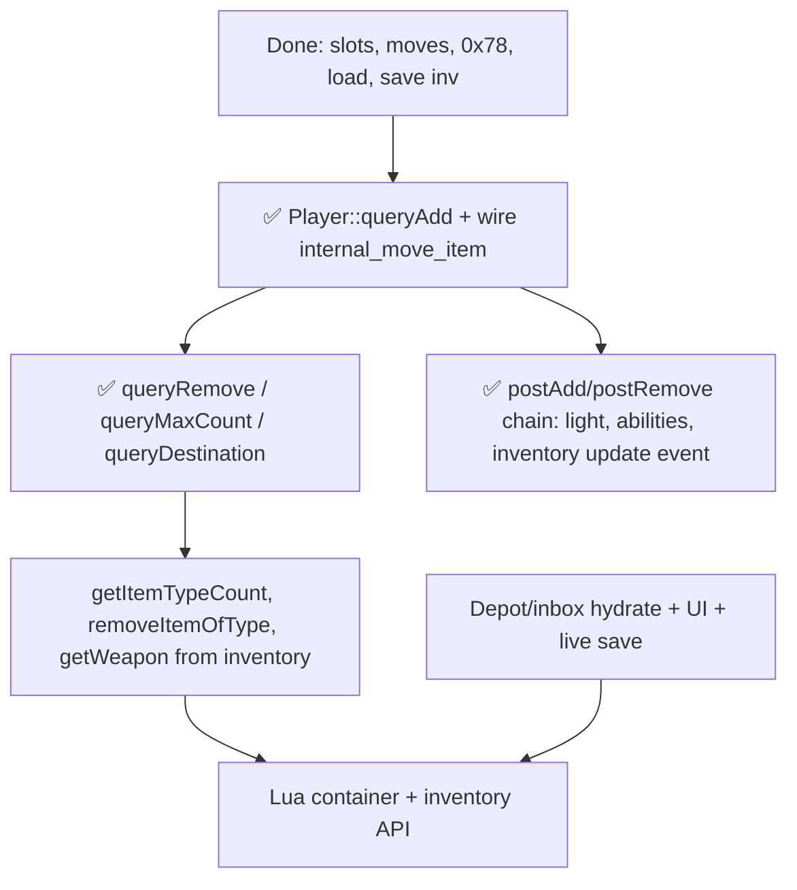

# Inventory & Equipment — Status & Next Steps

**Last updated:** 2026-05-30  
**Reference:** TFS 1.4.2 C++ (`src/player.cpp`, `src/game.cpp`, `src/iologindata.cpp`, `src/creature.h`)  
**Rust:** `crates/tfs-rust-core` (`inventory.rs`, `game_world_inventory.rs`, `player_inventory_load.rs`, `game_world_save.rs`, `game_world.rs`)

---

## Executive summary

**Playable Phase C is in place:** players can log in with equipment and nested containers, see real `0x78` inventory packets, move/equip/unequip via `internal_move_item`, use quick-equip, look at items and terrain (floors, water, trees), and **save the live worn-item tree** on logout.

**Not yet at full C++ parity:** MoveEvent equip script execution (`data/movements/`), depot/inbox as **runtime** cylinders, trade-item guards in moves, shop list refresh, and the rest of the **gradual Lua inventory API** (see [P5 — Lua API](#p5--lua-api-gradual-build--track-2)).

**Design rule:** Use idiomatic Rust (SlotMap, `Cylinder` enum, pure query functions) while preserving **observable** TFS 1.4.2 behavior — not a line-by-line C++ port.

---

## Architecture (Rust)

| C++ | Rust | Notes |
|-----|------|--------|
| `Player::inventory[CONST_SLOT_LAST+1]` | `Player::equipment_slots: [Option<ItemId>; 11]` | Slots 1–10 + store inbox (index 10 = slot 11) |
| `Item*` on player | `ItemId` in `SlotMap` | Generational keys; stale id = not found |
| `Cylinder` vtable | `Cylinder` enum + `GameWorld` methods | Documented deviation; same move targets |
| `Container` on items | `ContainerRegistry` + `container_ops.rs` | Nested bags, UI, query* for containers |
| `PlayerInventory` placeholder struct | Unused for slots; real model is `equipment_slots` | `player.rs` comment is stale |

**Threading:** All inventory mutation on the game thread only (`TFS-threading.mdc`).

---

## What works today (vs C++)

| Feature | C++ reference | Rust location | Status |
|---------|---------------|---------------|--------|
| Slot constants | `creature.h` `slots_t` | `inventory.rs` `InventorySlot` | ✅ |
| Load `player_items` | `iologindata.cpp` ~426–446 | `player_inventory_load.rs` | ✅ |
| Load store inbox | `iologindata.cpp` ~508+ | `load_store_inbox_table` | ✅ |
| Inventory weight | `player.cpp` `updateInventoryWeight` | `recompute_player_inventory_weight` | ✅ (no `HasInfiniteCapacity` flag yet) |
| Free capacity | `player.h` `getFreeCapacity` | `Player::get_free_capacity_u32` | ✅ simplified |
| `sendInventoryItem` (0x78) | `protocolgame.cpp` | `login_out.rs`, `broadcast_player_inventory_slot` | ✅ |
| `internalMoveItem` (inv paths) | `game.cpp` ~1078+ | `game_world.rs` | ✅ tile↔inv, container↔inv, inv↔inv, swap, partial stack |
| `getSlotType` / quick equip | `game.cpp` `getSlotType`, `playerEquipItem` | `inventory.rs`, `player_quick_equip` | ✅ subset of unequip (`WHEREEVER` vs explicit container) |
| `playerLookAt` | `game.cpp` ~3156 | `player_look_at`, `internal_get_thing_look`, `protocol_can_see` | ✅ items + ground/terrain + cross-floor look; creature text stubbed |
| Container open UI | `player.cpp` openContainers | `container_ui.rs`, `ContainerRegistry` | ✅ |
| Auto-open on login | `player.cpp` `autoOpenContainers` | `auto_open_containers_on_login` | ✅ |
| Equip move events | `postAddNotification` → move events | `on_player_equip` / `on_player_deequip` | ✅ partial |
| Save worn + nested items | `iologindata.cpp` `saveItems` | `game_world_save.rs` `append_save_item_tree` | ✅ inventory + store inbox from runtime |
| Slot mask check | `queryAdd` per-slot `SLOTP_*` | `item_fits_equipment_slot` | ✅ (superseded by `player_query_add` in move path) |
| `Player::queryAdd` full | `player.cpp` 2397–2617 | `player_inventory_query_add.rs` `player_query_add` | ✅ classic/non-classic, hand/two-hand, capacity, store-item, equip probe, `NeedExchange` |
| `Player::hasCapacity` | `player.cpp` ~2380–2395 | `player_has_capacity` | ✅ |
| `classicEquipmentSlots` config | `ConfigManager::CLASSIC_EQUIPMENT_SLOTS` | `classic_equipment_slots_from_config` | ✅ |

**Manual smoke:** connect → login → equip/deequip/move in backpack → disconnect → verify `player_items` rows updated.

---

## Gaps vs C++ (prioritized)

### P0 — `Player::queryAdd` ✅ DONE

**C++:** `player.cpp` ~2397–2617 (~220 lines).

**Rust:** `player_inventory_query_add.rs` — `player_query_add` wired into `internal_move_item` for all `Cylinder::Inventory` destinations (`game_world.rs` ~779). `item_fits_equipment_slot` retained in `inventory.rs` for legacy call-sites but is no longer used in the move path.

**Implemented:**

- `CLASSIC_EQUIPMENT_SLOTS` via `classic_equipment_slots_from_config` + `config.lua`
- Right/left hand: shield-only (non-classic), two-hand vs occupied hand
- `BothHandsNeedToBeFree`, `DropTwoHandedItem`, `CanOnlyUseOneWeapon`, `CanOnlyUseOneShield`
- Ammo slot + classic exception
- `isPickupable` / `isStoreItem` on direct slot add
- `FLAG_CHILDISOWNER` → capacity-only path for child-container queries
- `on_player_equip_check` probe before move (via `EventDispatcher` / `LuaEventDispatcher`)
- `NeedExchange` vs stackable same-id
- Unit tests inline in `player_inventory_query_add.rs` (classic/non-classic matrix, dual-weapon, dual-shield, two-hand)

---

### P1 — Other Player cylinder queries ✅ DONE

| C++ | Rust |
|-----|------|
| `Player::queryRemove` (~2695) | `player_query_remove` in `player_inventory_query_add.rs` |
| `Player::queryMaxCount` (~2619) | `player_query_max_count` (slots 1–10 + nested `ContainerIterator`) |
| `Player::queryDestination` (~2718) | `player_query_destination` (wherever BFS + concrete-slot redirect) |

**Wired:** `resolve_move_destination` (`container_ops.rs`), `internal_move_item` (`game_world.rs`) — `queryMaxCount` / `queryRemove` on inventory, `NeedExchange` pre-swap (`try_resolve_inventory_need_exchange`), partial stack inv→container.

**Deferred (same as C++ scope gaps):** `tradeItem` skip in destination BFS (stub until trade port); store inbox (slot 11) excluded from wherever scans (`CONST_SLOT_LAST`).

**C++ move pipeline:** `game.cpp` `internalMoveItem` — `queryDestination` loop → `queryAdd` → `NeedExchange` → `queryMaxCount` → `queryRemove`.

---

### P2 — Notification & stat side effects ✅ DONE

**C++:** `player.cpp` `postAddNotification` / `postRemoveNotification` (~3076–3191).

| Effect | Rust |
|--------|------|
| `g_moveEvents->onPlayerEquip` / deequip | ✅ via `events.on_player_*` (Owner link only) |
| `eventPlayerOnInventoryUpdate` | ✅ `fire_on_player_inventory_update` + `PlayerEventType::InventoryUpdate` loader |
| `updateInventoryWeight` | ✅ via `player_post_*` (Owner/TopParent) |
| `updateItemsLight` | ✅ `update_player_items_light` + `change_creature_light` |
| `sendStats` | ✅ via `player_post_*` |
| `inventoryAbilities[]` | ✅ `Player::inventory_abilities` + clear on deequip |
| `onUpdateInventoryItem` / `onRemoveInventoryItem` | 🟡 stubs (trade guards deferred) |
| Shop list refresh | 🟡 stub (`shop_owner` + debug log until shop runtime) |
| `onSendContainer` / `autoCloseContainers` | ✅ postAdd refresh + `auto_close_containers_for_container_item` |

**Rust:** [`player_inventory_notifications.rs`](crates/tfs-rust-core/src/player_inventory_notifications.rs), [`game_world_inventory.rs`](crates/tfs-rust-core/src/game_world_inventory.rs), [`container_ui.rs`](crates/tfs-rust-core/src/container_ui.rs), [`lua_scope.rs`](crates/tfs-rust-core/src/lua_scope.rs).

---

### P3 — Inventory utilities (combat / Lua / spells)

| C++ | Rust |
|-----|------|
| `getItemTypeCount` / `getAllItemTypeCount` | ❌ |
| `removeItemOfType` | Backpack-only in `lua_script_remove_item` |
| `getWeapon` / `getWeaponSkill` | Combat skeleton; not inventory-aware |
| GM flags (`HasInfiniteCapacity`, etc.) | ❌ on capacity |

---

### P4 — Depot & inbox runtime

**C++ load:** `iologindata.cpp` ~449–491 → `getDepotChest` / `getInbox()` live containers.

**Rust today:**

- Depot/inbox rows stored in `PlayerPersistBaseline` at login
- **No** runtime depot chest hydration (`ContainerType::Depot` unused in live path)
- Save: `build_player_save_data` **clones `baseline.depot` / `baseline.inbox`** — in-session depot edits do not persist

**Missing:** `isNearDepotBox`, open depot UI, `getMaxDepotItems`, `DepotIsFull`, live depot save.

---

### P5 — Lua API (gradual build — Track 2)

**Binding rules:** `@.cursor/rules/TFS-lua-boundaries.mdc` (path-scoped to `crates/tfs-rust-core/**/*.rs`, `crates/tfs-rust-lua/**/*.rs`). Any inventory Lua work must follow that file — summarized below.

Inventory-related Lua is being added incrementally in `tfs-rust-lua`, with game-thread mutations routed through `lua_scope` + `LuaMutation` (not direct `GameWorld` access from the VM).

**C++ reference:** `src/luascript.cpp` — `Creature` / `Player` / `Item` userdata; `luaPlayerAddItem`, `luaPlayerGetItemCount`, move-event equip scripts, etc.

#### Mandatory Lua boundaries (from `TFS-lua-boundaries.mdc`)

| Rule | Requirement |
|------|-------------|
| Engine | **mlua + LuaJIT** (`luajit`, `vendored`) — not Rhai / Lua 5.4 |
| Threading | `LuaRuntime` is `!Send`, **game thread only** (`LocalSet`) |
| Dependencies | `tfs-rust-lua` must **not** depend on `tfs-rust-core` — `core` → `lua` wiring only |
| Reads | `ScriptContext` in `tfs-rust-common`; userdata holds **IDs only**; `with_lua_context` |
| Mutations | `LuaMutation` + **immediate** `apply_lua_mutation` in `lua_scope.rs` if scripts read state in the same callback (e.g. `addItem`) |
| Dispatch | New events → `fire_on_*` in `lua_scope.rs` — no scattered world pointers in mlua closures |
| `EventDispatcher` | Must not import `tfs-rust-lua` |
| New methods | Classify each `luascript.cpp` port as **read** (`ScriptContext`) vs **mutation** (`LuaMutation`) |
| Equip MoveEvents | When wired: dispatch from `fire_on_*` / `LuaEventDispatcher` under `with_lua_mutation_scope` if scripts can mutate inventory in the callback |

#### Infrastructure (done)

| Piece | Rust | Notes |
|-------|------|--------|
| VM + script load | `tfs-rust-lua` `LuaRuntime`, `ScriptLoader` | `data/lib/`, creaturescripts, actions |
| Read context during Lua | `LuaContext` + `with_lua_context` | `get_creature`, `get_item_data`, slot/capacity queries |
| Mutations from Lua | `LuaMutation` + `register_lua_mutation_applier` | Game thread only; `lua_scope.rs` applies to `GameWorld` |
| Login scripts | `fire_on_login` → `LuaEventDispatcher::on_login` | Real callback dispatch |
| Core hook points | `EventDispatcher::on_player_equip` / `on_player_deequip` | Called from inventory moves; **Lua move scripts not wired yet** |

#### `Player` / `Creature` userdata — implemented

Registered in `crates/tfs-rust-lua/src/userdata/player.rs` (shared `CreatureRef` metatable):

| Lua method | Backed by | Parity |
|------------|-----------|--------|
| `getId` | FFI creature id | ✅ |
| `getName` | `LuaContext::get_creature` | ✅ |
| `getGuid` | player guid | ✅ |
| `getSlotItem(slot)` | `get_player_slot_item_id` → `ItemRef` | ✅ equipment slots |
| `getCapacity` | `get_player_capacity` | ✅ |
| `getFreeCapacity` | `get_player_free_capacity` | ✅ |
| `addItem(itemId[, count])` | `lua_script_add_item` (backpack only) | 🟡 subset — no `canDropOnMap`, slot arg, subType |
| `removeItem(itemId, count)` | `lua_script_remove_item` (backpack tree) | 🟡 subset — not full `removeItemOfType` / equipped scan |

#### `Item` userdata — implemented (read-only)

`crates/tfs-rust-lua/src/userdata/item.rs`:

| Lua method | Status |
|------------|--------|
| `getId` | ✅ (script id / handle) |
| `getType` | ✅ server item type |
| `getCount` | ✅ |
| `getWeight` | ✅ |
| `getName` | ✅ |

#### Creature events — inventory-related

| Event | Status |
|-------|--------|
| `onLogin` | ✅ dispatched |
| `onLogout` | ✅ dispatched |
| MoveEvent `onEquip` / `onDeEquip` | ❌ `LuaEventDispatcher` only **traces** today — does not run `data/movements/` equip scripts |

Equip/deequip **game** hooks exist (`game_world_inventory` → `events.on_player_*`); wiring those to Lua MoveEvents is a separate step from userdata methods.

#### Not started (typical next Lua tranche)

| Lua API (C++) | Blocked by |
|---------------|------------|
| `player:getItemCount` / `getItemById` | `getItemTypeCount`, deep container search (P3) |
| `player:addItemEx` | `internalAddItem` / remainder (Phase 9) |
| `player:getDepotChest` / `getInbox` | Depot/inbox runtime (P4) |
| `player:getContainerId` / `getContainerById` / `getContainerIndex` | Open-container registry already in core; bindings missing |
| `Container` userdata | No `userdata/container.rs` yet |
| `item:moveTo`, `item:remove`, `item:transform` | `internalMoveItem` / `transformItem` from Lua |
| `item:getParent`, `getTopParent`, `getPosition` | Cylinder/parent resolution in `LuaContext` |
| `item:getActionId`, `setAttribute`, store flags, etc. | Item attribute API surface |

#### Lua ↔ core dependency

```text
Player:addItem/removeItem (today) → LuaMutation → GameWorld::lua_script_* (backpack)
Future getItemCount/removeItem(full) → getItemTypeCount / removeItemOfType (P3) first
Future item:moveTo → internal_move_item + full Player::queryAdd (P0)
MoveEvent equip scripts → LuaEventDispatcher + movements loader (parallel to userdata)
```

**Step 8** in the table below = expand this section as each binding lands; prefer mutation applier + `LuaContext` over calling core from raw Lua C API style.

---

## Next steps (recommended order)



| Step | Work | Primary files | C++ ref | Status |
|------|------|---------------|---------|--------|
| **1** | Port `Player::queryAdd` + config `classicEquipmentSlots` | `player_inventory_query_add.rs`, `game_world.rs` | `player.cpp` 2397–2617 | ✅ |
| **2** | Replace `item_fits_equipment_slot`-only checks in inv moves | `game_world.rs` | `game.cpp` 1117+ | ✅ |
| **9** | Tests: hand/two-hand/classic `ReturnValue` matrix | Inline in `player_inventory_query_add.rs` | `player.cpp` cases | ✅ (inline) |
| **3** | `Player::queryDestination` (auto-stack to backpack) | `player_inventory_query_add.rs`, `container_ops.rs` | `player.cpp` 2718–2841 | ✅ |
| **4** | `queryMaxCount` / `queryRemove` for inventory cylinder | `player_inventory_query_add.rs`, `game_world.rs` | `player.cpp` 2619–2716 | ✅ |
| **5** | `postAddNotification` parity (light, abilities, inventory update) | `player_inventory_notifications.rs`, `game_world_inventory.rs` | `player.cpp` 3076–3191 | ✅ |
| **6** | `getItemTypeCount`, `removeItemOfType` | `game_world_inventory.rs` | `player.cpp` 2974–3047 | ❌ |
| **7** | Depot/inbox runtime + save from live state | `player_inventory_load.rs`, `game_world_save.rs`, `login.rs` | `iologindata.cpp` 449–491, save depot block | ❌ |
| **8** | Lua bindings | `tfs-rust-lua` | `luascript.cpp` player/item/container | ❌ |

**Doc hygiene (optional, same PR or follow-up):**

- Mark Phase C complete in `tasks/03-phase-B-C.md` (checkboxes still open).
- Remove or repurpose stale `PlayerInventory { capacity_slots }` comment in `player.rs`.

---

## Verification

```bash
cargo test -p tfs-rust-core inventory
cargo test -p tfs-rust-core --test inventory_container_gaps
SQLX_OFFLINE=true cargo check --workspace
```

**Manual parity checks (steps 1–2 done; re-verify with a live client):**

- Two-handed weapon with item in opposite hand → `BothHandsNeedToBeFree`
- Non-classic: non-shield in right slot → `CannotBeDressed`
- Dual shield / dual weapon → correct cancel message
- Store item into non-store container → `ItemCannotBeMovedThere`
- Depot open / put item (after step 7)

---

## Related docs

| File | Contents |
|------|----------|
| `docs/PROJECT_STATUS.md` | Overall project; Phase C marked ✅ |
| `tasks/inventory_implementation_plan.md` | Full phased breakdown (Phases 1–9); **Phase 7 = Lua** |
| `crates/tfs-rust-lua/src/userdata/` | Current Player/Item bindings |
| `crates/tfs-rust-core/src/lua_scope.rs` | Login + mutation applier bridge |
| `.cursor/rules/TFS-lua-boundaries.mdc` | **Lua integration rules** — load with `@` for any core/lua inventory work |
| `tasks/03-phase-B-C.md` | Phase B/C checklist (C still unchecked in file) |
| `tasks/container-bugs.md` | Container UI known issues |
| `.cursor/rules/TFS-Core.mdc` | 1:1 parity + idiomatic Rust mandate |

---

## Bottom line

**Where we are:** Inventory is **playable** for a live client session (wear, move, quick-equip, look, save worn gear). Container **UI** and **container query*** are in place. **P0** (`queryAdd`) and **P1** (`queryDestination` / `queryMaxCount` / `queryRemove`) are **complete** — wired through `resolve_move_destination` and `internal_move_item`.

**What’s next:** `getItemTypeCount` / `removeItemOfType` (P3), depot runtime (P4), and Lua (P5).
