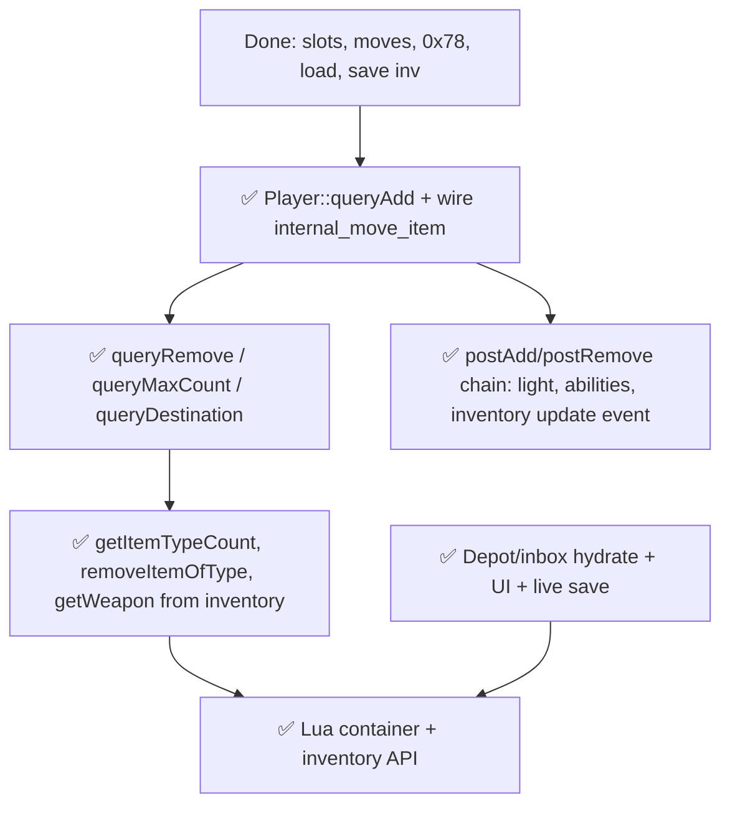

# Inventory & Equipment — Status & Next Steps

**Last updated:** 2026-05-30  
**Reference:** TFS 1.4.2 C++ (`src/player.cpp`, `src/game.cpp`, `src/iologindata.cpp`, `src/creature.h`)  
**Rust:** `crates/tfs-rust-core` (`inventory.rs`, `game_world_inventory.rs`, `player_inventory_load.rs`, `game_world_save.rs`, `game_world.rs`)

---

## Executive summary

**Playable Phase C is in place:** players can log in with equipment and nested containers, see real `0x78` inventory packets, move/equip/unequip via `internal_move_item`, use quick-equip, look at items and terrain (floors, water, trees), and **save the live worn-item tree** on logout.

**Not yet at full C++ parity:** trade-item guards in moves, shop list refresh, full `data/lib` bootstrap, MoveEvent `inventoryAbilities` from XML child nodes, and deferred APIs (`addItemEx`, `item:transform`, tile MoveEvents).

**Design rule:** Use idiomatic Rust (SlotMap, `Cylinder` enum, pure query functions) while preserving **observable** TFS 1.4.2 behavior — not a line-by-line C++ port.

---

## Architecture (Rust)

| C++ | Rust | Notes |
|-----|------|--------|
| `Player::inventory[CONST_SLOT_LAST+1]` | `Player::equipment_slots: [Option<ItemId>; 11]` | Slots 1–10 + store inbox (index 10 = slot 11) |
| `Item*` on player | `ItemId` in `SlotMap` | Generational keys; stale id = not found |
| `Cylinder` vtable | `Cylinder` enum + `GameWorld` methods | Documented deviation; same move targets |
| `Container` on items | `ContainerRegistry` + `container_ops.rs` | Nested bags, UI, query* for containers |
| `PlayerInventory` placeholder struct | Unused for slots; real model is `equipment_slots` | `player.rs` comment is stale |

**Threading:** All inventory mutation on the game thread only (`TFS-threading.mdc`).

---

## What works today (vs C++)

| Feature | C++ reference | Rust location | Status |
|---------|---------------|---------------|--------|
| Slot constants | `creature.h` `slots_t` | `inventory.rs` `InventorySlot` | ✅ |
| Load `player_items` | `iologindata.cpp` ~426–446 | `player_inventory_load.rs` | ✅ |
| Load store inbox | `iologindata.cpp` ~508+ | `load_store_inbox_table` | ✅ |
| Inventory weight | `player.cpp` `updateInventoryWeight` | `recompute_player_inventory_weight` | ✅ (skips when `HasInfiniteCapacity`) |
| Free capacity | `player.h` `getFreeCapacity` | `get_free_capacity_u32_with_flags` + group flags | ✅ |
| `sendInventoryItem` (0x78) | `protocolgame.cpp` | `login_out.rs`, `broadcast_player_inventory_slot` | ✅ |
| `internalMoveItem` (inv paths) | `game.cpp` ~1078+ | `game_world.rs` | ✅ tile↔inv, container↔inv, inv↔inv, swap, partial stack |
| `getSlotType` / quick equip | `game.cpp` `getSlotType`, `playerEquipItem` | `inventory.rs`, `player_quick_equip` | ✅ subset of unequip (`WHEREEVER` vs explicit container) |
| `playerLookAt` | `game.cpp` ~3156 | `player_look_at`, `internal_get_thing_look`, `protocol_can_see` | ✅ items + ground/terrain + cross-floor look; creature text stubbed |
| Container open UI | `player.cpp` openContainers | `container_ui.rs`, `ContainerRegistry` | ✅ |
| Auto-open on login | `player.cpp` `autoOpenContainers` | `auto_open_containers_on_login` | ✅ |
| Equip move events | `postAddNotification` → move events | `fire_on_player_equip*` + `MoveEventsRegistry` | ✅ XML `function=` equip/deequip |
| Save worn + nested items | `iologindata.cpp` `saveItems` | `game_world_save.rs` `append_save_item_tree` | ✅ inventory + store inbox from runtime |
| Slot mask check | `queryAdd` per-slot `SLOTP_*` | `item_fits_equipment_slot` | ✅ (superseded by `player_query_add` in move path) |
| `Player::queryAdd` full | `player.cpp` 2397–2617 | `player_inventory_query_add.rs` `player_query_add` | ✅ classic/non-classic, hand/two-hand, capacity, store-item, equip probe, `NeedExchange` |
| `Player::hasCapacity` | `player.cpp` ~2380–2395 | `player_has_capacity` | ✅ |
| `classicEquipmentSlots` config | `ConfigManager::CLASSIC_EQUIPMENT_SLOTS` | `classic_equipment_slots_from_config` | ✅ |

**Manual smoke:** connect → login → equip/deequip/move in backpack → disconnect → verify `player_items` rows updated.

---

## Gaps vs C++ (prioritized)

### P0 — `Player::queryAdd` ✅ DONE

**C++:** `player.cpp` ~2397–2617 (~220 lines).

**Rust:** `player_inventory_query_add.rs` — `player_query_add` wired into `internal_move_item` for all `Cylinder::Inventory` destinations (`game_world.rs` ~779). `item_fits_equipment_slot` retained in `inventory.rs` for legacy call-sites but is no longer used in the move path.

**Implemented:**

- `CLASSIC_EQUIPMENT_SLOTS` via `classic_equipment_slots_from_config` + `config.lua`
- Right/left hand: shield-only (non-classic), two-hand vs occupied hand
- `BothHandsNeedToBeFree`, `DropTwoHandedItem`, `CanOnlyUseOneWeapon`, `CanOnlyUseOneShield`
- Ammo slot + classic exception
- `isPickupable` / `isStoreItem` on direct slot add
- `FLAG_CHILDISOWNER` → capacity-only path for child-container queries
- `on_player_equip_check` probe before move (via `EventDispatcher` / `LuaEventDispatcher`)
- `NeedExchange` vs stackable same-id
- Unit tests inline in `player_inventory_query_add.rs` (classic/non-classic matrix, dual-weapon, dual-shield, two-hand)

---

### P1 — Other Player cylinder queries ✅ DONE

| C++ | Rust |
|-----|------|
| `Player::queryRemove` (~2695) | `player_query_remove` in `player_inventory_query_add.rs` |
| `Player::queryMaxCount` (~2619) | `player_query_max_count` (slots 1–10 + nested `ContainerIterator`) |
| `Player::queryDestination` (~2718) | `player_query_destination` (wherever BFS + concrete-slot redirect) |

**Wired:** `resolve_move_destination` (`container_ops.rs`), `internal_move_item` (`game_world.rs`) — `queryMaxCount` / `queryRemove` on inventory, `NeedExchange` pre-swap (`try_resolve_inventory_need_exchange`), partial stack inv→container.

**Deferred (same as C++ scope gaps):** `tradeItem` skip in destination BFS (stub until trade port); store inbox (slot 11) excluded from wherever scans (`CONST_SLOT_LAST`).

**C++ move pipeline:** `game.cpp` `internalMoveItem` — `queryDestination` loop → `queryAdd` → `NeedExchange` → `queryMaxCount` → `queryRemove`.

---

### P2 — Notification & stat side effects ✅ DONE

**C++:** `player.cpp` `postAddNotification` / `postRemoveNotification` (~3076–3191).

| Effect | Rust |
|--------|------|
| `g_moveEvents->onPlayerEquip` / deequip | ✅ via `events.on_player_*` (Owner link only) |
| `eventPlayerOnInventoryUpdate` | ✅ `fire_on_player_inventory_update` + `PlayerEventType::InventoryUpdate` loader |
| `updateInventoryWeight` | ✅ via `player_post_*` (Owner/TopParent) |
| `updateItemsLight` | ✅ `update_player_items_light` + `change_creature_light` |
| `sendStats` | ✅ via `player_post_*` |
| `inventoryAbilities[]` | ✅ `Player::inventory_abilities` + clear on deequip |
| `onUpdateInventoryItem` / `onRemoveInventoryItem` | 🟡 stubs (trade guards deferred) |
| Shop list refresh | 🟡 stub (`shop_owner` + debug log until shop runtime) |
| `onSendContainer` / `autoCloseContainers` | ✅ postAdd refresh + `auto_close_containers_for_container_item` |

**Rust:** [`player_inventory_notifications.rs`](crates/tfs-rust-core/src/player_inventory_notifications.rs), [`game_world_inventory.rs`](crates/tfs-rust-core/src/game_world_inventory.rs), [`container_ui.rs`](crates/tfs-rust-core/src/container_ui.rs), [`lua_scope.rs`](crates/tfs-rust-core/src/lua_scope.rs).

---

### P3 — Inventory utilities (combat / Lua / spells) ✅ DONE

| C++ | Rust |
|-----|------|
| `getItemTypeCount` / `getAllItemTypeCount` | ✅ `player_inventory_util.rs` |
| `removeItemOfType` | ✅ `player_remove_item_of_type` + `internal_remove_items` |
| `getWeapon` / `getWeaponSkill` | ✅ `player_get_weapon*` / `player_get_weapon_skill` |
| GM flags (`HasInfiniteCapacity`, etc.) | ✅ `player_flags.rs`, `groups.xml` on `GameWorld` |

---

### P4 — Depot & inbox runtime — ✅ DONE

**C++ load:** `iologindata.cpp` ~449–506 → `getDepotChest` / `getInbox()` live containers.

**Rust today:**

| Piece | Status |
|-------|--------|
| `is_depot()` / `depot_id` attr / `TILESTATE_DEPOT` on map load | ✅ |
| `player_depot.rs` — `getInbox`, `getDepotChest`, `getDepotLocker`, `getMaxDepotItems`, `isNearDepotBox`, `last_depot_id` | ✅ |
| Login hydration — `load_depot_table` / `load_inbox_table`; store inbox `ContainerType::StoreInbox` | ✅ |
| Depot locker open via `UseItem` (`container_ui.rs`) | ✅ |
| `DepotIsFull` + locker/inbox `queryAdd` (`container_ops.rs`); `depotFreeLimit` / `depotPremiumLimit` | ✅ |
| Live depot/inbox save when `last_depot_id != -1` (`game_world_save.rs`) | ✅ |
| Depot-owner container UI refresh (`player_inventory_notifications.rs`) | ✅ |

**Manual smoke checklist:**

- [ ] Connect → walk to depot → use locker → locker UI (market / inbox / town chests)
- [ ] Move item into town depot chest → logout → `player_depotitems` updated
- [ ] Fill depot to limit → next add shows cancel message (`DepotIsFull`)
- [ ] Never open depot → logout → depot rows unchanged in DB

**Deferred (P5+):** full market runtime (`0xF6`), `onReceiveMail`, MoveEvent `inventoryAbilities` from XML nested nodes, Lua `MoveEvent():register()` compat scripts.

---

### P5 — Lua API (gradual build — Track 2) — ✅ DONE (core tranche)

**Binding rules:** `@.cursor/rules/TFS-lua-boundaries.mdc`. Reads → `ScriptContext`; mutations → `LuaMutation` + immediate `apply_lua_mutation`; equip MoveEvents → `fire_on_player_equip*` under mutation scope.

**C++ reference:** `src/luascript.cpp`, `src/movement.cpp` `MoveEvents::fireEquip`.

#### Core prerequisites (Tranche 0)

| Piece | Rust | Status |
|-------|------|--------|
| `findItemOfType` | `player_inventory_util.rs` | ✅ slots 1–10 + BFS |
| Cylinder/parent reads | `ScriptContext` + `player_lua_context.rs` | ✅ `ScriptCylinder`, container queries |
| Lua mutation helpers | `game_world_inventory.rs` `lua_script_*` | ✅ moveTo, remove, depot, container addItem, attrs |
| Equip dispatch scope | `lua_scope.rs` `fire_on_player_equip*` | ✅ replaces bare `EventDispatcher` calls |
| `player_query_add` equip probe | `player_inventory_query_add.rs` | ✅ `&mut self` + level/slot-mask in dispatcher |

#### `Player` userdata — implemented

| Lua method | Status |
|------------|--------|
| `getId`, `getName`, `getGuid` | ✅ |
| `getSlotItem`, `getCapacity`, `getFreeCapacity`, `getItemCount` | ✅ |
| `getItemById(id\|name[, deep[, subType]])` | ✅ via `find_item_of_type` |
| `getDepotChest(id[, autoCreate])`, `getInbox()` | ✅ mutation when auto-create |
| `getContainerId`, `getContainerById`, `getContainerIndex` | ✅ |
| `addItem(id[, count[, canDropOnMap[, subType[, slot]]]])` | ✅ expanded (not `addItemEx`) |
| `removeItem` | ✅ |

#### `Item` userdata — implemented

| Lua method | Status |
|------------|--------|
| `getId`, `getType`, `getCount`, `getWeight`, `getName` | ✅ |
| `moveTo(cylinder\|position[, flags])` | ✅ Container/Player/Position |
| `remove([count])` | ✅ |
| `getParent`, `getTopParent`, `getPosition` | ✅ |
| `isContainer`, `getContainer` | ✅ |
| `getActionId` / `setActionId`, `getUniqueId` / `setUniqueId`, store flags | ✅ |

#### `Container` userdata — implemented

Inherits Item methods via mlua metatable chain (`userdata/container.rs`). Read: `getSize`, `getCapacity`, `getEmptySlots`, `getItem`, `getItems`, `getItemHoldingCount`, `getItemCountById`, `hasItem`, `getCorpseOwner`. Mutation: `addItem`. Deferred: `addItemEx`, `getContentDescription`, `setCapacity`.

#### MoveEvents equip scripts

| Piece | Status |
|-------|--------|
| XML `function="onEquipItem"` / `onDeEquipItem` | ✅ `move_events.rs` loader |
| Default equip globals when lib empty | ✅ bootstrap chunk in loader |
| `req_level` + slot mask | ✅ checked in `LuaEventDispatcher` |
| Lua callback `(player, item, slot, isCheck)` | ✅ `call_move_equip` |
| Step-in/step-out tile MoveEvents | ❌ deferred |
| `MoveEvent():register()` from `data/scripts/movements/` | ❌ deferred (needs compat `MoveEvent` metatable) |
| XML nested `inventoryAbilities` | ❌ deferred (needs full `onEquipItem` lib port) |

#### Explicit deferrals

| API | Blocker |
|-----|---------|
| `player:addItemEx`, `container:addItemEx` | Virtual cylinder + `internalAddItem` (Phase 9) |
| `item:transform` | No `transform_item` in core |
| `Tile` userdata for `moveTo` | Position→tile path works |
| Full `data/lib` load | `LuaRuntime::new` TODO — movements bootstrap only |

**Manual smoke checklist (P5):**

- [ ] GM: `player:addItem(2160, 100)` → `getItemCount` reflects immediately
- [ ] `player:getDepotChest(id, true):getItemHoldingCount()` from `data/lib/core/player.lua`
- [ ] Death/drop script: `item:moveTo(corpse)`
- [ ] Equip level-gated boots (`movements.xml` `level=`) → low level blocked
- [ ] `player:getItemById(2148, true)` finds gold in nested backpack

---

## Next steps (recommended order)



| Step | Work | Primary files | C++ ref | Status |
|------|------|---------------|---------|--------|
| **1** | Port `Player::queryAdd` + config `classicEquipmentSlots` | `player_inventory_query_add.rs`, `game_world.rs` | `player.cpp` 2397–2617 | ✅ |
| **2** | Replace `item_fits_equipment_slot`-only checks in inv moves | `game_world.rs` | `game.cpp` 1117+ | ✅ |
| **9** | Tests: hand/two-hand/classic `ReturnValue` matrix | Inline in `player_inventory_query_add.rs` | `player.cpp` cases | ✅ (inline) |
| **3** | `Player::queryDestination` (auto-stack to backpack) | `player_inventory_query_add.rs`, `container_ops.rs` | `player.cpp` 2718–2841 | ✅ |
| **4** | `queryMaxCount` / `queryRemove` for inventory cylinder | `player_inventory_query_add.rs`, `game_world.rs` | `player.cpp` 2619–2716 | ✅ |
| **5** | `postAddNotification` parity (light, abilities, inventory update) | `player_inventory_notifications.rs`, `game_world_inventory.rs` | `player.cpp` 3076–3191 | ✅ |
| **6** | `getItemTypeCount`, `removeItemOfType` | `player_inventory_util.rs`, `game_world_inventory.rs` | `player.cpp` 2974–3047 | ✅ |
| **7** | Depot/inbox runtime + save from live state | `player_depot.rs`, `game_world_save.rs`, `login.rs` | `iologindata.cpp` 449–491 | ✅ |
| **8** | Lua bindings | `tfs-rust-lua`, `lua_scope.rs`, `move_events.rs` | `luascript.cpp`, `movement.cpp` | ✅ core tranche |

**Doc hygiene (optional, same PR or follow-up):**

- Mark Phase C complete in `tasks/03-phase-B-C.md` (checkboxes still open).
- Remove or repurpose stale `PlayerInventory { capacity_slots }` comment in `player.rs`.

---

## Verification

```bash
cargo test -p tfs-rust-core --lib find_item_in_backpack
cargo test -p tfs-rust-core inventory
cargo test -p tfs-rust-core --test inventory_container_gaps
SQLX_OFFLINE=true cargo check --workspace
```

**Manual parity checks (steps 1–2 done; re-verify with a live client):**

- Two-handed weapon with item in opposite hand → `BothHandsNeedToBeFree`
- Non-classic: non-shield in right slot → `CannotBeDressed`
- Dual shield / dual weapon → correct cancel message
- Store item into non-store container → `ItemCannotBeMovedThere`
- Depot open / put item (after step 7)

---

## Related docs

| File | Contents |
|------|----------|
| `docs/PROJECT_STATUS.md` | Overall project; Phase C marked ✅ |
| `tasks/inventory_implementation_plan.md` | Full phased breakdown (Phases 1–9); **Phase 7 = Lua** |
| `crates/tfs-rust-lua/src/userdata/` | Current Player/Item bindings |
| `crates/tfs-rust-core/src/lua_scope.rs` | Login + mutation applier bridge |
| `.cursor/rules/TFS-lua-boundaries.mdc` | **Lua integration rules** — load with `@` for any core/lua inventory work |
| `tasks/03-phase-B-C.md` | Phase B/C checklist (C still unchecked in file) |
| `tasks/container-bugs.md` | Container UI known issues |
| `.cursor/rules/TFS-Core.mdc` | 1:1 parity + idiomatic Rust mandate |

---

## Bottom line

**Where we are:** Inventory is **playable** for a live client session (wear, move, quick-equip, look, save worn gear + depot/inbox). **P0–P5 core tranches are complete** — cylinder queries, notifications, utilities, depot runtime, Lua Player/Item/Container API, and XML equip MoveEvents.

**What’s next:** Full `data/lib` bootstrap, MoveEvent `inventoryAbilities` / compat `MoveEvent():register()`, trade guards, shop refresh, Phase 9 `addItemEx` / `transform`.
