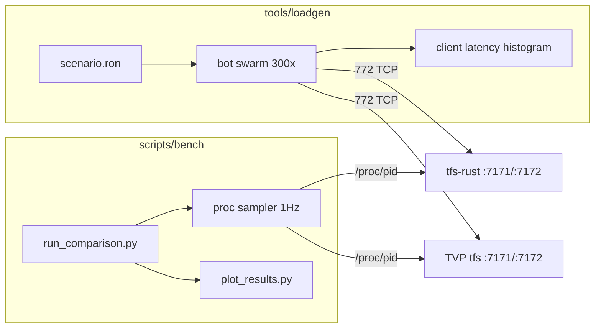

# TVP vs Rust Performance Comparison Harness

Status: planned (not yet implemented)

Goal: produce defensible, publishable evidence of the Rust server's performance
against the TVP C++ 7.72 server, using one measurement instrument on both sides.

## Core insight

Both servers speak the **same 772 wire protocol**. One synthetic client drives both, so the
measurement instrument is identical on each side — this is what makes the comparison defensible.



## Why a load curve, not a flame graph

Flamegraphs profile one binary against itself; two unrelated symbol trees side by side prove
nothing to a reader, and a single snapshot hides scaling behaviour. Headline artifact instead:

- **Load curve** — X: concurrent bots (25/50/100/200/300/400/600). Y: CPU%, RSS, p99 action
  latency. Two lines per chart. Finds each server's knee.
- **Steady-state time series** — 1 Hz samples during a fixed 300-bot run.
- **Headline number** — max concurrent bots sustained at p99 action latency under 100 ms.
- **Appendix only** — `perf` / `cargo flamegraph` at the 300-bot point, per server, to explain *why*.

## Component 1 — `tools/loadgen` (new workspace member)

New crate `tools/loadgen` (bin `tfs-loadgen`), added to `members` in `Cargo.toml`.
Reuses `tfs-rust-net` and `tfs-rust-common`; does **not** touch `tfs-rust-core`.

Missing primitive: client-side RSA. Add to `crates/tfs-rust-net/src/rsa.rs`, mirroring the
existing raw `decrypt`:

```rust
/// Raw 1024-bit RSA block encrypt: `m^e mod n`. Client side of `decrypt`.
pub fn encrypt(block: &[u8; 128], n: &BigUint, e: &BigUint) -> Result<[u8; 128]>
```

Everything else is reuse: `xtea_tfs::{expand_key, encrypt, decrypt}`,
`protocol_game::encrypt_xtea_game_frame`, `game_frame::read_sized_payload`, opcode tables in
`tfs-rust-common/src/protocol_opcodes.rs`.

Session driver mirrors the server flow in `crates/tfs-rust-net/src/server.rs`: connect 7171,
RSA first packet, read char list, connect 7172, game first packet, then opcode stream.

**Inbound handling:** deliberately minimal. Parse only self-id/position from the login packet and
`0x6C` / `0x6D` move updates so bots stay spatially coherent; everything else is length-framed,
byte-counted, discarded. A full client decoder is out of scope.

**Latency measurement:** timestamp an outbound action, match the first correlated server frame,
record into an HDR-style histogram. Two tracked SLOs — walk-step ack latency and spell/rune
effect latency.

## Component 2 — Behaviour scenarios

Declarative `bench/scenarios/*.ron` (repo already depends on `ron`). Weighted role mix over the
bot population, seeded per-bot RNG for reproducibility:

- walker (pathing churn, spectator recalculation)
- melee hunter (target acquisition, combat ticks)
- spell caster (Lua + combat pipeline)
- rune thrower, single-target
- AoE rune thrower (worst case: area resolution x spectator broadcast)
- chat / look / trade noise

Baseline scenario `bench/scenarios/mixed_300.ron` is the 300-player mixed workload; each role is
also runnable in isolation to attribute cost.

## Component 3 — Orchestrator and sampling

New `scripts/bench/`:

- `run_comparison.py` — start target server, wait for readiness, warm up, ramp bots, sample,
  tear down, write `results/<timestamp>/<server>/<bots>/`.
- `sample_proc.py` — 1 Hz from `/proc/<pid>`: `utime` / `stime`, RSS + PSS from `smaps_rollup`,
  thread count, per-thread CPU (separates TVP's dispatcher from its asio threads), ctx switches,
  `/proc/<pid>/io`. Language-agnostic, so identical treatment of both servers.
- `plot_results.py` — matplotlib charts from the raw CSVs.

Missing today, also needed: `scripts/build_tvp.sh` and `scripts/run_tvp.sh` (TVP has no repo
wrapper; build is CMake Release from `reference/tvp-772/gameserver/`).

Rust-side `GameObs` (`RUST_LOG=tfs_obs=info`, `beat_wall_ms`) is captured for **diagnosis only** —
TVP has no equivalent, so it never appears in a head-to-head chart.

## Component 4 — Fairness controls

This is what the comparison will be attacked on, so it is a first-class deliverable in
`docs/PERF_BENCHMARK_METHODOLOGY.md`:

- Same host, **alternating** A/B/A/B runs, never concurrent. 3+ repetitions, report median and spread.
- Both servers pinned to the same cpuset; loadgen on a separate cpuset (or separate machine) with
  its own CPU measured to prove it is not the bottleneck.
- CPU governor `performance`; document CPU model, kernel, RAM.
- Both Release: TVP `-DCMAKE_BUILD_TYPE=Release` with IPO; Rust `--release`. Document any
  asymmetric flags.
- Content alignment: shared OTBM (already byte-identical), spawns converted via
  `scripts/convert_tvp_spawns_to_tfs.py`, same monster set. Document residual deltas —
  `items.otb` differs, and the Lua/script trees are separate.
- Normalize persistence: TVP `enablePlayerDataFiles = true` writes player files while Rust saves
  to DB. Either disable saves on both or measure and disclose.
- Warmup discarded (first 30 s).
- Publish raw CSVs plus the harness itself.

## Known risks

- **Bulk accounts.** 300 logins need seeded accounts/characters in both DBs. Extend
  `scripts/seed_test_account.sql` into a generator.
- **Login ramp.** Rust caps at `MAX_CONCURRENT_LOGIN_LOADS = 8` in
  `crates/tfs-rust-core/src/login.rs`. Ramp gradually; report login throughput as its own metric
  rather than letting it distort steady state.
- **Anti-flood.** TVP connection timers and rate limits may drop bots that ignore cooldowns. Bots
  must respect action cooldowns or results are invalid.
- **Spawn density** must be verified equal, or monster count silently drives the difference.

## Sub-agent split

Per `.cursor/rules/TFS-subagents.mdc`: RSA encrypt + session driver, scenario engine,
orchestrator/sampler, and TVP build scripts each go to a `generalPurpose` sub-agent; verification
runs go to `shell`. Parent integrates and owns `tasks/todo.md` and `tasks/lessons.md`.

## Task list

| # | Task |
|---|------|
| 1 | Add client-side raw RSA encrypt to `crates/tfs-rust-net/src/rsa.rs`, mirroring the existing decrypt, with a round-trip unit test |
| 2 | Create `tools/loadgen` workspace member with a single-bot session driver: login handshake on 7171, game handshake on 7172, XTEA frame loop, minimal inbound parse (self id/position) |
| 3 | Bulk account/character seeding for both the Rust MariaDB schema and TVP's `schema.sql` |
| 4 | Scenario engine plus `bench/scenarios/*.ron`: walker, melee hunter, spell caster, rune, AoE rune roles with weighted mix and seeded per-bot RNG |
| 5 | Client-side latency histograms for walk-step ack and spell/rune effect, emitted as JSON per run |
| 6 | Add `scripts/build_tvp.sh` and `scripts/run_tvp.sh` (CMake Release build, config + DB setup for `reference/tvp-772/gameserver`) |
| 7 | Align content between servers: shared OTBM, converted spawns, matching monster set; document residual deltas |
| 8 | `scripts/bench/sample_proc.py`: 1 Hz `/proc` sampling of CPU, RSS/PSS, threads, per-thread CPU, ctx switches, io |
| 9 | `scripts/bench/run_comparison.py`: ramp schedule, warmup, alternating A/B runs, repetitions, results directory layout |
| 10 | `scripts/bench/plot_results.py`: load curves and steady-state time series charts |
| 11 | Write `docs/PERF_BENCHMARK_METHODOLOGY.md` covering fairness controls, hardware disclosure, and known deltas |
| 12 | Execute the first full comparison run and capture publishable numbers plus optional flamegraph appendix |
