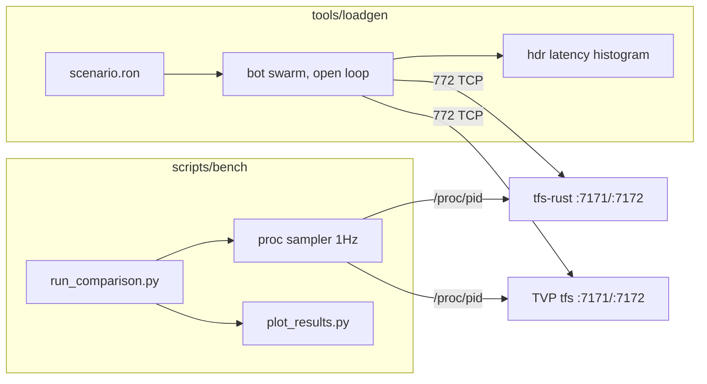

# Performance measurement plan

Status: planned (not yet implemented)

Two distinct goals, deliberately separated because they want different instruments:

- **Engineering** — catch regressions per commit, and find what to optimize next.
- **Publishable comparison** — defensible evidence against the TVP C++ 7.72 server.

Building only the second (the earlier version of this plan) produces a number you generate
once and never regenerate, and gives the optimization loop nothing to work with. The tiers
below are ordered cheapest-first; each is useful on its own and each is a prerequisite for
the next.

| Tier | Instrument | Cost | Answers |
|---|---|---|---|
| 1 | Microbenches over hot paths | ~1 day | Did this commit slow down pathfinding / spectators / conditions? |
| 2 | `sim_harness` in-process load | ~2 days | How does the game thread scale with creature and player count? |
| 3 | Wire loadgen vs Rust only | ~1 week | What does the network + serialization + broadcast layer cost? |
| 4 | A/B vs TVP | ~1 week on top | How do we compare to the C++ reference? |

Tiers 1–2 run in CI. Tiers 3–4 are manual, pinned-host runs.

---

## Tier 1 — Microbenches (regression gate)

No benchmark harness exists in the workspace today: no `criterion`, `divan`, `iai`, or
`[[bench]]` in any `Cargo.toml`, and no `benches/` directory. Add Divan or Criterion to
`tfs-rust-core` and cover the paths that `GameObs` already identifies as hot
(`crates/tfs-rust-core/src/obs.rs:100-152` tracks exactly these):

- pathfinding (`path_us` is the largest subsystem histogram under chase load)
- spectator set resolution
- condition / skill ticks
- ToDo heap push/pop under synchronized-due load

Wire into CI as a threshold check, not a chart. Cheap, deterministic, per-commit.

## Tier 2 — In-process load via `sim_harness`

The threading invariant makes the single game thread the scaling limit, so the bottleneck
can be saturated **without any network, DB, login cap, or anti-flood involvement** — and
deterministically.

`crates/tfs-rust-core/src/sim_harness.rs` already provides everything needed: world builders
(`minimal_world:429`, `beat_driven_world:494`), entity insertion, a scenario clock
(`set_sim_harness_wall_ms`), a seeded parity RNG (`world.seed_parity_rng(42)`), and a tick
driver (`run_sim_tick:1907`). `crates/tfs-rust-core/src/bin/chase_kite_sim.rs` already drives
it from a binary under `--features sim`.

Deliverable: a scaling sweep over synthetic populations (N monsters chasing, N players in
combat, N spectators per broadcast), reporting beat wall time and per-subsystem µs from
`GameObs`. This is where optimization work actually gets its feedback.

**Flamegraphs belong here, as a first-class tool, not an appendix.** A flamegraph of two
unrelated binaries side by side proves nothing to a reader — that argument holds, and is why
flamegraphs are not a *comparison* artifact. But a flamegraph of our own binary under Tier 2
load is the primary instrument for making it faster. Add `scripts/profile_sim.sh` wrapping
`cargo flamegraph` over the sim binary.

## Tier 3 — Wire loadgen against the Rust server

Only now is a synthetic 772 client worth building, and it is worth building against our own
server first — it exercises the network, serialization, spectator fan-out, output-queue
backpressure, and login throughput that Tier 2 cannot reach.

### `tools/loadgen` (new workspace member)

New crate `tools/loadgen` (bin `tfs-loadgen`), added to `members` in `Cargo.toml` (currently
`crates/*` plus `tools/packet-proxy` only). Reuses `tfs-rust-net` and `tfs-rust-common`;
does **not** touch `tfs-rust-core`.

Missing primitive: client-side RSA. `crates/tfs-rust-net/src/rsa.rs` has raw `decrypt` (:18)
and no `encrypt`. Add the mirror:

```rust
/// Raw 1024-bit RSA block encrypt: `m^e mod n`. Client side of `decrypt`.
pub fn encrypt(block: &[u8; 128], n: &BigUint, e: &BigUint) -> Result<[u8; 128]>
```

Everything else is reuse: `xtea_tfs::{expand_key, encrypt, decrypt}`,
`protocol_game::encrypt_xtea_game_frame`, `game_frame::read_sized_payload`, opcode tables in
`tfs-rust-common/src/protocol_opcodes.rs`.

Session driver mirrors the server flow in `crates/tfs-rust-net/src/server.rs`
(`handle_login_connection`, `handle_game_connection`): connect 7171, RSA first packet, read
char list, connect 7172, game first packet, then opcode stream.

**Inbound handling:** deliberately minimal. Parse only self-id/position from the login packet
and `0x6C` / `0x6D` move updates so bots stay spatially coherent; everything else is
length-framed, byte-counted, discarded. A full client decoder is out of scope.

### Latency measurement — open loop, mandatory

Each bot's actions are scheduled at **fixed intended wall-clock times** from a per-bot seeded
schedule. Latency is measured from the *intended* send time, not the actual send time.

This is not a detail. A closed-loop bot that waits for a response before issuing its next
action stops generating load exactly when the server stalls, so the histogram records a few
slow samples instead of the backlog a real player population would have suffered — the
classic coordinated-omission bias, routinely worth an order of magnitude in the tail. Any p99
produced by a closed-loop bot is not publishable.

If a prior action is still outstanding when the next is due, the wait counts toward the next
action's latency. Use the `hdrhistogram` crate (new dependency) — `obs.rs`'s `FixedHistogram`
geometric buckets are fine for diagnosis but too coarse to publish percentiles from.

Correlation rule must be defined per action type, not left as "first correlated frame":
walk-step ack is a `0x6C`/`0x6D` for our own creature id; spell/rune effect is the magic-effect
frame at the target tile. Two tracked SLOs, those two.

### Loadgen validation (before any number is trusted)

- **Prove the client's own ceiling.** Drive the loadgen against a null echo server and find
  where it saturates. If that is near the intended bot count, we are measuring the client.
- **Prove the byte stream is real.** The loadgen encodes what *our server* believes 772 looks
  like. Record a genuine client session through the existing `tools/packet-proxy` and validate
  the loadgen's output against that capture. Without this, a protocol divergence silently
  becomes a different workload in Tier 4.

### Behaviour scenarios

Declarative `bench/scenarios/*.ron` (`ron` is already a workspace dependency, `Cargo.toml:49`).
Weighted role mix over the bot population, seeded per-bot RNG for reproducibility:

- walker (pathing churn, spectator recalculation)
- melee hunter (target acquisition, combat ticks)
- spell caster (Lua + combat pipeline)
- rune thrower, single-target
- AoE rune thrower (worst case: area resolution × spectator broadcast)
- chat / look / trade noise

Baseline scenario `bench/scenarios/mixed_300.ron` is the 300-player mixed workload; each role
is also runnable in isolation to attribute cost. **Scenario files are versioned and frozen
before a publication run** — the headline number is meaningless if the mix drifts.

---

## Tier 4 — A/B against TVP

Both servers speak the same 772 wire protocol, so one synthetic client drives both and the
measurement instrument is identical on each side. That is what makes the comparison
defensible — and it only works once Tier 3 has proven the client itself.



### Artifacts

- **Load curve** — X: concurrent bots (25/50/100/200/300/400/600). Y: CPU%, RSS, p99 action
  latency. Two lines per chart. Finds each server's knee. A single snapshot would hide
  scaling behaviour, which is the interesting part.
- **Steady-state time series** — 1 Hz samples during a fixed 300-bot run.
- **Overload behaviour** — one run past each server's knee. Graceful degradation versus
  collapse is arguably a more interesting claim than the knee itself.
- **Soak** — one long run at 200 bots for memory growth. A single RSS reading does not support
  a memory claim; an hour of flat RSS does.
- **Headline numbers** — (a) max concurrent bots sustained at walk-ack p99 under 100 ms on the
  frozen mixed scenario, and (b) CPU-seconds per delivered action.

### Why work-normalized CPU is required

TVP is asio-multithreaded; the Rust server is one game thread plus Tokio I/O. Comparing total
CPU% rewards or punishes that difference rather than measuring efficiency. Report raw CPU%
*and* CPU-seconds per delivered action / per outbound byte.

### Orchestrator and sampling — `scripts/bench/`

- `run_comparison.py` — start target server, wait for readiness, warm up, ramp bots, sample,
  tear down, write `results/<timestamp>/<server>/<bots>/`.
- `sample_proc.py` — 1 Hz from `/proc/<pid>`: `utime`/`stime`, RSS + PSS from `smaps_rollup`,
  thread count, per-thread CPU (separates TVP's dispatcher from its asio threads), ctx
  switches, `/proc/<pid>/io`, **and bytes/packets sent** (`/proc/<pid>/net/dev` or socket
  counters). Language-agnostic, so identical treatment of both servers.
- `plot_results.py` — matplotlib charts from the raw CSVs. (No Python plotting exists in
  `scripts/` today; existing scripts are stdlib + subprocess.)

Missing today, also needed: `scripts/build_tvp.sh` and `scripts/run_tvp.sh` (TVP has no repo
wrapper; build is CMake Release from `reference/tvp-772/gameserver/`).

Rust-side `GameObs` (`RUST_LOG=tfs_obs=info`, `beat_wall_ms`) is captured for **diagnosis
only** — TVP has no equivalent, so it never appears in a head-to-head chart.

### Fairness controls

This is what the comparison will be attacked on, so it is a first-class deliverable in
`docs/PERF_BENCHMARK_METHODOLOGY.md`:

- Same host, **alternating** A/B/A/B runs, never concurrent. 3+ repetitions, report median and
  spread.
- Both servers pinned to the same cpuset; loadgen on a separate cpuset (or separate machine)
  with its own CPU measured to prove it is not the bottleneck.
- CPU governor `performance`; document CPU model, kernel, RAM. `CLOCK_MONOTONIC` for all
  client-side timing.
- Both Release: TVP `-DCMAKE_BUILD_TYPE=Release` with IPO; Rust `--release`. Document any
  asymmetric flags.
- Normalize persistence: TVP `enablePlayerDataFiles = true`
  (`reference/tvp-772/gameserver/config.lua.dist:151`) writes player files while Rust saves to
  DB. Either disable saves on both or measure and disclose.
- Warmup discarded (first 30 s).
- Publish raw CSVs plus the harness itself.

### Content equivalence — a validity gate, not a disclosure

Shared OTBM (already byte-identical), spawns converted via
`scripts/convert_tvp_spawns_to_tfs.py`, same monster set. But `items.otb` differs and the
Lua/script trees are separate, which means the two servers may do genuinely different amounts
of work per action — the AoE rune role, our designated worst case, is exactly where the script
trees diverge most.

So this is gated, not footnoted: **run every role at very low load first and assert equivalent
observable outcomes** — same damage numbers, same creature counts, comparable packet counts
per action. If the two servers do not match at 5 bots, the 300-bot chart is not measuring what
it claims to. Document whatever residual delta survives that check.

### Known risks

- **Bulk accounts.** 300 logins need seeded accounts/characters in both DBs. Extend
  `scripts/seed_test_account.sql` into a generator.
- **Login ramp.** Rust caps at `MAX_CONCURRENT_LOGIN_LOADS = 8`
  (`crates/tfs-rust-core/src/login.rs:344`). Ramp gradually; report login throughput as its own
  metric rather than letting it distort steady state.
- **Anti-flood.** TVP connection timers and rate limits may drop bots that ignore cooldowns.
  Bots must respect action cooldowns or results are invalid. Note the tension with open-loop
  scheduling: cooldowns constrain the *schedule*, they never suppress a due action's timestamp.
- **Spawn density** must be verified equal, or monster count silently drives the difference.
- **Server-side RNG** (loot, combat) differs between the two servers. Verify the headline
  metrics are insensitive to it, or fix seeds where each server allows.

---

## Sub-agent split

Per `.cursor/rules/TFS-subagents.mdc`: microbench suite, RSA encrypt + session driver, scenario
engine, orchestrator/sampler, and TVP build scripts each go to a `generalPurpose` sub-agent;
verification runs go to `shell`. Parent integrates and owns `tasks/todo.md` and
`tasks/lessons.md`.

## Task list

Ordered so that the riskiest assumption is tested early. The old ordering gated the first real
number on both the TVP build and content alignment — the two most likely things to go wrong.

| # | Tier | Task |
|---|---|------|
| 1 | 3 | **Spike:** client-side raw RSA encrypt in `crates/tfs-rust-net/src/rsa.rs` (round-trip unit test) plus one bot that logs in and walks against **both** servers. Nothing else proceeds until this works on TVP. |
| 2 | 1 | Add a bench harness to `tfs-rust-core` covering pathfinding, spectator resolution, condition ticks, ToDo heap; wire a threshold check into `.github/workflows/ci.yml` |
| 3 | 2 | `sim_harness` scaling sweep binary: N monsters / N players / N spectators, reporting `GameObs` beat wall and subsystem µs |
| 4 | 2 | `scripts/profile_sim.sh` — `cargo flamegraph` over the sim binary for the optimization loop |
| 5 | 3 | Flesh out `tools/loadgen` as a workspace member: full session driver, XTEA frame loop, minimal inbound parse (self id/position, `0x6C`/`0x6D`) |
| 6 | 3 | Open-loop action scheduler + `hdrhistogram` latency for walk-ack and spell/rune effect, with per-action-type correlation rules; JSON per run |
| 7 | 3 | Loadgen validation: null-echo ceiling test, and byte-stream diff against a real client capture recorded through `tools/packet-proxy` |
| 8 | 3 | Scenario engine plus `bench/scenarios/*.ron`: walker, melee, caster, rune, AoE rune, noise; weighted mix, seeded per-bot RNG, frozen/versioned files |
| 9 | 4 | Bulk account/character seeding for both the Rust MariaDB schema and TVP's `schema.sql` |
| 10 | 4 | `scripts/build_tvp.sh` and `scripts/run_tvp.sh` (CMake Release, config + DB setup for `reference/tvp-772/gameserver`) |
| 11 | 4 | Content equivalence gate: shared OTBM, converted spawns, matching monster set, plus the low-load outcome-equivalence assertions; document residual deltas |
| 12 | 4 | `scripts/bench/sample_proc.py`: 1 Hz CPU, RSS/PSS, threads, per-thread CPU, ctx switches, io, bytes/packets sent |
| 13 | 4 | `scripts/bench/run_comparison.py`: ramp schedule, warmup, alternating A/B runs, repetitions, results layout |
| 14 | 4 | `scripts/bench/plot_results.py`: load curves and steady-state time series |
| 15 | 4 | `docs/PERF_BENCHMARK_METHODOLOGY.md`: fairness controls, hardware disclosure, coordinated-omission handling, known deltas |
| 16 | 4 | Execute the full comparison: load curve, steady state, overload, soak. Capture publishable numbers. |
