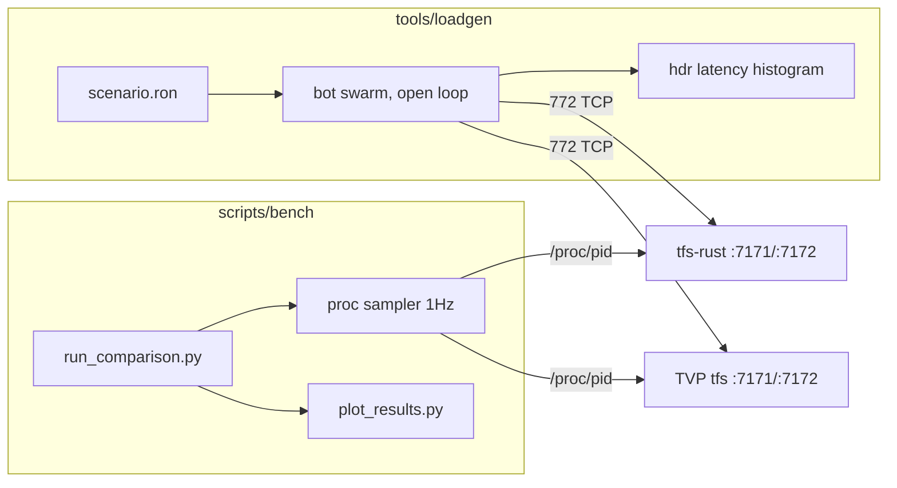

# Performance measurement plan

Status: Phase A–B done (core visibility + Criterion hot_paths). Tiers 2–4 not yet implemented.

Two distinct goals, deliberately separated because they want different instruments:

- **Engineering** — catch regressions per commit, and find what to optimize next.
- **Publishable comparison** — defensible evidence against the TVP C++ 7.72 server.

Building only the second (the earlier version of this plan) produces a number you generate
once and never regenerate, and gives the optimization loop nothing to work with. The tiers
below are ordered cheapest-first; each is useful on its own and each is a prerequisite for
the next.

| Tier | Instrument | Cost | Answers |
|---|---|---|---|
| 1 | Microbenches over hot paths | ~1 day | Did this commit slow down pathfinding / spectators / conditions? |
| 2 | `tfs-rust-sim` in-process load | ~2 days | How does the game thread scale with creature and player count? |
| 3 | Wire loadgen vs Rust only | ~1 week | What does the network + serialization + broadcast layer cost? |
| 4 | A/B vs TVP | ~1 week on top | How do we compare to the C++ reference? |

Tiers 1–2 run in CI. Tiers 3–4 are manual, pinned-host runs.

---

## Tier 1 — Microbenches (regression gate)

No benchmark harness exists in the workspace today: no `criterion`, `divan`, `iai`, or
`[[bench]]` in any `Cargo.toml`, and no `benches/` directory. Add Criterion
(`default-features = false`) to `tfs-rust-core` and cover the paths that `GameObs` already
identifies as hot (`crates/tfs-rust-core/src/obs.rs:100-152` tracks exactly these). Benches
compile as an external crate, so they reach **pub API only** — `pathfinding::get_path_matching`
and `SparseGrid::collect_spectators` already qualify; `todo_queue` must become `pub mod`:

- pathfinding (`path_us` is the largest subsystem histogram under chase load)
- spectator set resolution
- condition / skill ticks
- ToDo heap push/pop under synchronized-due load

Wire into CI as a threshold check, not a chart. Cheap, deterministic, per-commit.

## Tier 2 — In-process load via `tfs-rust-sim`

The threading invariant makes the single game thread the scaling limit, so the bottleneck
can be saturated **without any network, DB, login cap, or anti-flood involvement** — and
deterministically.

`crates/tfs-rust-sim` owns scenario builders, the wall clock, and `chase_kite_sim`. Core `test_support` stays as unit-test fixtures. Seed with `world.seed_parity_rng(42)`. Tick via `GameWorld::advance_beat(beat_ms)` — the full `AdvanceGame` beat that production runs and that `GameObs::record_subsystems` feeds. (Parity `.scenario` runs keep `move_creatures` per `docs/SIM_HARNESS.md` §3.3; the load sweep is not a parity contract.) New code goes in focused sim modules (`population.rs`, `sweep.rs`, bin `scale_sweep`), not into `world.rs` / `scenario.rs`.

Core prerequisite (Phase A): `pub mod obs` / `pub mod todo_queue`; read-only `GameWorld::obs()` / `take_obs_window()`. Nothing else in core changes.

Deliverable: a scaling sweep over synthetic populations (N monsters chasing, N players in
combat, N spectators per broadcast), reporting beat wall time and per-subsystem µs from
`GameObs`. This is where optimization work actually gets its feedback.

**Flamegraphs belong here, as a first-class tool, not an appendix.** A flamegraph of two
unrelated binaries side by side proves nothing to a reader — that argument holds, and is why
flamegraphs are not a *comparison* artifact. But a flamegraph of our own binary under Tier 2
load is the primary instrument for making it faster. Add `scripts/profile_sim.sh` wrapping
`cargo flamegraph` over the sim binary.

## Tier 3 — Wire loadgen against the Rust server

Only now is a synthetic 772 client worth building, and it is worth building against our own
server first — it exercises the network, serialization, spectator fan-out, output-queue
backpressure, and login throughput that Tier 2 cannot reach.

### `tools/loadgen` (new workspace member)

New crate `tools/loadgen` (bin `tfs-loadgen`), added to `members` in `Cargo.toml` (currently
`crates/*` plus `tools/packet-proxy` only). Reuses `tfs-rust-net` and `tfs-rust-common`;
does **not** touch `tfs-rust-core`.

Missing primitive: client-side RSA. `crates/tfs-rust-net/src/rsa.rs` has raw `decrypt` (:18)
and no `encrypt`. Add the mirror:

```rust
/// Raw 1024-bit RSA block encrypt: `m^e mod n`. Client side of `decrypt`.
pub fn encrypt(block: &[u8; 128], n: &BigUint, e: &BigUint) -> Result<[u8; 128]>
```

Everything else is reuse: `xtea_tfs::{expand_key, encrypt, decrypt}`,
`protocol_game::encrypt_xtea_game_frame`, `game_frame::read_sized_payload`, opcode tables in
`tfs-rust-common/src/protocol_opcodes.rs`.

Session driver mirrors the server flow in `crates/tfs-rust-net/src/server.rs`
(`handle_login_connection`, `handle_game_connection`): connect 7171, RSA first packet, read
char list, connect 7172, game first packet, then opcode stream.

**Inbound handling:** deliberately minimal. Parse only self-id/position from the login packet
and `0x6C` / `0x6D` move updates so bots stay spatially coherent; everything else is
length-framed, byte-counted, discarded. A full client decoder is out of scope.

### Latency measurement — open loop, mandatory

Each bot's actions are scheduled at **fixed intended wall-clock times** from a per-bot seeded
schedule. Latency is measured from the *intended* send time, not the actual send time.

This is not a detail. A closed-loop bot that waits for a response before issuing its next
action stops generating load exactly when the server stalls, so the histogram records a few
slow samples instead of the backlog a real player population would have suffered — the
classic coordinated-omission bias, routinely worth an order of magnitude in the tail. Any p99
produced by a closed-loop bot is not publishable.

If a prior action is still outstanding when the next is due, the wait counts toward the next
action's latency. Use the `hdrhistogram` crate (new dependency) — `obs.rs`'s `FixedHistogram`
geometric buckets are fine for diagnosis but too coarse to publish percentiles from.

Correlation rule must be defined per action type, not left as "first correlated frame":
walk-step ack is a `0x6C`/`0x6D` for our own creature id; spell/rune effect is the magic-effect
frame at the target tile. Two tracked SLOs, those two.

### Loadgen validation (before any number is trusted)

- **Prove the client's own ceiling.** Drive the loadgen against a null echo server and find
  where it saturates. If that is near the intended bot count, we are measuring the client.
- **Prove the byte stream is real.** The loadgen encodes what *our server* believes 772 looks
  like. Record a genuine client session through the existing `tools/packet-proxy` and validate
  the loadgen's output against that capture. Without this, a protocol divergence silently
  becomes a different workload in Tier 4.

### Behaviour scenarios

Declarative `bench/scenarios/*.ron` (`ron` is already a workspace dependency, `Cargo.toml:49`).
Weighted role mix over the bot population, seeded per-bot RNG for reproducibility:

- walker (pathing churn, spectator recalculation)
- melee hunter (target acquisition, combat ticks)
- spell caster (Lua + combat pipeline)
- rune thrower, single-target
- AoE rune thrower (worst case: area resolution × spectator broadcast)
- chat / look / trade noise

Baseline scenario `bench/scenarios/mixed_300.ron` is the 300-player mixed workload; each role
is also runnable in isolation to attribute cost. **Scenario files are versioned and frozen
before a publication run** — the headline number is meaningless if the mix drifts.

---

## Tier 4 — A/B against TVP

Both servers speak the same 772 wire protocol, so one synthetic client drives both and the
measurement instrument is identical on each side. That is what makes the comparison
defensible — and it only works once Tier 3 has proven the client itself.


```mermaid
flowchart LR
  subgraph loadgen [tools/loadgen]
    Scenario[scenario.ron] --> Swarm[bot swarm, open loop]
    Swarm --> Latency[hdr latency histogram]
  end
  subgraph orch [scripts/bench]
    Runner[run_comparison.py] --> Sampler[proc sampler 1Hz]
    Runner --> Plot[plot_results.py]
  end
  Swarm -->|772 TCP| Rust[tfs-rust :7171/:7172]
  Swarm -->|772 TCP| TVP[TVP tfs :7171/:7172]
  Sampler -->|/proc/pid| Rust
  Sampler -->|/proc/pid| TVP
```

### Artifacts

- **Load curve** — X: concurrent bots (25/50/100/200/300/400/600). Y: CPU%, RSS, p99 action
  latency. Two lines per chart. Finds each server's knee. A single snapshot would hide
  scaling behaviour, which is the interesting part.
- **Steady-state time series** — 1 Hz samples during a fixed 300-bot run.
- **Overload behaviour** — one run past each server's knee. Graceful degradation versus
  collapse is arguably a more interesting claim than the knee itself.
- **Soak** — one long run at 200 bots for memory growth. A single RSS reading does not support
  a memory claim; an hour of flat RSS does.
- **Headline numbers** — (a) max concurrent bots sustained at walk-ack p99 under 100 ms on the
  frozen mixed scenario, and (b) CPU-seconds per delivered action.

### Why work-normalized CPU is required

TVP is asio-multithreaded; the Rust server is one game thread plus Tokio I/O. Comparing total
CPU% rewards or punishes that difference rather than measuring efficiency. Report raw CPU%
*and* CPU-seconds per delivered action / per outbound byte.

### Orchestrator and sampling — `scripts/bench/`

- `run_comparison.py` — start target server, wait for readiness, warm up, ramp bots, sample,
  tear down, write `results/<timestamp>/<server>/<bots>/`.
- `sample_proc.py` — 1 Hz from `/proc/<pid>`: `utime`/`stime`, RSS + PSS from `smaps_rollup`,
  thread count, per-thread CPU (separates TVP's dispatcher from its asio threads), ctx
  switches, `/proc/<pid>/io`, **and bytes/packets sent** (`/proc/<pid>/net/dev` or socket
  counters). Language-agnostic, so identical treatment of both servers.
- `plot_results.py` — matplotlib charts from the raw CSVs. (No Python plotting exists in
  `scripts/` today; existing scripts are stdlib + subprocess.)

Missing today, also needed: `scripts/build_tvp.sh` and `scripts/run_tvp.sh` (TVP has no repo
wrapper; build is CMake Release from `reference/tvp-772/gameserver/`).

Rust-side `GameObs` (`RUST_LOG=tfs_obs=info`, `beat_wall_ms`) is captured for **diagnosis
only** — TVP has no equivalent, so it never appears in a head-to-head chart.

### Fairness controls

This is what the comparison will be attacked on, so it is a first-class deliverable in
`docs/PERF_BENCHMARK_METHODOLOGY.md`:

- Same host, **alternating** A/B/A/B runs, never concurrent. 3+ repetitions, report median and
  spread.
- Both servers pinned to the same cpuset; loadgen on a separate cpuset (or separate machine)
  with its own CPU measured to prove it is not the bottleneck.
- CPU governor `performance`; document CPU model, kernel, RAM. `CLOCK_MONOTONIC` for all
  client-side timing.
- Both Release: TVP `-DCMAKE_BUILD_TYPE=Release` with IPO; Rust `--release`. Document any
  asymmetric flags.
- Normalize persistence: TVP `enablePlayerDataFiles = true`
  (`reference/tvp-772/gameserver/config.lua.dist:151`) writes player files while Rust saves to
  DB. Either disable saves on both or measure and disclose.
- Warmup discarded (first 30 s).
- Publish raw CSVs plus the harness itself.

### Content equivalence — a validity gate, not a disclosure

Shared OTBM (already byte-identical), spawns converted via
`scripts/convert_tvp_spawns_to_tfs.py`, same monster set. But `items.otb` differs and the
Lua/script trees are separate, which means the two servers may do genuinely different amounts
of work per action — the AoE rune role, our designated worst case, is exactly where the script
trees diverge most.

So this is gated, not footnoted: **run every role at very low load first and assert equivalent
observable outcomes** — same damage numbers, same creature counts, comparable packet counts
per action. If the two servers do not match at 5 bots, the 300-bot chart is not measuring what
it claims to. Document whatever residual delta survives that check.

### Known risks

- **Bulk accounts.** 300 logins need seeded accounts/characters in both DBs. Extend
  `scripts/seed_test_account.sql` into a generator.
- **Login ramp.** Rust caps at `MAX_CONCURRENT_LOGIN_LOADS = 8`
  (`crates/tfs-rust-core/src/login.rs:344`). Ramp gradually; report login throughput as its own
  metric rather than letting it distort steady state.
- **Anti-flood.** TVP connection timers and rate limits may drop bots that ignore cooldowns.
  Bots must respect action cooldowns or results are invalid. Note the tension with open-loop
  scheduling: cooldowns constrain the *schedule*, they never suppress a due action's timestamp.
- **Spawn density** must be verified equal, or monster count silently drives the difference.
- **Server-side RNG** (loot, combat) differs between the two servers. Verify the headline
  metrics are insensitive to it, or fix seeds where each server allows.

---

## Sub-agent split

Per `.cursor/rules/TFS-subagents.mdc`: sub-agents are **research only** (C++/wire tracing,
codebase citations, read-only `cargo test` verification). The parent writes every file —
microbench suite, RSA encrypt + session driver, scenario engine, orchestrator/sampler, TVP
build scripts — and owns `tasks/todo.md` and `tasks/lessons.md`.

# Perf benchmark suite — `docs/PERF_BENCHMARK_PLAN.md` (2026-09-12)

Tiers 1–2 first (engineering loop), Tier 3 spike early (riskiest assumption), Tier 4 last. Sim harness is now `crates/tfs-rust-sim` (depends on core, never the reverse) — Tier 2 lives there, not in core.

**Crate placement (No god files):** Tier 1 → `crates/tfs-rust-core/benches/` (external crate, **pub API only**). Tier 2 → `tfs-rust-sim` new modules `population.rs` + `sweep.rs` + bin `scale_sweep` (`autobins = false` → explicit `[[bin]]`); do **not** grow `world.rs` (705) / `scenario.rs` (862) / `chase_kite_sim.rs` (954). Tier 3 → `tools/loadgen`. Tier 4 → `scripts/bench/`.

**Sub-agents:** research only (`TFS-subagents.mdc`); parent writes every file. Plan §"Sub-agent split" is superseded.

**Decisions (defaults; flag if you disagree):**
- Tier 1 harness = Criterion (`default-features = false`, no plotters/rayon). CI gate = median vs cached `main` baseline, fail at +25% (runner noise). Fallback if it flaps: `iai-callgrind` instruction counts.
- Tier 2 sweep drives **`advance_beat(50)`** (full `AdvanceGame`, `MechanicsProfile.beat_ms = 50`, `formulas.rs:578`) — that is what production runs and what `record_subsystems` feeds. Parity `.scenario` runs keep `move_creatures` per `docs/SIM_HARNESS.md` §3.3; the sweep is not a parity contract.
- Core API widening is limited to read-only obs access + `ToDoQueue` visibility. No new `impl GameWorld` clusters.

## Phase A — core visibility (prereq, ≤ 40 lines)
- [x] `lib.rs`: `mod obs` → `pub mod obs`; `mod todo_queue` → `pub mod todo_queue`
- [x] `obs.rs`: un-gate `FixedHistogram::{samples, max}` (drop `#[cfg(test)]`); keep `reset` test-only
- [x] `GameWorld::obs(&self) -> &GameObs` + `GameWorld::take_obs_window(&mut self) -> GameObs` (`std::mem::take`, preserves `commands_processed_total` like `reset_window`) — put next to `advance_beat` in `game_world_tick.rs`, not `game_world.rs`
- [x] Verify: `rtk cargo check -p tfs-rust-core`, existing `obs` tests

## Phase B — Tier 1 microbenches (`crates/tfs-rust-core`)
- [x] `Cargo.toml`: `[dev-dependencies] criterion = { version = "0.5", default-features = false }`; `[[bench]] name = "hot_paths" harness = false`
- [x] `benches/hot_paths.rs` — one file, four groups, synthetic fixtures built from pub types (`Map`, `SparseGrid`, `Tile::Normal`/`TileBody`, ~15-line arena helper; mirror `path_compare.rs` for params):
  - `pathfinding` — `pathfinding::get_path_matching` on arena r=16/32/64, straight + obstacle wall; params via `monster_path_search_params`-equivalent literal (`monster_ai.rs:1423`)
  - `spectators` — `SparseGrid::collect_spectators` (`map/grid.rs:201`) with 1k / 10k registered creatures, 18×14 view box (`range_x=8, range_y=6`)
  - `condition_tick` — `condition::dot_tick_for_condition` (`condition.rs:309`) fire/energy cycles (poison is not this fn; no API widen)
  - `todo_heap` — `ToDoQueue::insert` N same-key (synchronized-due) then `pop` drain, N=1k/10k (`todo_queue.rs:37/73`)
- [x] `scripts/bench/check_regression.py` — stdlib only; walk `target/criterion/**/new/estimates.json` median vs sibling `main/`, fail > +25%, print table; skip if no `main/` baseline
- [x] `.github/workflows/ci.yml` new job `bench_gate`: `actions/cache` `target/criterion` keyed `bench-${{ github.base_ref || github.ref_name }}`; main push → `cargo bench -p tfs-rust-core --bench hot_paths -- --noplot --save-baseline main`; PR → `--baseline main` + `check_regression.py`. Non-blocking (`continue-on-error`) until 2026-09-26, then required.
- [x] Verify: `rtk cargo bench -p tfs-rust-core --bench hot_paths -- --noplot --quick`; `rtk cargo clippy -p tfs-rust-core --all-targets -- -D warnings`

## Phase C — Tier 2 scaling sweep (`crates/tfs-rust-sim`)
- [ ] `src/population.rs` — synthetic populations on top of `world.rs` helpers (no edits there):
  - `spawn_monster_ring(world, mtype|name, n, center, radius)` via `insert_monster_from_type` / `insert_monster`, then `appear_monsters` batch so they acquire the hero as target (chase load → `path_us`)
  - `spawn_player_grid(world, n, center)` via `sim_hero_player` + `insert_player` + `register_conn_mapping(ConnId(i), cid)` so spectator fan-out fills `pending_outgoing` (pub) — sweep drains + byte-counts it per beat
  - `queue_random_walks(world, players, rng)` via `player_move_request` for the players axis
- [ ] `src/sweep.rs` — `SweepAxis { Monsters, Players, Spectators }`, `SweepPoint { n, beats, warmup }`, `SweepResult { beat_wall_us p50/p95/p99/max, creatures/skills/todo/path µs percentiles, path_searches, outgoing_bytes_per_beat }` from `take_obs_window()`; serde/`ron` or hand-rolled JSON (match `chase_jsonl.rs` style — no new serde dep unless already transitive)
- [ ] `src/bin/scale_sweep.rs` + `[[bin]]`: `--axis monsters|players|spectators --points 50,100,200,400,800 --beats 600 --warmup 100 --map synthetic|otbm --seed 42 --out results/sweep_<axis>.json`; `seed_parity_rng(seed)` once; synthetic arena via `beat_driven_world_for_kite_synthetic`, real map via `beat_driven_world_from_map` (`TFS_DATA_DIR`, `TFS_MAP_OTBM`)
- [ ] `scripts/profile_sim.sh` — checks `cargo flamegraph` + `perf` (neither installed locally: `pacman -S perf`, `cargo install flamegraph`), sets `CARGO_PROFILE_RELEASE_DEBUG=true`, runs `cargo flamegraph -p tfs-rust-sim --bin scale_sweep -- <args>` → `results/flamegraph_<axis>_<n>.svg`
- [ ] `scripts/bench/plot_sweep.py` (matplotlib, optional import) — N vs beat wall p99 + stacked subsystem µs
- [ ] `docs/SIM_HARNESS.md` §3.3 one-line note: perf sweep uses `advance_beat`; parity scenarios do not
- [ ] Tests (`src/sweep_tests.rs`): 50-monster synthetic point runs 20 beats, `beat_wall` histogram has 20 samples, `path_searches > 0`; players axis produces `outgoing_bytes_per_beat > 0`
- [ ] Verify: `rtk cargo run -p tfs-rust-sim --release --bin scale_sweep -- --axis monsters --points 50,200 --beats 100`; `rtk cargo test -p tfs-rust-sim`

## Phase D — Tier 3 spike, then loadgen
- [ ] **Spike** `rsa.rs`: `pub fn encrypt(block: &[u8; 128], n: &BigUint, e: &BigUint) -> Result<[u8; 128]>` (`num-bigint-dig` `modpow`, mirror of `decrypt` `rsa.rs:18`); `pub fn public_parts(&RsaPrivateKey) -> (BigUint, BigUint)`; round-trip unit test
- [ ] **Spike** one bot (`tools/loadgen`, minimal): login 7171 → `0x01` + OS + ver + 12 skip + RSA[`0x00`, xtea key ×4 LE, u32 account, string pw] (`game_first_packet.rs:176/293`) → framed reply, parse `0x64` char list (772: **no Adler**, `protocol_version.rs:79`) → game 7172 → `0x0A` + OS + ver + RSA[`0x00`, key, gm u8, u32 acc, string char, string pw] (`game_first_packet.rs:346/390`) → XTEA loop (`xtea_tfs::{expand_key, encrypt, decrypt}`, `read_sized_payload`, `encrypt_xtea_game_frame`) → walk N/S. Must work against **both** Rust and TVP before anything below
- [ ] `tools/loadgen` workspace member (bin `tfs-loadgen`): deps `tfs-rust-net`, `tfs-rust-common`, `tokio`, `clap`, `hdrhistogram`, `ron`, `rand`; **no** `tfs-rust-core`
- [ ] Inbound parse: self id from `self_appear` `0x0A`, own pos from `MAP_DESCRIPTION` `0x64` header, `0x6D` creature move / `0x6C` remove (raw bytes — no named server consts exist, `codec/v772.rs:339`); all else length-framed + counted
- [ ] Open-loop scheduler (intended-time latency, `CLOCK_MONOTONIC`), `hdrhistogram`; correlation: walk-ack = `0x6D` for self id; spell/rune = `MAGIC_EFFECT` `0x83` at target tile; JSON per run
- [ ] Validation: null-echo ceiling bin; byte diff vs `tools/packet-proxy` text hex log (`logger.rs:42`) — small converter `scripts/bench/proxy_log_to_frames.py`
- [ ] `bench/scenarios/*.ron` — walker, melee, caster, rune, aoe_rune, noise; `mixed_300.ron`; per-bot seeded RNG; frozen before publication
- [ ] Respect server gates: login cap `MAX_CONCURRENT_LOGIN_LOADS = 8` (`login.rs:348`) → ramp ≤ 8/s; `RecordTalk` 2.5 s window (`chat_talk.rs:100`); `earliest_walk_server_ms`

## Phase E — Tier 4 (plan tasks 9–16, unchanged order)
- [ ] Bulk account/char seeding (extend `scripts/seed_test_account.sql` → generator; Rust `schema.sql` + TVP `schema.sql`)
- [ ] `scripts/build_tvp.sh` / `scripts/run_tvp.sh`
- [ ] Content-equivalence gate at 5 bots (damage numbers, creature counts, packets/action)
- [ ] `scripts/bench/sample_proc.py`, `run_comparison.py`, `plot_results.py`
- [ ] `docs/PERF_BENCHMARK_METHODOLOGY.md`
- [ ] Execute: load curve, steady state, overload, soak

Verify every phase: `rtk cargo check --workspace`, `rtk cargo clippy --workspace --all-targets -- -D warnings`, `rtk cargo test -p tfs-rust-core -p tfs-rust-sim`, `python3 scripts/run_sim_battery.py` (Tier 2 must not move parity JSONL).