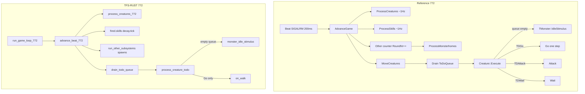
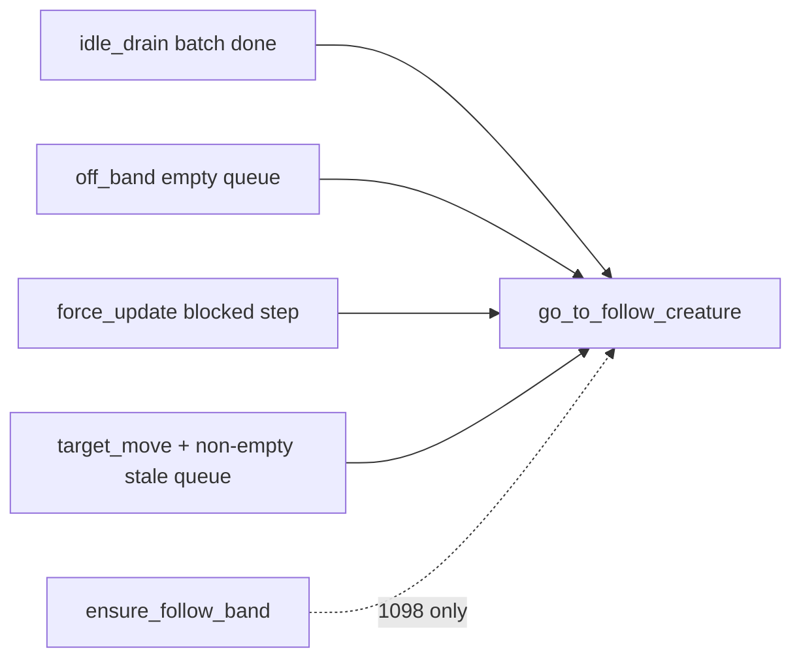
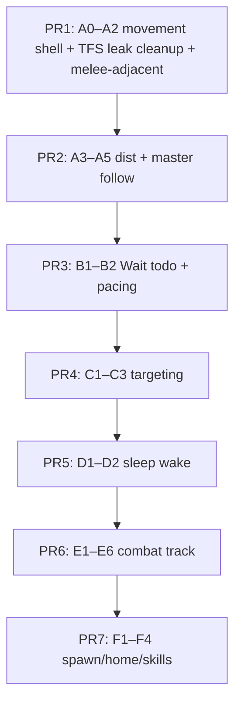
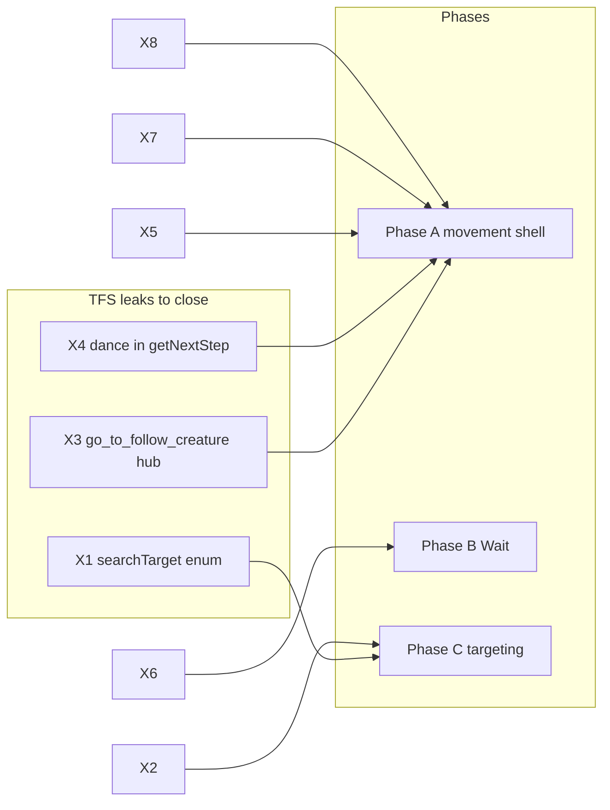

# TFS-RUST 7.72 Monster AI — Comprehensive Gap Audit

**Date:** 2026-06-11  
**Scope:** Full 772 monster AI parity vs `tibia-game-master` decompiled C++ (`crnonpl.cc`, `cract.cc`, `crmain.cc`, `crcombat.cc`, `main.cc`)  
**Related:**
- [TFS-RUST_772_Chase_Path_Parity_Gaps.md](TFS-RUST_772_Chase_Path_Parity_Gaps.md) — live chase-path evidence, synthetic harness, Jun 8 replay metrics
- [TIBIA_GAME_MASTER_DEV.md](TIBIA_GAME_MASTER_DEV.md) — reference stack setup, chase debug env vars

---

## Executive summary

772 monster AI is a **two-clock system**:

1. **~1 Hz think** — `process_creatures_772` → `monster_on_think` (target list hygiene, spawn range, idle status, look-only `do_attacking`).
2. **Beat-driven walk** — `advance_beat_772` (200 ms) drains the global `ToDoQueue`; when a monster's action list empties, `monster_idle_stimulus` runs the reference `IdleStimulus` body (chase, flee, dance, roam, combat setup).

**What is largely ported:** subsystem stagger (`SubsystemCounters772`), global min-heap todo queue, `Go`-only execution chain, reverse-terrain `TShortway`, repath hysteresis on target move, walk delay quantizer (`NotifyGo` beat ceil), 772 look gating while chasing.

**Largest remaining debt:**

| Area | Status |
|------|--------|
| IdleStimulus movement branches (melee-adjacent, dist_chase budget) | ❌ Open — see [§5](#5-movement-branch-gaps-idlestimulus-walking) |
| ToDo `Attack` / `Wait` actions | ❌ Missing — `CreatureAction::Go` only |
| Combat loop (melee damage, spell cast in idle) | ❌ Stub |
| Weighted race `Strategy[]` targeting | ❌ TFS-shaped |
| `SLEEPING` / `PANIC` / `ATTACKING` state machine | ❌ `is_idle` boolean only |
| Chase pathfinder + repath cadence | ✅ Mostly resolved — see [chase doc](TFS-RUST_772_Chase_Path_Parity_Gaps.md) |
| TFS 1098 APIs on 772 path (`getDistanceStep`, `getDanceStep`, think-repath, …) | 🟡 Partially gated — see [§10](#10-tfs-1098-api-leak-audit) |

### Keep-distance policy (Rust vs decompile literals)

The decompiled C++ uses **literal `4`** in the ranged branch (`Distance < 4`, `== 4`, `> 4`; `ToDoGo(..., max: Distance - 4)`) because classic distance fighters in that build keep chebyshev **4**. **Do not hardcode `4` in Rust.**

| Concept | C++ (`crnonpl.cc`) | Rust source | Parity rule |
|---------|-------------------|-------------|-------------|
| Keep band | Implicit `4` for `DistanceFighting` | `Monster.target_distance` from `monsters.xml`, via `monster_effective_target_distance()` (`MechanicsProfile.distance_keep` may force Fixed) | Same **shape** of logic, **per-type** band |
| Too close | `Distance < 4` → `dist_flee` | `cheb < target_distance` → flee / `SearchFlightField` | Match |
| At band | `Distance == 4` → `dist_dance` | `cheb == target_distance` → lateral dance + Wait | Match |
| Too far | `Distance > 4` → `dist_chase` | `cheb > target_distance` → chase | Match |
| Chase batch size | `max: Distance - 4` | `max: cheb - target_distance` (cap/path trim per `TShortway` rules) | Match formula, not literal 4 |
| Melee | `Distance > 1` / `== 1` dance | `target_distance <= 1`: `cheb > 1` chase, `cheb == 1` `melee_dance` | Match |

Everything else in the dist/melee branch order (flee before chase, `SearchFlightField`, `ToDoWait(1000)` after dance, idle vs `getNextStep` placement) still follows the decompile — only the band number comes from the monster file.

### Path failure policy (no TFS A* fallback on 772)

772 monster chase uses **`TShortway` only** (`cract.cc:1067`). When `Calculate` fails, `ToDoGo` clears the todo list and throws **`NOWAY`** (`cract.cc:1068–1076`) — there is **no** forward TFS A* retry.

| Outcome | C++ (`crnonpl.cc` / `cract.cc`) | Rust today | Target |
|---------|--------------------------------|------------|--------|
| `TShortway` fails in `ToDoGo` | `ToDoClear()` + `NOWAY` | `path_forward_fallback = false` → `get_path_matching` returns `None` ✅ | Keep |
| Relaxed / second-chance A* | **None** on 772 | Relaxed `fpp` retry gated to `!beat_driven_loop` only ✅ | Keep |
| Greedy one-tile closer step | **None** | `monster_try_any_closer_step` still runs on 772 (`monster_ai.rs:565`) ❌ | **Remove on 772** (X11) |
| `getDistanceStep` / `getDanceStep` fallback | **None** | Gated off 772 in `go_to_follow_creature` ✅ | Keep |
| After `NOWAY` in idle walk `try` | `Target = 0`; `ToDoClear()`; fall through to **roam** loop (`crnonpl.cc:2813–2863`) | `go_to_follow_creature` returns silently; no roam ❌ | **M11** |
| `SearchFlightField` fails (dist flee) | `ToDoWait(1000)` in-band (`crnonpl.cc:2766`) | Partial — not always Wait | M5 |
| `SearchFlightField` fails (panic flee) | Falls through to other idle branches (no immediate roam) | Differs | A4 |

**Policy:** On 772, do **not** call TFS forward A* (`path_matching_forward`), relaxed retry, or `monster_try_any_closer_step`. Path failure during chase should follow the reference exception path → clear chase state → idle **roam** section (or in-band `ToDoWait` for dist-flee only). `pathForwardFallback` stays **`false`** in `772.lua`.

---

## Architecture comparison



### Reference ↔ Rust module map

| C++ (`reference/cipsoft-772/tibia-game-master/src/`) | Rust | Parity |
|------------------------------------------------------|------|--------|
| `main.cc` `AdvanceGame` (~317) | `game_world_tick.rs` `advance_beat_772` | Mostly matched |
| `crmain.cc` `MoveCreatures` (~1106) | `walk/mod.rs` `drain_todo_queue` | Go drain OK; no Attack/Wait dispatch |
| `crmain.cc` `ProcessCreatures` (~1039) | `creature_think.rs` `process_creatures_772` | Partial — regen/logout subset only |
| `crmain.cc` `ProcessSkills` (~1094) | `advance_beat_772` → `decay.tick` | Partial — no per-creature `ProcessSkills` |
| `crnonpl.cc` `ProcessMonsterhomes` (~1396) | `spawn_lifecycle.rs` TFS XML spawns | Different model |
| `cract.cc` `Execute` → `IdleStimulus` (~758) | `idle_stimulus.rs`, `walk/mod.rs` | Partial |
| `crnonpl.cc` `TMonster::IdleStimulus` (~2297) | `idle_stimulus.rs` + `monster_ai.rs` | Partial |
| `crnonpl.cc` `DamageStimulus` (~2278) | — | **Missing** |
| `crnonpl.cc` `CreatureMoveStimulus` (~2866) | `monster_events.rs` | Partial — no sleep wake |
| `cract.cc` `TShortway` / `ToDoGo` | `pathfinding.rs`, `monster_ai.rs` | Algorithm OK; dispatch gaps |
| `crnonpl.cc` `Strategy[]` target roll (~2424) | `monster_targets.rs` | **TFS-shaped** |
| `crcombat.cc` `ToDoAttack` / `Attack` (~1325, ~530) | `creature_todo.rs`, `combat/mod.rs` | **Phase B deferred** |

---

## 1. Scheduler / ToDo queue gaps

| ID | Status | Gap | Reference | Rust | Sev |
|----|--------|-----|-----------|------|-----|
| S1 | ❌ Open | **ToDo action kinds incomplete** | `TDGo`, `TDAttack`, `TDWait`, `TDRotate`, … (`cract.cc:787`) | `CreatureAction::Go` only (`creature_todo.rs:6` — "Phase A: Go only. Attack/Wait deferred") | P0 |
| S2 | ❌ Open | **No `ToDoWait(1000)` pacing** | After roam, dist_dance, dist_flee fail, non-attacking branch, master dist 2–3 (`crnonpl.cc:2693–2807,2852,2861`) | Roam uses 1 s `last_step` gate in `monster_next_walk_step` only; no todo Wait | P1 |
| S3 | 🟡 Partial | **`ToDoYield` on damage/move wake** | `DamageStimulus` / sleeping `CreatureMoveStimulus` call `ToDoYield()` (`crnonpl.cc:2286,2871`; `cract.cc:1001`) | `request_idle_stimulus` / `force_update_follow_path` — different preemption semantics | P1 |
| S4 | ✅ OK | **`LockToDo` guard** | `IdleStimulus` returns if `LockToDo` (`crnonpl.cc:2298`) | `todo.locked` checked in `idle_stimulus` (`idle_stimulus.rs:27`) | — |
| S5 | ✅ OK | **Subsystem stagger** | Creature 1750 ms, skill 1250 ms, cron 1500 ms, other 1000 ms (`main.cc:331–347`) | `subsystem_counters_772.rs` thresholds | — |
| S6 | 🟡 Partial | **`ProcessSkills` vs decay** | Per-creature `Creature->ProcessSkills()` ~1 Hz (`crmain.cc:1094`) — skill timers, conditions, GO strength | `fired.skills` → `decay.tick` only; no monster skill/combat gate integration | P2 |
| S7 | 🟡 Partial | **`RoundNr` / monsterhomes** | `ProcessMonsterhomes` per round — timer decay, player-proximity spawn (`crnonpl.cc:1396`; `main.cc:353`) | TFS XML `SpawnManager` + `poll_spawn_respawns`; no `MonsterhomeInRange` engine | P2 |
| S8 | ✅ OK | **Lag skip guard** | `MoveCreatures` skipped when `Delay >= 1000` (`main.cc:444–451`) | `advance_beat_772` skips `drain_todo_queue` when `delay_ms >= 1000` (`game_world_tick.rs:62`) | — |
| S9 | ✅ OK | **Walk delay quantizer** | `NotifyGo`: `(Waypoints*1000)/GetSpeed()`, ceil to beat (`cract.cc:1369+`) | `walk_timing.rs` + `todo_start_go_delay` | — |

### Scheduler notes

- Reference `MoveCreatures` advances `ServerMilliseconds` **before** draining the heap (`crmain.cc:1107`). Rust advances `server_ms` in `advance_beat_772` then drains — same ordering.
- Reference `ToDoStart` sets `LockToDo`, computes `CalculateDelay()`, inserts `(ServerMilliseconds + Delay, creatureId)` (`cract.cc:985–998`). Rust mirrors via `schedule_creature_wakeup` + `todo_start_go_delay`.
- Reference `Execute` on empty todo list: `ToDoClear()` → `IdleStimulus()` (`cract.cc:764–767`). Rust: `creature_todo_queue_empty` → `idle_stimulus` (`walk/mod.rs:363–364`, `idle_stimulus.rs:317`).

**Fix direction (S1/S2):** Extend `CreatureAction` with `Wait { until_ms }` and `Attack`; port `ToDoAttack` enqueue from `IdleStimulus` combat tail; schedule Wait after roam/dist_dance per reference.

---

## 2. IdleStimulus state machine gaps

Reference `STATE` enum (`enums.hh`): `SLEEPING`, `IDLE`, `UNDERATTACK`, `PANIC`, `ATTACKING`. Rust uses `Monster.is_idle: bool` + `MonsterAiPhase` (informational only, not reference-gated).

| ID | Status | Gap | Reference | Rust | Sev |
|----|--------|-----|-----------|------|-----|
| I1 | ❌ Open | **SLEEPING monsters** | `TNonplayer` ctor sets `SLEEPING` (`crnonpl.cc:1517`); wake on player/wild-monster `CreatureMoveStimulus` (`crnonpl.cc:2875–2891`); sleep when no visible creatures (`crnonpl.cc:2497–2506`) | `is_idle=true` at spawn; wake via `monster_set_idle(false)` on opponent enter; **no move-wake for sleeping monsters** | P1 |
| I2 | ❌ Open | **`DamageStimulus` transitions** | Hit → `PANIC`/`UNDERATTACK` + `ToDoYield` (`crnonpl.cc:2278–2294`) | No damage stimulus handler; todos not yielded on hit | P1 |
| I3 | ❌ Open | **`ATTACKING` / `PANIC` gating** | Melee `ToDoGo` skipped when `ATTACKING`/`PANIC` (`crnonpl.cc:2731`); `SKILL_FIST > 0` sets `ATTACKING` (`crnonpl.cc:2705–2706`) | No equivalent; chase always via `go_to_follow_creature` in idle | P1 |
| I4 | ✅ OK | **Idle early return** | Sleeping monsters skip full idle body until awake | `monster_idle_stimulus` returns when `is_idle` (`idle_stimulus.rs:97`) | — |
| I5 | ❌ Open | **LifeEndRound summon despawn** | `LifeEndRound <= RoundNr` → `StartLogout` (`crnonpl.cc:2302–2306`) | Not implemented | P3 |
| I6 | 🟡 Partial | **Master distance despawn** | Player relog / z>1 / 30-tile box → despawn (`crnonpl.cc:2320–2344`) | `monster_think_summon_stub` only (`monster_ai.rs:921`) | P2 |
| I7 | 🟡 Partial | **Monsterhome out-of-range** | `MonsterhomeInRange` → logout in idle (`crnonpl.cc:2358`; radius per home `crnonpl.cc:1498`) | TFS `despawn_radius` Chebyshev 50 + teleport (`monster_ai.rs` `is_in_spawn_range`) | P2 |
| I8 | ❌ Open | **Random animal talk** | 1/50 roll, `RaceData.Talks` (`crnonpl.cc:2392–2417`) | Not implemented | P3 |
| I9 | 🟡 Partial | **Roam radius (`Radius`)** | Wild monsters: `MovePossible` blocks steps beyond `this->Radius` unless `ATTACKING`/`PANIC` (`crnonpl.cc:2122–2133`) | TFS `walk_to_spawn_radius` axis box; no per-monster roam radius from race | P2 |

**Fix direction (I1/I2):** Add `MonsterState` enum mirroring reference states; wire `CreatureMoveStimulus` sleep wake; hook combat damage into `DamageStimulus` + `ToDoYield`.

---

## 3. Target acquisition and loss gaps

| ID | Status | Gap | Reference | Rust | Sev |
|----|--------|-----|-----------|------|-----|
| T1 | ❌ Open | **Weighted `Strategy[]` roll** | Roll among NEAREST / LOWEST_HEALTH / MOST_DAMAGE / RANDOM from `RaceData.Strategy[]` (`crnonpl.cc:2424–2493`) | `monster_search_target` uses TFS `TargetSearchType` + random default; **no race weights, no MOST_DAMAGE** | P0 |
| T2 | ❌ Open | **`LoseTarget` random roll** | `random(0,99) < RaceData.LoseTarget` each idle when wild (`crnonpl.cc:2381`) | Not implemented | P1 |
| T3 | 🟡 Partial | **Target scan area** | `TFindCreatures(12, 12, …)` — 25×25 (`crnonpl.cc:2437`) | `MAP_MAX_VIEWPORT = 11` — 23×23 (`monster_ai.rs:33`) | P2 |
| T4 | 🟡 Partial | **Lose-target range** | `abs(dx), abs(dy) > 10` (`crnonpl.cc:2373–2374`) | Pruned via `creature_can_see` viewport 11 | P2 |
| T5 | 🟡 Verify | **Wild monster filter** | Skip non-player-controlled monsters (`crnonpl.cc:2450`) | TFS `isTarget` / friend logic | P2 |
| T6 | ✅ OK | **Weakest HP metric** | `Strategy == 1` → `-Target->Skills[SKILL_HITPOINTS]->Get()` | `WeakestTargetMetric::CurrentHp` in `MechanicsProfile` / `772.lua` | — |
| T7 | 🟡 By design | **Target acquire on enter** | `onCreatureFound` stops at list update (no immediate chase) | `monster_try_acquire_chase_target` on enter when not in login defer bucket (lesson #32) | Document |
| T8 | 🟡 Partial | **Master target inheritance** | `Target = Master.Combat.AttackDest` or master; master following clears target (`crnonpl.cc:2347–2355`) | `monster_think_summon_stub` partial | P2 |
| T9 | 🟡 Partial | **House zone on target** | `IsHouse` check on acquire/lose (`crnonpl.cc:2377,2466`) | PZ check in `monster_is_target`; house zone not mirrored | P2 |

**Fix direction (T1):** Parse race strategy weights from 772 monster definitions (`.mon` / `RaceData` equivalent); implement `monster_idle_select_target` with weighted roll + `damage_map` for MOST_DAMAGE.

---

## 4. Combat / attack gaps

| ID | Status | Gap | Reference | Rust | Sev |
|----|--------|-----|-----------|------|-----|
| C1 | ❌ Open | **`ToDoAttack` in todo queue** | After `Rotate(Target)` when `ATTACKING`/`PANIC` (`crnonpl.cc:2795–2800`); `ToDoAttack` → `CanToDoAttack` + optional `ToDoWait(100)` (`cract.cc:1325`) | `monster_do_attacking` only updates look (`monster_ai.rs:324`) | P0 |
| C2 | ❌ Open | **Melee damage execution** | `TDAttack` → `Attack()` → `CloseAttack` (`crcombat.cc:530+`) | `combat/mod.rs` stub; `combat/math.rs` formulas not wired to AI loop | P0 |
| C3 | ❌ Open | **Race spell casting in IdleStimulus** | `RaceData.Spells` loop with delay rolls, shapes (`crnonpl.cc:2521–2666`) | Monster XML `attack_spells` parsed; **no idle cast loop** | P1 |
| C4 | ❌ Open | **Attack/defense interval** | `DelayAttack(2000)` / defense gate (`crcombat.cc:523`; profile `attack_speed_ms`) | `attack_speed_ms = 0` in 772 profile; not wired to monster attacks | P1 |
| C5 | ✅ OK | **Player chase via combat** | `CanToDoAttack` enqueues `ToDoGo` for players (`crcombat.cc:496–508`) | N/A for monsters on 772 | — |
| C6 | 🟡 Partial | **`SetAttackDest` / chase mode** | `SetAttackDest`, `SetChaseMode(NONE/CLOSE)` before walk (`crnonpl.cc:2710–2726`) | `attack_target` / `follow_target` only; no chase mode enum | P2 |

**Fix direction (C1/C2):** Phase B todo queue — enqueue `CreatureAction::Attack` after movement batch; call `combat/math.rs` melee path on execute; gate with `EarliestAttackTime` equivalent.

---

## 5. Movement branch gaps (IdleStimulus walking)

Reference dispatch order: `crnonpl.cc:2676–2810` (flee → master follow → melee/dist branches → attack/wait → start).

Rust routes almost all chase through `monster_idle_prepare_and_enqueue_go` → `go_to_follow_creature` → `monster_try_apply_chase_path` (max 3 steps, `CHASE_PATH_MAX_STEPS`).

### Open gaps

| ID | Status | Gap | Reference | Rust | Sev |
|----|--------|-----|-----------|------|-----|
| M1 | ❌ Open | **Melee-at-adjacent (`melee_dance`)** | cheb≤1: random cardinal keeping dist=1 + `ToDoGo(must:1)` (`crnonpl.cc:2736–2753`) | Idle repath uses 2–3 step `shortway`; dance only in `monster_next_walk_step` on empty queue | **P0** |
| M2 | ❌ Open | **Shortway at cheb≤2** | Mostly 1-step cardinal (25/46 in snake replay) | Mostly 2–3 step batches (45/147) | **P0** |
| M3 | ❌ Open | **`dist_chase` step budget** | `ToDoGo(..., max: Distance - keepDist)` — keepDist **4** in reference (`crnonpl.cc:2769`) | Always `CHASE_PATH_MAX_STEPS = 3`; should be `cheb - target_distance` from monster type | P1 |
| M4 | ❌ Open | **`dist_dance` + Wait** | `Distance == keepDist` lateral + `ToDoWait(1000)` (`crnonpl.cc:2772–2791`) | Dance in `monster_next_walk_step`; no Wait; should use `cheb == target_distance` | P1 |
| M5 | 🟡 Partial | **`dist_flee` + Wait on fail** | `SearchFlightField` or `ToDoWait(1000)` (`crnonpl.cc:2762–2767`) | Flee via `search_flight_field` in `monster_next_walk_step`; idle flee uses full shortway | P1 |
| M6 | 🟡 Partial | **Master follow Wait** | Manhattan 2–3: `ToDoWait(1000)` only; else `ToDoGo(max:3)` (`crnonpl.cc:2691–2700`) | `monster_think_summon_stub` + generic follow; no Wait band | P2 |
| M7 | 🟡 Approx | **Roam pacing** | `ToDoGo` + `ToDoWait(1000)` (`crnonpl.cc:2850–2853`) | `branch: roam` logged; 1 s `last_step` gate in `monster_next_walk_step` | P2 |
| M8 | ❌ Open | **Diagonal `go_exec`** | 0% in snake replay | ~4.4% Rust — symptom of M1/M2 | P1 |
| M9 | 🟡 Partial | **`SetChaseMode`** | `CHASE_MODE_CLOSE` / `NONE` before walk (`crnonpl.cc:2710–2726`) | Not modeled | P2 |
| M10 | ❌ Open | **Kick boxes** | `CanKickBoxes` / `KickBoxes` (`crnonpl.cc:2897`) | Not implemented | P3 |
| M11 | ❌ Open | **Path failure → roam (not TFS fallback)** | `ToDoGo` / `TShortway` fail → `NOWAY` → `Target=0` → idle roam (`cract.cc:1068`, `crnonpl.cc:2813–2863`) | `monster_try_any_closer_step` greedy step on 772; no roam on shortway fail | P1 |

### Resolved movement / path items

Cross-reference: [TFS-RUST_772_Chase_Path_Parity_Gaps.md](TFS-RUST_772_Chase_Path_Parity_Gaps.md)

| Item | Status | Evidence |
|------|--------|----------|
| 772 todo `Go` execution | ✅ | `idle_stimulus.rs`, `creature_todo.rs`, `walk/mod.rs` |
| Repath cadence (`shortway/go_exec` ~0.43–0.47) | ✅ | Live snake replay Jun 8 |
| Queue trim (`truncate_cipsoft_chase_queue`) | ✅ | `monster_try_apply_chase_path`; unit test |
| TShortway linked-list expand | ✅ | 5/5 synthetics in `compare_chase_pathfinding.py` |
| Terrain `min_wp` (no 150; drawbridge 90) | ✅ | OTB patch + live logs |
| Look direction while chasing | ✅ | Gated in `idle_stimulus` / `on_walk_complete` |
| Roam debug `branch` | ✅ | `idle_stimulus.rs` |
| Target-move repath hysteresis | ✅ | `monster_chase_queue_stale`; empty queue not stale |
| No forward A* on 772 (`pathForwardFallback`) | ✅ | `772.lua` + `pathfinding.rs:216` |
| No relaxed A* retry on 772 | ✅ | `monster_try_apply_chase_path` uses `&[fpp]` only when `beat_driven_loop` |

### M1/M2/M8 — chase evidence summary (from chase doc)

Do **not** duplicate full replay tables here. Key numbers from Jun 8 snake session:

| Metric | Reference | Rust (latest) |
|--------|-----------|---------------|
| `shortway` / `go_exec` | ~0.47 | ~0.46 ✅ |
| Diagonal `go_exec` | 0/97 (0%) | 14/319 (4.4%) ❌ |
| `melee_dance` at cheb≤1 | 6 | 5 |
| `shortway` at cheb≤2 | 25 (mostly 1-step) | 45 (mostly 2–3 step) |
| Exact `(start, dest, steps)` match | — | 1 / 147 |

**Fix direction (M1/M2):** In `monster_idle_stimulus` / `monster_idle_prepare_and_enqueue_go`, before `go_to_follow_creature`, branch cheb≤2 through reference-shaped `melee_dance` (cardinal, `must:1`) or 1-step shortway — not 3-step `melee_chase` batch.

---

## 6. Event / repath trigger gaps

| ID | Status | Gap | Reference | Rust | Sev |
|----|--------|-----|-----------|------|-----|
| E1 | ✅ OK | **Target-move repath** | Monsters: wake/yield only; no per-tile follow repath (`CreatureMoveStimulus` + idle drain) | Stale-queue hysteresis + `request_idle_stimulus` (`monster_events.rs`) | — |
| E2 | ✅ OK | **1098 `hasFollowPath` on move** | TFS repaths when `hasFollowPath` | Gated off 772 via `beat_driven_loop` | — |
| E3 | ✅ OK | **Blocked step repath** | `forceUpdateFollowPath` | `force_update_follow_path` → idle repath (`idle_stimulus.rs`) | — |
| E4 | ✅ OK | **Think vs idle split** | Chase in `IdleStimulus` only | `monster_native_on_think` skips chase when `beat_driven_loop` | — |
| E5 | 🟡 Partial | **Sleeping monster move wake** | `CreatureMoveStimulus` → `IDLE` + `ToDoYield` (`crnonpl.cc:2875–2891`) | List update only; no yield/state transition | P1 |

772 repath triggers (final, post Jun-8 fix):



---

## 7. Spawn / monsterhome gaps

| ID | Status | Gap | Reference | Rust | Sev |
|----|--------|-----|-----------|------|-----|
| H1 | 🟡 Partial | **Monsterhome spawn engine** | `ProcessMonsterhomes`: per-home timer, player proximity shrinks spawn radius (`crnonpl.cc:1396`) | TFS XML spawn slots + respawn timers | P2 |
| H2 | 🟡 Partial | **Spawn starts SLEEPING** | `CreateMonster` → `TNonplayer` ctor `SLEEPING` (`crnonpl.cc:1517`) | Monster spawns `is_idle=true` (similar semantics, different wake rules) | P2 |
| H3 | ✅ OK | **Death notifies home** | `NotifyMonsterhomeOfDeath` (`crnonpl.cc:1474`) | TFS spawn slot `current` clear + respawn timer | — |
| H4 | 🟡 Partial | **MovePossible home radius** | Blocks roam outside home unless attacking (`crnonpl.cc:2122`) | `is_in_spawn_range` on think; walk not gated by home radius mid-roam | P2 |

---

## 8. Logging / compare tooling gaps

| Gap | Reference | Rust |
|-----|-----------|------|
| Monster names | `"a snake"` | `"Snake"` |
| Chase repath signal | `todo_go` (`max:3`, `must:0`) + `shortway` | `shortway` + optional `branch: melee_chase` |
| `branch` semantics | IdleStimulus arm only (`roam`, `melee_dance`, …) — **not** melee chase | `go_to_follow_creature` logs `melee_chase` per repath (Rust-only) |
| `branch/go_exec` metric | ~0.22 | ~0.47 — **invalid for parity** |
| Controlled lock-step replay | — | 🟡 Partial — footprint overlap only |

### Logging semantics (critical)

| `evt` | Reference | Rust |
|-------|-----------|------|
| `branch` | IdleStimulus chose roam / dance / dist arm — **not** melee chase | `go_to_follow_creature` logs `melee_chase` / `dist_chase` / `flee` + `reason` |
| `todo_go` | `ToDoGo` (`via`: `enter`, `single`) | `idle_enqueue_go_and_start` (`via`: `idle_drain`, `roam`, …) |
| `shortway` | `TShortway::Calculate` | `monster_try_apply_chase_path` |
| `go_exec` | `TCreature::Go` | `on_walk` step executed |

**Valid parity metrics:** `shortway/go_exec`, `diag` on `go_exec`, `min_wp` distribution, fuzzy `(start, dest, steps)` on `shortway`.  
**Invalid:** `branch/go_exec` (different semantics).

---

## 9. Priority roadmap

### Severity index (unchanged)

| Severity | Gap IDs | Theme |
|----------|---------|-------|
| **P0** | M1, M2, C1, C2, T1, S1 | Melee dispatch; attack todo + damage; strategy roll; full todo kinds |
| **P1** | S2, S3, M3–M5, M8, I1–I3, T2, C3, C4, E5 | Wait pacing; dist branches; diagonals; sleep/damage wake; lose target; spells |
| **P2** | I6, I7, I9, M6, M7, T3, T4, T8, T9, S6, S7, H1, H2, H4, M9, C6 | Master/home; scan radius; skills; chase mode |
| **P3** | I5, I8, M10 | Summon lifetime; animal talk; kick boxes |

Severity (P0–P3) measures **parity impact**. **Implementation order** below is a separate axis: what to ship in which PR, and what is blocked on combat.

### Combat dependency split

| Track | Can start now? | Gap IDs |
|-------|----------------|---------|
| **Pre-combat** | Yes — movement, Wait todo, targeting (partial), sleep wake | M1–M7, M8, S2, T1 (partial), T2–T4, T8–T9, I1, E5, S3 (move half) |
| **Combat-gated** | No — needs damage loop, `ToDoAttack`, or spell impacts | C1–C4, C6, I2, I3, T1 (MOST_DAMAGE), S1 (Attack half), M9 (chase mode) |

~60% of open gaps are pre-combat. The largest verifiable win before combat is **M1/M2** (chase_path.log compare).

---

### Implementation order (numbered)

Work top-to-bottom. Each step should land with tests and/or live log compare where noted.

#### Phase A — IdleStimulus movement (pre-combat, highest ROI)

| Step | Gap IDs | Work | Verify |
|------|---------|------|--------|
| **A0** | **X3–X5, X7, X8, X11, M11** | Stop using TFS `goToFollowCreature` as the 772 chase hub; **remove** `monster_try_any_closer_step` on 772; on `TShortway` fail follow `NOWAY` → roam (not greedy step); fix `at_follow_goal` / `full_path_search`. | §10 leak checklist; `test_772_*` |
| **A1** | (shell) | Reorder `monster_idle_stimulus` walking body to match reference dispatch: flee → master follow → melee/dist → roam (`crnonpl.cc:2676+`). Do not route everything through `go_to_follow_creature` first. | Unit tests in `idle_stimulus.rs` |
| **A2** | **M1, M2, M8, X4** | At cheb≤2: `melee_dance` (cardinal, `must:1`) or 1-step shortway in **idle** — not 3-step `melee_chase` batch via TFS path. | `compare_chase_live_logs.py`; `diag` on `go_exec` → 0% |
| **A3** | **M3, X7, X8** | Ranged `dist_chase`: `max` steps = `cheb - target_distance` (from `monsters.xml`, not hardcoded 4); at-band / flee use same `target_distance`; path params from `DistanceFighting` not TFS `canUseAttack`. | Live log step-len distribution |
| **A4** | **M4, M5, X4** | `dist_dance` / `dist_flee` in idle only — remove 772 duplicate from `monster_next_walk_step`. | Branch logs + kiting replay |
| **A5** | **M6** | Master follow: Manhattan 2–3 → wait-only band; else `ToDoGo(max:3)`. | Summon follow tests |

**Files:** `idle_stimulus.rs`, `monster_ai.rs`, `monster_distance_step.rs`, `pathfinding.rs`.

#### Phase B — Todo Wait + pacing (pre-combat)

| Step | Gap IDs | Work | Verify |
|------|---------|------|--------|
| **B1** | **S2**, S1 (Wait half) | Add `CreatureAction::Wait { until_ms }`; dispatch in `finish_creature_todo_execute` / `Execute` equivalent. | `creature_todo` tests |
| **B2** | **M7, X6**, M4, M5, M6 | Enqueue `ToDoWait(1000)` after roam, dist_dance, dist_flee fail, master dist 2–3 — **delete** `get_random_step` + `last_step` roam gate from `monster_next_walk_step` on 772. | Roam cadence vs reference rabbits in chase log |

**Files:** `creature_todo.rs`, `walk/mod.rs`, `idle_stimulus.rs`.

#### Phase C — Targeting (pre-combat subset)

| Step | Gap IDs | Work | Verify |
|------|---------|------|--------|
| **C1** | **T1, X1, X2** (partial) | Replace `monster_search_target(TargetSearchType::*)` in idle with race `Strategy[]` roll; **gate off** `monster_on_think_target` on 772 (or replace). **Defer MOST_DAMAGE** until combat feeds `damage_map`. | Per-race target selection tests |
| **C2** | **T2** | `LoseTarget` random roll each idle (`RaceData.LoseTarget`). | Idle lose-target test |
| **C3** | **T3, T4, T9** | Scan `TFindCreatures(12,12)`; lose range >10; house zone on `monster_is_target`. | Viewport boundary tests |

**Files:** `monster_targets.rs`, monster type / content loaders.

#### Phase D — Sleep / wake (pre-combat)

| Step | Gap IDs | Work | Verify |
|------|---------|------|--------|
| **D1** | **I1, E5**, S3 (move) | `CreatureMoveStimulus`: sleeping monster → wake on player/wild-monster move + `ToDoYield`. | Move-enter wakes idle monster |
| **D2** | **H2** | Align spawn semantics with reference `SLEEPING` (vs `is_idle` only). | Spawn + approach test |

**Files:** `monster_events.rs`, `spawn_lifecycle.rs`, `creature/monster.rs`.

#### Phase E — Combat todo + damage (combat-gated — start here after A–D or in parallel if combat lands first)

| Step | Gap IDs | Work | Verify |
|------|---------|------|--------|
| **E1** | **S1** (Attack half), **C1** | `CreatureAction::Attack`; enqueue after `Rotate` in idle combat tail (`crnonpl.cc:2795`). Stub execute OK until E2. | Todo queue ordering test |
| **E2** | **C2, C4** | Wire `combat/math.rs` melee path on `Attack` execute; `DelayAttack(2000)` gate. | Damage integration tests |
| **E3** | **C3** | Idle `RaceData.Spells` loop with delay rolls and shapes. | Spell cast parity |
| **E4** | **T1** (MOST_DAMAGE) | Strategy bucket 2 using `damage_map`. | Multi-attacker target test |
| **E5** | **I2, I3**, S3 (damage) | `DamageStimulus` → PANIC/UNDERATTACK + yield; `ATTACKING` gating on melee chase. | Hit-wake + chase skip tests |
| **E6** | **C6, M9** | `SetAttackDest` / `SetChaseMode(NONE/CLOSE)` before walk arms. | Chase mode tests |

**Files:** `combat/mod.rs`, `combat/math.rs`, `creature_todo.rs`, `idle_stimulus.rs`.

#### Phase F — Spawn / home / skills (P2, mostly independent)

| Step | Gap IDs | Work |
|------|---------|------|
| **F1** | **I6, T8** | Full master target inheritance + despawn rules |
| **F2** | **I7, I9, H1, H4** | Monsterhome radius / `MovePossible` roam gate |
| **F3** | **S6, S7, H1** | `ProcessSkills` per creature; `ProcessMonsterhomes` engine |
| **F4** | **I5, I8, M10** | Summon lifetime, animal talk, kick boxes (P3 polish) |

---

### PR-sized milestones (recommended)



| PR | Phases | Primary gaps closed | Blocked on |
|----|--------|---------------------|------------|
| **PR1** | A0–A2 | M1, M2, M8, M11, X3–X5, X7, X8, X11 | — |
| **PR2** | A3–A5 | M3, M4, M5, M6 | — |
| **PR3** | B1–B2 | S2, M7, X6 | — |
| **PR4** | C1–C3 | T1 (partial), T2, T3, T4, T9, X1, X2 | — |
| **PR5** | D1–D2 | I1, E5, H2 | — |
| **PR6** | E1–E6 | C1–C4, C6, I2, I3, T1 full, S1, M9 | Combat math + attack execute |
| **PR7** | F1–F4 | I5–I9, H1, H4, M10, S6, S7 | — (can run parallel to PR6) |

**Start with PR1** — verifiable against [chase path doc](TFS-RUST_772_Chase_Path_Parity_Gaps.md) without any combat code. **PR1 must also close TFS leak items X3–X6** (see §10).

---

## 10. TFS 1098 API leak audit

772 behavior must come from `tibia-game-master` `IdleStimulus` / `ToDoGo` / `TShortway`, not from repo-root TFS 1.4.2 `monster.cpp` / `creature.cpp` think-and-walk patterns. The runtime gate is `GameWorld::beat_driven_loop` (true when `MechanicsProfile::step_speed == LinearGo`).

### Rule of thumb

| Layer | 772 authority | 1098 (must not run on 772) |
|-------|---------------|----------------------------|
| Chase / flee / dance / roam decisions | `crnonpl.cc` `TMonster::IdleStimulus` | `Monster::getNextStep` dance poll, `goToFollowCreature` think repath |
| One-step sidestep | `melee_dance` / `dist_dance` in idle + `SearchFlightField` | `getDanceStep`, `getDistanceStep` |
| Path batch | `ToDoGo(..., max)` + `TShortway` | `getPathTo` + `listWalkDir` + Tokio `eventWalk` |
| Target pick | `RaceData.Strategy[]` roll in idle | `searchTarget` / `TargetSearchType` on think |

### Correctly gated today (no action)

| TFS 1098 API | Rust location | Gate |
|--------------|---------------|------|
| `get_distance_step` in chase repath | `go_to_follow_creature` (`monster_ai.rs:498`) | `!beat_driven_loop` only |
| `get_dance_step` (flee + `staticAttackChance` dance) | `monster_next_walk_step` (`monster_ai.rs:1344–1367`) | `else` branch — 1098 only |
| `monster_try_greedy_chase_step` | `go_to_follow_creature` (`monster_ai.rs:566`) | `!beat_driven_loop` only |
| Relaxed A* retry (`fpp` + `relaxed`) | `monster_try_apply_chase_path` (`monster_ai.rs:605`) | `!beat_driven_loop` only |
| `monster_arm_event_walk` / Tokio `add_event_walk` | `monster_native_on_think`, `walk/mod.rs` | 1098 loop only |
| `creature_on_think` → `go_to_follow_creature` | `creature_think.rs:176` | `!beat_driven_loop` only |
| `monster_follow_repath_now` (sync repath) | `monster_events.rs`, `monster_targets.rs` | 772 uses `request_idle_stimulus` instead |
| `monster_ensure_follow_band` → sync repath | `monster_ai.rs:262` | 772 defers `force_update_follow_path` only |
| `monster_reconcile_follow_band` on walk complete | `monster_on_walk_complete` (`monster_ai.rs:1185`) | `!beat_driven_loop` only |
| `max_search_dist: 12` forward A* | `monster_path_search_params` (`monster_ai.rs:814`) | 772 uses `0` (internal 10) |
| Relaxed second A* try | `monster_try_apply_chase_path` (`monster_ai.rs:605`) | `!beat_driven_loop` only |
| Forward A* after reverse fail | `pathfinding.rs` `path_forward_fallback` | `false` on 772 (`772.lua`) |

### 772-native helpers (not leaks)

These live in `monster_distance_step.rs` but cite 772 reference — OK **on 772** when called from the idle/`getNextStep` 772 branch:

- `search_flight_field` — `info.cc` `SearchFlightField` (`monster_distance_step.rs:546`)
- Inline `melee_dance` / `dist_dance` (rand % 5, cardinal, keep cheb) in `monster_next_walk_step` when `beat_driven_loop` (`monster_ai.rs:1286–1321`) — **shape matches** `crnonpl.cc:2736–2788` but see **X4** (wrong call site)

### Active leaks / mis-placements

| ID | Status | TFS 1098 API / pattern | Where it runs on 772 | 772 should use | Fix phase |
|----|--------|------------------------|----------------------|----------------|-----------|
| **X1** | ❌ Leak | `monster_search_target` + `TargetSearchType::{Default,AttackRange,Random,Nearest}` | `idle_stimulus.rs:105–116` | `RaceData.Strategy[]` roll in idle (`crnonpl.cc:2424`) | C1 (T1) |
| **X2** | ❌ Leak | `monster_on_think_target` (`changeTargetSpeed` / `changeTargetChance`) | `idle_stimulus.rs:122` | No 772 equivalent in `IdleStimulus` — gate off or replace | C1 or PR4 |
| **X3** | ❌ Leak | `go_to_follow_creature` as **sole** chase entry (TFS `Creature::goToFollowCreature`) | `idle_stimulus.rs:232` → `monster_ai.rs:432` | Reference branch order in idle **before** path (`crnonpl.cc:2676`) | A1 |
| **X4** | 🟡 Mis-placed | Dance / flee in `getNextStep` | `monster_next_walk_step` 772 branch (`monster_ai.rs:1278–1323`) | `melee_dance` / `dist_dance` / `SearchFlightField` in **`IdleStimulus`**, not `getNextStep` | A2, A4 |
| **X5** | 🟡 Leak | `monster_should_keep_dance_walk_alive` (TFS empty-queue dance poll) | `walk/mod.rs:1246–1248` on failed step | Idle drain + `ToDoWait`; no `getNextStep` dance poll | A2, B2 |
| **X6** | 🟡 Leak | `get_random_step` + `last_step` 1 s roam gate | `monster_next_walk_step` (`monster_ai.rs:1245–1260`) | Idle roam + `ToDoGo` + `ToDoWait(1000)` (`crnonpl.cc:2827–2853`) | B2, M7 |
| **X7** | 🟡 Leak | `full_path_search = !monster_can_use_attack` (TFS `getPathSearchParams`) | `monster_path_search_params` (`monster_ai.rs:835`) | 772: `DistanceFighting` + `ThrowPossible` (`crnonpl.cc:2723–2726`), not TFS spell range | A3 |
| **X8** | 🟡 Leak | `monster_at_follow_goal` uses `canUseAttack` for keep-distance band | `monster_ai.rs:283–288` | 772: `cheb == target_distance` (from monster file) for dist types; `cheb <= 1` when `target_distance <= 1` — no TFS `canUseAttack` gate | A3 |
| **X9** | 🟡 Shared | `monster_do_attacking` (TFS look-only stub) | `process_creatures_772` → `creature_on_attacking` | Harmless until combat; replace with `ToDoAttack` tail in E1 | E1 |
| **X10** | 🟡 Model | TFS `walkToSpawn` / `deSpawnRadius` | `monster_ai.rs` think | 772 `MonsterhomeInRange` / `Radius` (`crnonpl.cc:2122`) | F2 |
| **X11** | ❌ Leak | `monster_try_any_closer_step` (greedy cheb-reducing step) | `go_to_follow_creature` (`monster_ai.rs:565`) — runs on **772** | **None** — reference throws `NOWAY`; idle catch → roam (`cract.cc:1068`, `crnonpl.cc:2813`) | A0 (M11) |

### Leak → implementation mapping



| PR | Leak IDs closed |
|----|-----------------|
| **PR1** | X3, X4, X5, X7, X8 (movement + stop routing all chase through TFS `goToFollowCreature`) |
| **PR3** | X6 (roam via idle + Wait, not `get_random_step` poll) |
| **PR4** | X1, X2 (replace TFS target search / change-target with 772 strategy roll) |

### Verification: no TFS path on 772

After PR1, these should **never** fire when `beat_driven_loop == true`:

- `get_distance_step` / `get_dance_step` (except unit tests)
- `monster_try_greedy_chase_step`
- `monster_try_any_closer_step`
- `monster_arm_event_walk`
- `creature_on_think` → `go_to_follow_creature`
- `monster_follow_repath_now` (use `request_idle_stimulus` only)

Add regression tests:

```bash
cargo test -p tfs-rust-core --lib test_772_ -- --nocapture
cargo test -p tfs-rust-core --lib test_772_melee_dance -- --nocapture
```

Consider a `debug_assert!(!beat_driven_loop)` at the top of `get_dance_step` / `get_distance_step` call sites in `monster_ai.rs` during PR1 (test builds only) to catch regressions.

---

## 11. Verification appendix

### Live chase compare

```bash
# Reference stack
export TIBIA_CHASE_PATH_DEBUG=1
scripts/tibia_game_online.sh start
# → reference/cipsoft-772/runtime/log/chase_path.log

# Rust
export TFS_CHASE_PATH_DEBUG=1
export TFS_CHASE_PATH_LOG=log/chase_path_rust.log
cargo run --bin tfs-rust

python3 scripts/compare_chase_live_logs.py \
  --ref reference/cipsoft-772/runtime/log/chase_path.log \
  --rust log/chase_path_rust.log
```

### Synthetic pathfinder harness

```bash
cargo build -p tfs-rust-core --bin path_compare
python3 scripts/compare_chase_pathfinding.py
```

### Unit tests

```bash
cargo test -p tfs-rust-core --lib test_772_ -- --nocapture
cargo test -p tfs-rust-core --lib idle_stimulus -- --nocapture
cargo test -p tfs-rust-core --lib repath -- --nocapture
cargo test -p tfs-rust-core --lib pathfinding -- --nocapture
cargo test -p tfs-rust-core --lib subsystem_counters_772 -- --nocapture
cargo test -p tfs-rust-content --test audit_objects_srv_waypoints -- --nocapture
```

### Key Rust files for parity work

| Area | Files |
|------|-------|
| Scheduler | `game_world_tick.rs`, `subsystem_counters_772.rs`, `game_loop.rs` |
| Todo queue | `creature_todo.rs`, `todo_queue.rs`, `walk/mod.rs` |
| Idle AI | `idle_stimulus.rs`, `monster_ai.rs` |
| Targets | `monster_targets.rs`, `monster_events.rs` |
| Path | `pathfinding.rs`, `monster_distance_step.rs` |
| Think | `creature_think.rs` |
| Combat | `combat/mod.rs`, `combat/math.rs` |
| Profile | `formulas.rs`, `data/formulas/772.lua` |

### Key C++ reference locations

| Area | File:function (approx line) |
|------|----------------------------|
| AdvanceGame | `main.cc:317` |
| MoveCreatures | `crmain.cc:1106` |
| Execute / IdleStimulus drain | `cract.cc:758` |
| ToDoGo / ToDoAttack / ToDoWait | `cract.cc:1022, 1325, 1008` |
| NotifyGo timing | `cract.cc:1369` |
| TMonster::IdleStimulus | `crnonpl.cc:2297` |
| DamageStimulus | `crnonpl.cc:2278` |
| CreatureMoveStimulus | `crnonpl.cc:2866` |
| ProcessMonsterhomes | `crnonpl.cc:1396` |
| MonsterhomeInRange | `crnonpl.cc:1498` |
| TCombat::CanToDoAttack | `crcombat.cc:441` |

---

## Bottom line

| Question | Answer |
|----------|--------|
| Is the 772 scheduler shell ported? | **Mostly yes** — beat loop, staggered subsystems, todo heap, Go execution |
| Is `IdleStimulus` behavior matched? | **No** — movement branches, combat tail, state machine, targeting roll |
| Is chase pathfinding matched? | **Algorithm yes**; **dispatch no** (melee-adjacent, dist_chase budget) |
| Is combat matched? | **No** — `ToDoAttack`, melee damage, idle spells all missing |
| Biggest pre-combat work? | **PR1:** M1/M2 melee-adjacent + idle movement shell |
| Biggest combat-gated work? | **PR6:** C1/C2 attack todo + melee damage + idle spells |
| What to implement first? | Phase A (movement) → Phase B (Wait) → Phase C (targeting) → Phase D (sleep) → Phase E (combat) |
| Are TFS 1098 helpers leaking on 772? | **Partially** — forward A* fallback already off; `monster_try_any_closer_step` still leaks; `searchTarget`, `goToFollowCreature` hub, dance/roam in `getNextStep` (§10) |
| Path fail on 772? | **Should** → `NOWAY` + roam — **not** TFS A* or greedy closer step (M11, X11) |

---

## Changelog

| Date | Change |
|------|--------|
| 2026-06-11 | Initial comprehensive audit — scheduler, state, targeting, combat, movement, spawn, events, verification |
| 2026-06-11 | §9: phased implementation order (A–F), combat dependency split, PR milestones PR1–PR7 |
| 2026-06-11 | §10: TFS 1098 API leak audit (X1–X10), PR1/PR3/PR4 leak closure mapping |
| 2026-06-11 | Keep-distance policy: per-type `target_distance` from monster file, not hardcoded 4; branch logic matches decompile |
| 2026-06-11 | Path failure policy: no TFS A* fallback on 772; M11/X11 — remove `monster_try_any_closer_step`, NOWAY → roam |
