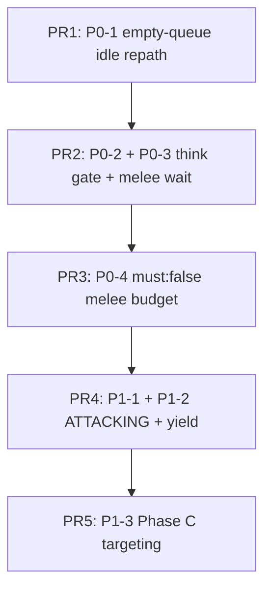

# TFS-RUST 772 Monster AI — Pathing Fix Priority

**Date:** 2026-06-11  
**Context:** Post Phase A (A0–A5) + Phase B (B1–B2) implementation; chase feels sluggish vs `tibia-game-master` decompiled server.  
**Related:**
- [TFS-RUST_772_Monster_AI_Comprehensive_Gap_Audit.md](TFS-RUST_772_Monster_AI_Comprehensive_Gap_Audit.md)
- [TFS-RUST_772_Monster_State_Model.md](TFS-RUST_772_Monster_State_Model.md)

---

## Executive summary

TShortway and repath cadence are largely matched (`shortway/go_exec` ~0.46 vs ~0.47). Sluggishness comes from **scheduling and idle-pacing bugs**, not pathfinder algorithm debt.

Fix in the order below. Items **P0-1 through P0-4** are pre-combat and should land before Phase C targeting or Phase E combat state work.

---

## Priority order

| Rank | ID | Severity | Gap | Symptom | Primary files |
|------|-----|----------|-----|---------|---------------|
| **1** | P0-1 | P0 | X5 (772 leak) | Monster lags behind kiting player for ~300–950 ms after stale queue clear | `walk/mod.rs`, `monster_events.rs` |
| **2** | P0-2 | P0 | X2 | Mid-chase retarget / hesitation on monsters with `changeTargetSpeed > 0` | `idle_stimulus.rs`, `creature_think.rs` |
| **3** | P0-3 | P0 | M4 / E1-lite | Stick-fight at cheb==1: 1 s `Wait` after failed dance + attack stub | `idle_stimulus.rs` |
| **4** | P0-4 | P0 | M2 / A2 | Stutter at cheb==2: `must:true` → NOWAY → roam → re-acquire | `monster_ai.rs` |
| **5** | P1-1 | P1 | I3 / E5 | Wrong chase vs attack ordering; idle chase when reference skips for `ATTACKING` | `idle_stimulus.rs`, `creature/monster.rs` |
| **6** | P1-2 | P1 | S3 | Stale repath cannot preempt scheduled step (`ToDoYield` missing) | `creature_todo.rs`, `idle_stimulus.rs` |
| **7** | P1-3 | P1 | C1–C3 / X1 | TFS `searchTarget` in idle; no `Strategy[]` / `LoseTarget` | `idle_stimulus.rs`, `monster_targets.rs` |
| **8** | P2-1 | P2 | I1 / D1–D2 | Spawn chase before wake; move-wake scope wrong | `spawn_lifecycle.rs`, `monster_events.rs` |
| **9** | P2-2 | P2 | E2 | Attack stub has no `DelayAttack` / damage cadence | `combat/mod.rs`, `idle_stimulus.rs` |
| **10** | P2-3 | P2 | M8 | ~4.4% diagonal `go_exec` vs 0% reference (path shape) | `pathfinding.rs` (verify only) |

---

## P0 — Fix first (pre-combat, highest ROI)

### P0-1 — Empty `walk_queue` on 772 chase must idle-repath, not poll delay

**Problem:** When `Go` executes but `walk_queue` is empty during an active chase, `on_walk` calls `schedule_walk_followup_deadline` (~step duration) instead of `request_idle_stimulus` / `TShortway` repath.

**Typical trigger:** Target moves → `monster_on_follow_creature_moved` clears stale `walk_queue` + sets `force_update_follow_path` → pending `Go` still fires with empty queue.

**Reference:** 772 idle drain owns chase; no TFS `getNextStep` poll (gap X5). `IdleStimulus` runs on todo drain, not walk-timer poll.

**Fix:**
- On `beat_driven_loop`, when `pop_dir` is `None` and `follow_target` is set → `request_idle_stimulus` (or synchronous `idle_stimulus` if safe).
- Remove / rewrite `test_772_dance_retry_cadence` — it asserts the wrong 1098-style delay.

**Verify:** Kite a snake/rat; `chase_path.log` should show `shortway` within one beat of target move, not a multi-hundred-ms gap with no `shortway`.

---

### P0-2 — Gate `monster_on_think_target` off 772 idle drain

**Problem:** `monster_idle_stimulus` calls `monster_on_think_target(cid, 1000)` on **every** idle segment. Reference runs change-target logic from `ProcessCreatures` ~1 Hz, not per walk batch.

**Symptom:** `target_change_ticks` advances as if a full second passed each chase segment → premature random retarget on types with `changeTargetSpeed > 0`.

**Fix:**
- Remove the call from `monster_idle_stimulus` when `beat_driven_loop`.
- Keep change-target in `process_creatures_772` only (or replace with Phase C strategy roll).

**Verify:** Monster with `changeTargetSpeed` set does not roll mid-chase every few steps.

---

### P0-3 — Stop 1 s `Wait` after failed melee dance when attack is armed

**Problem:** At cheb==1, failed `MeleeDance` → `Hold` → `Attack` stub enqueued → next idle tick → `monster_idle_maybe_enqueue_at_goal_wait` adds `Wait(1000)`.

**Reference:** `crnonpl.cc:2795–2807` — `ATTACKING` monsters get `ToDoAttack`, **not** trailing `ToDoWait(1000)`. The 1 s wait is the `else` branch for non-`ATTACKING` only.

**Fix (interim, pre-E5):**
- Do **not** call `at_goal_wait` for `MeleeDance` when attack was enqueued or when monster is hostile melee at band.
- Keep `DistDance` → `Go` + `Wait` (reference `crnonpl.cc:2791` always waits at dist band).

**Verify:** Adjacent rat/snake stick-fight has no 1 s pause between attack attempts.

---

### P0-4 — Revert A2 `must:true` at cheb==2 to reference `must:false, max:3`

**Problem:** `monster_idle_chase_step_budget` uses `(1, true)` at cheb==2. Reference melee chase uses `ToDoGo(..., false, 3)` (`crnonpl.cc:2732–2733`). Trim naturally stops at cheb≤1 (`cract.cc:260–261`).

**Symptom:** Extra `NOWAY` → clear target → roam → re-acquire stutter at distance 2, not steady slow chase.

**Fix:**
```rust
// melee chase: match reference — max 3, must false; let truncate stop at band
if is_melee_chase {
    (CHASE_PATH_MAX_STEPS, false)
}
```
Update `test_772_melee_chase_cheb2_*` accordingly.

**Verify:** Fewer `noway` + `roam` events at cheb==2 in live chase log.

---

## P1 — Next (shape / preemption)

### P1-1 — `ATTACKING` / `PANIC` state gating (Phase E5 subset)

**Problem:** Reference skips idle `ToDoGo` melee chase when `ATTACKING`/`PANIC` (`crnonpl.cc:2731`); chase comes from `ToDoAttack` → `CanToDoAttack` → `ToDoGo(max:3)` (`crcombat.cc:496–498`). Rust always runs idle `MeleeChase` + attack stub.

**Fix:** Minimal combat posture flag or full `MonsterState` (see [state model doc](TFS-RUST_772_Monster_State_Model.md)); gate idle chase arm; route distance>1 movement through attack tail when `ATTACKING`.

**Blocked on:** Phase E2 damage execute for full parity; posture flag alone is still worthwhile for pacing.

---

### P1-2 — `creature_todo_yield` (reference `ToDoYield`)

**Problem:** `request_idle_stimulus` returns early when `next_wakeup` is set or todo non-empty. Reference `ToDoYield` enqueues `Wait(0)` + reschedules immediately (`cract.cc:1001`).

**Fix:** Add `creature_todo_yield(cid)` — respect `todo.locked`; use on move-wake and stale repath when preemption is needed.

**Verify:** `test_creature_todo_yield_preempts_queue`.

---

### P1-3 — Phase C targeting (X1 / X2)

**Problem:** Idle still calls TFS `monster_search_target` + per-drain `monster_on_think_target`. Reference uses `RaceData.Strategy[]` roll + `LoseTarget` in `IdleStimulus`.

**Fix:** Phase C1–C3 from gap audit §9. Gate X1/X2 off 772 idle until landed.

**Note:** Unlikely primary cause of slow pathing; do after P0.

---

## P2 — Later / parallel

### P2-1 — Sleep / wake (Phase D)

Spawn immediate chase, move-wake scope, re-sleep. See [TFS-RUST_772_Monster_State_Model.md](TFS-RUST_772_Monster_State_Model.md). Affects engagement latency, not in-flight chase step timing.

### P2-2 — Attack damage + `DelayAttack` (Phase E2)

Wire `combat/math.rs` on `CreatureAction::Attack`; `EarliestAttackTime` gate. Closes C2/C4.

### P2-3 — Diagonal `go_exec` distribution

~4.4% Rust vs 0% reference in snake replay. Verify after P0-4; may be path-shape only. Do not chase until P0 live compare is clean.

---

## Implementation milestones



| PR | Items | Expected player-visible win |
|----|-------|----------------------------|
| **PR1** | P0-1 | Monsters track kiting players without multi-step lag |
| **PR2** | P0-2, P0-3 | Steady chase without random pauses / slow stick-fight |
| **PR3** | P0-4 | Fewer chase drop-outs at distance 2 |
| **PR4** | P1-1, P1-2 | Combat posture + wake preemption match reference |
| **PR5** | P1-3 | Target selection parity (separate from pathing feel) |

---

## Verification checklist

After each PR:

```bash
cargo test -p tfs-rust-core --lib test_772_ -- --nocapture
cargo test -p tfs-rust-core --lib idle_stimulus -- --nocapture
```

Live compare (reference stack + Rust, `TFS_CHASE_PATH_DEBUG=1`):

```bash
python3 scripts/compare_chase_live_logs.py \
  --ref reference/cipsoft-772/runtime/log/chase_path.log \
  --rust log/chase_path_rust.log
```

| Metric | Healthy after P0 |
|--------|------------------|
| Gap target_move → `shortway` | ≤ 1 beat (~200 ms) |
| `shortway/go_exec` | ~0.43–0.47 |
| `noway` at cheb==2 | Rare |
| `execute_wait` during melee chase | Only dist band / roam, not cheb==1 stick-fight |

---

## Changelog

| Date | Change |
|------|--------|
| 2026-06-11 | Initial priority doc from post-A/B pathing gap analysis |
