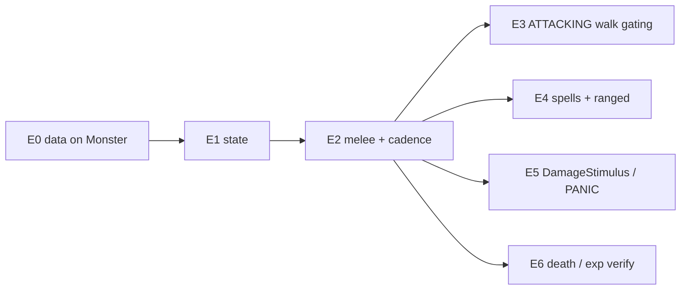

# TFS-RUST 772 Monster AI — Movement Parity Check + Combat Integration Brief

**Date:** 2026-06-13
**Audience:** implementing engineer. This is an instruction brief, not a discussion doc. Read the cited decompile and Rust seams *before* writing code.
**Status:** plan only — no code written yet.
**Goal:** (1) confirm the ported 772 movement/pathing AI matches the decompile; (2) integrate the missing combat system (melee, ranged, spells, cadence, PANIC/ATTACKING) at decompile-outcome parity, idiomatic Rust, running unchanged on the current TFS-style data pack.

## How to use this brief

- **Reference paths.** Decompile = `reference/cipsoft-772/tibia-game-master/src/` (referred to below by bare filename, e.g. `crcombat.cc:530`). Local git exclude + tracked `.cursorignore` negations (`scripts/setup_reference_local.sh`). Main CRG graph skips untracked reference — run `scripts/register_reference_graph.sh`, then use `cross_repo_search_tool`; otherwise `Read`/`Grep` explicit paths.
- **Line refs drift.** §1–§3 line numbers were captured against an earlier decompile pull and now sit ~15–20 lines low (e.g. `IdleStimulus` is `crnonpl.cc:2314`, not `:2297`). Match by **function name**, not the literal line. E4–E6 refs below were re-verified against the current checkout.
- **Parity rule.** Match *observable outcomes* (damage rolls, cadence, target picks, walk shape), not C++ structure. Write idiomatic Rust (enums + `match`, `?`, `SlotMap` ids, no `unsafe`). Era literals come from `MechanicsProfile` / `data/formulas/772.lua` — never hardcode, never add `*_772` public names. Put the C++ `file:function` ref in a doc comment on every ported fn.
- **Don't re-implement** the formulas/apply layer in §3 — they exist and are unit-tested. Wire them.

---

## 0. Executive summary

| Area | Status | Action |
|------|--------|--------|
| Scheduler (beat loop, todo heap, Go/Wait drain) | At parity | none |
| Movement / pathing (chase / flee / dance / roam / keep-distance) | **At parity** (verified §1) | none — combat slots into existing idle tail |
| Monster combat data on runtime struct | **E0 done** | none |
| Combat state machine (ATTACKING/PANIC/UNDERATTACK) | **E1 done** | sim: `combat_state` event |
| Melee damage + attack cadence | **E2 done** | sim: `melee_hit`, `attack_enqueue` |
| ATTACKING walk gating | **E3 done** | sim: `chase_mode=close`, `todo_go.arm=attack_close_chase` |
| Spell casting + ranged | **E4 done** | sim: poison cast at range, `DistanceAttack` |
| DamageStimulus → PANIC/UNDERATTACK | **Missing** | E5 |
| Death / exp / loot-on-spawn model | **Missing the 772 model** (generic corpse + placeholder exp only) | E6 |

Bottom line: the pathfinder and walk cadence are correct. The work is **combat**, and it must hook into the existing `IdleStimulus` tail and the `CreatureAction::Attack` todo path that already exist.

---

## 1. Movement / pathing parity — verification (no work required)

Decompile entry: `crnonpl.cc:2297` `TMonster::IdleStimulus`. Structure of that function, top to bottom:

1. Despawn / monsterhome checks → `:2305-2363`.
2. **Target scan** `TFindCreatures(12,12, …)` → `:2437`; `Strategy[]` roll → `:2424-2493`; `LoseTarget` → `:2380`; re-sleep `ShouldSleep` → `:2422`, `:2497-2514`.
3. **TALKING** → `:2392`.
4. **CASTING** `RaceData.Spells` loop → `:2521-2667`.
5. **WALKING** (flee/master/melee/dist/dance/roam) → `:2676-2810`, with combat tail `Rotate` + `ToDoAttack` → `:2795-2807`.

Rust mirrors **step 5** in `monster_idle_classify_walk_branch` + arm executors ([idle_stimulus.rs](../crates/tfs-rust-core/src/idle_stimulus.rs):388). Verified mapping:

| Behavior | Decompile | Rust | Match |
|----------|-----------|------|-------|
| Branch priority flee→master→melee/dist→roam | `crnonpl.cc:2678-2792` | `monster_idle_classify_walk_branch` | yes |
| Flee step | `SearchFlightField` `crnonpl.cc:2680` | `monster_idle_flee_step` | yes |
| Master follow Manhattan 2-3 = Wait; else `ToDoGo(max:3)` | `crnonpl.cc:2691-2700` | `monster_master_follow_in_wait_band` (A5) | yes |
| Melee chase `cheb>1` | `ToDoGo(false,3)` `crnonpl.cc:2733` | `MeleeChase` + `monster_idle_chase_step_budget` | yes |
| Melee dance `cheb==1` | `rand()%5` + `ToDoGo(must,INT_MAX)` `crnonpl.cc:2736-2753` | `monster_idle_dance_step` | yes |
| Dist chase `Distance>4` | `ToDoGo(false, Distance-4)` `crnonpl.cc:2769` | `max = cheb - target_distance` (A3) | yes (formula, not literal 4) |
| Dist flee `Distance<4` | `SearchFlightField` else `ToDoWait(1000)` `crnonpl.cc:2760-2767` | `DistFlee` arm + Wait | yes |
| Dist dance `==4` | lateral + `ToDoWait(1000)` `crnonpl.cc:2772-2791` | `DistDance` + Wait | yes |
| Path fail | `TShortway` fail → `NOWAY` → `Target=0` → roam `cract.cc:1068`, `crnonpl.cc:2813` | `monster_idle_chase_repath`→`Noway`→roam | yes (no TFS A*/greedy) |
| Walk timing | `NotifyGo` ceil-to-beat `cract.cc:1369` | `walk_timing.rs` + `todo_start_go_delay` | yes |

Live metric (Jun 8 snake replay): `shortway/go_exec` 0.46 vs 0.47 reference.

**Two residual divergences — both close themselves once combat lands; do not "fix" them in movement code:**

1. `MeleeChase` still runs where the decompile is `ATTACKING` (`crnonpl.cc:2731` skips idle melee chase when `ATTACKING`/`PANIC`; the walk then comes from the attack tail under `CHASE_MODE_CLOSE`). Self-noted at [idle_stimulus.rs](../crates/tfs-rust-core/src/idle_stimulus.rs) ~428-432. → **Phase E3**.
2. `is_fleeing` is health-only ([monster.rs](../crates/tfs-rust-core/src/creature/monster.rs):141); decompile gates flee through `PANIC`. → **Phase E5**.

---

## 2. Combat — exactly what is missing

| Piece | Decompile | Rust seam | State |
|-------|-----------|-----------|-------|
| Idle attack tail (`Rotate`+`ToDoAttack`) | `crnonpl.cc:2795-2807` | `monster_idle_maybe_enqueue_attack` ([idle_stimulus.rs](../crates/tfs-rust-core/src/idle_stimulus.rs):236) | enqueues `Attack`, but… |
| `Attack` execute | `cract.cc:1325` `ToDoAttack` → `TDAttack` | `monster_do_attacking` ([monster_ai.rs](../crates/tfs-rust-core/src/monster_ai.rs):365) | **face-only stub** |
| Attack delay on todo | `cract.cc:909` (`TDAttack` uses `EarliestAttackTime`) | `todo_start_*` / wakeup calc | **not modeled** |
| `CanToDoAttack` (close-walk under CHASE_MODE) | `crcombat.cc:441` | — | **missing** |
| `Attack`/`CloseAttack` (damage) | `crcombat.cc:530` / `:647` | — | **missing** |
| `DelayAttack` cadence | `crcombat.cc:523`; `Attack` does `DelayAttack(200)` then `DelayAttack(2000)` `:607,:640` | — | **missing** |
| Spell cast loop | `crnonpl.cc:2521-2667` | — | **missing** (`attack_spells` parsed only) |
| `DamageStimulus` → PANIC/UNDERATTACK | `crnonpl.cc:2295`; dispatched from `TCreature::Damage` `crmain.cc:~600` | — | **missing** |
| Move-stimulus attack step (CHASE_MODE_CLOSE) | `crmain.cc:888` `TCreature::CreatureMoveStimulus` | `monster_events.rs` | partial |
| **Loot rolled on spawn** (bag in `INVENTORY_BAG`; equip non-weapons via `CreateAtCreature`) | `TMonster::TMonster` `crnonpl.cc:2050-2103` | spawn path (E0 site) | **missing** — runtime `Monster` has no inventory |
| **Equipment grants stats** (armor/weapon from equipped loot, race base fallback) | `CheckCombatValues`/`GetWeapon`/`GetArmorStrength` `crcombat.cc:128,36,286` | `combat/math.rs` consumes `armor`/`melee_attack` | **missing** — stats use race base only |
| **Drop-all on death** (move body items → race corpse) | `~TCreature` `crmain.cc:204-290` (`LoseInventory==ALL`, default `:175`) | `death.rs` | **missing** — drops generic corpse `3058` |
| **Race exp on death** (`ExperiencePoints`, 20-slot proportional) | `~TMonster` `crnonpl.cc:2117` → `DistributeExperiencePoints` `crcombat.cc:908` | `death.rs` | **wrong** — uses `max_health*4` placeholder |

---

## 3. Reuse these — do not rewrite

| Need | Function | File |
|------|----------|------|
| Attack roll (`GetAttackDamage` `crcombat.cc:219`: ±mode then `ProbeValue`) | `weapon_damage` / `probe_value` | [combat/math.rs](../crates/tfs-rust-core/src/combat/math.rs):139,119 |
| Monster melee max | `max_melee_damage_monster(skill, attack)` | [weapon.rs](../crates/tfs-rust-core/src/weapon.rs):20 |
| Defense roll (`GetDefendDamage` `crcombat.cc:236`) | `defense_value` | [combat/math.rs](../crates/tfs-rust-core/src/combat/math.rs):158 |
| Armor (`GetArmorStrength` `crcombat.cc:285`: `(A/2)+rand%(A/2)` for A≥2) | `armor_reduction` (`ArmorReduction::Randomized`) | [combat/math.rs](../crates/tfs-rust-core/src/combat/math.rs):181 |
| Final melee (`CloseAttack` `crcombat.cc:650`: `max(0, atk-def)` then armor) | `melee_damage_after_defense_and_armor` | [combat/math.rs](../crates/tfs-rust-core/src/combat/math.rs):204 |
| Spell damage (`ComputeDamage` `magic.cc:784`) | `spell_damage` | [combat/math.rs](../crates/tfs-rust-core/src/combat/math.rs):216 |
| Condition DoT (fire/energy ticks) | `condition_tick` + `add_condition_merge` | [combat/math.rs](../crates/tfs-rust-core/src/combat/math.rs):335, `condition.rs` |
| Apply HP / mana / dispel / condition (writes `damage_map`) | `combat::execute` / `apply_health_delta` | [combat/mod.rs](../crates/tfs-rust-core/src/combat/mod.rs):55 |
| Exp split (`crcombat.cc:891`, 20-slot proportional) + PvP cap | `distribute_experience` / `pvp_exp_cap` | [combat/math.rs](../crates/tfs-rust-core/src/combat/math.rs):269,282 |
| Death scaffold (events, decay, corpse insert) | `handle_creature_death` (⚠ rework for E6 — see below) | [death.rs](../crates/tfs-rust-core/src/death.rs):36 |
| Loot table parse (TFS shape: `chance`/100000, `countmax`, `child_loot`) | `LootBlock` / `load_loot_item` | [monsters.rs](../crates/tfs-rust-content/src/monsters.rs):18,265 |
| Item containers (bag holds `ItemId`s) | `Location::Container { container_id, slot }` | [item.rs](../crates/tfs-rust-core/src/item.rs):17 |

---

## 4. Implementation phases

Dependency order:



---

### E0 — Carry combat data onto the runtime `Monster` - DONE

**Read first:** `cr.hh:55` `struct TSpellData {Shape, ShapeParam1-4, Impact, ImpactParam1-4, Delay}`; content parser [monsters.rs](../crates/tfs-rust-content/src/monsters.rs) (`MonsterSpellNode`, `MonsterDefenses`, `attack_spells`); sample data `data/monster/monsters/{rat,cobra}.xml`.

**Do:**
1. Add to `MonsterAiConfig` + `Monster` ([monster.rs](../crates/tfs-rust-core/src/creature/monster.rs)): `melee_skill: i32`, `melee_attack: i32`, `poison_cycles: i32`, `armor: i32`, `defense: i32`, `spells: Vec<MonsterSpell>`.
2. Define a runtime enum (idiomatic translation of `TSpellData`):

   ```rust
   pub struct MonsterSpell {
       pub delay: i32,            // <attack delay=> ; cast gate rand()%Delay==0 (crnonpl.cc:2527)
       pub range: i32,            // <attack range=>
       pub min_cycle: i32,        // <attack mincycle=> / cycle
       pub shape: SpellShape,     // SHAPE_* (crnonpl.cc:2609)
       pub impact: SpellImpact,   // IMPACT_* (crnonpl.cc:2536)
       pub shoot_effect: Option<u8>,
       pub area_effect: Option<u8>,
   }
   pub enum SpellImpact {
       Damage { element: CombatType, base: i32, variation: i32 },
       Field(FieldType),
       Healing { base: i32, variation: i32 },
       Speed { percent: i32, variation: i32, duration: i32 },
       Condition { /* poison/fire/energy cycles */ },
       Summon { race: String, max: i32 },
   }
   ```
3. Converter `MonsterSpell::from_node(&MonsterSpellNode) -> Option<MonsterSpell>` in the content→runtime spawn path. Map the data-pack keys:
   - `<attack name="melee" skill=.. attack=.. poisoncycles=..>` → melee fields on `Monster` (not a spell).
   - `<attack name="..condition" delay= cycle= mincycle= range=>` + `<attribute key="shooteffect">` → `SpellImpact::Condition` / `Damage`.
   - `<defenses armor=.. defense=..>` → `armor` / `defense`.
4. Populate at spawn (where `MonsterAiConfig::from(MonsterTypeFlags)` runs).

**Gotcha:** the pack is **TVP-772** shaped (`skill="15" attack="7"`), which feeds `probe_value`/`max_melee_damage_monster` directly — do not assume TFS 1.4.2 `min/max/interval` attack nodes. Keep the converter tolerant of unknown spell names (skip + `tracing::debug!`).

**Done when:** rat loads `melee_skill=15, melee_attack=7, defense=3, armor=1`; cobra loads a poison spell with `delay=4, range=5`.

---

### E1 — Combat state machine - DONE

**Read first:** `enums.hh` STATE enum; `crnonpl.cc:2705-2712` (`SKILL_FIST>0 && !PANIC ⇒ ATTACKING`; then `SetAttackDest`/`SetChaseMode`); `:2387` (reset to `IDLE` unless PANIC/UNDERATTACK); [TFS-RUST_772_Monster_State_Model.md](TFS-RUST_772_Monster_State_Model.md).

**Do:**
1. Add `MonsterState { Sleeping, Idle, UnderAttack, Attacking, Panic }` on `Monster`, **gated by `beat_driven_loop`** (1098 keeps `is_idle`; do not entangle). Reconcile with the `MonsterLifecycleState` proposal in the state-model doc — pick one field, document it.
2. In the idle tail, set `Attacking` when the monster has melee capability and is not `Panic` (`crnonpl.cc:2705`); reset to `Idle` at top of idle when not PANIC/UNDERATTACK (`crnonpl.cc:2387`).

**Done when:** a hostile melee monster with a target reports `Attacking`; unit test asserts the transition.

---

### E2 — Melee execute + attack cadence - Done

**Read first:** `cract.cc:1325` `ToDoAttack` (adds `Wait(100)` when `GetDistance()!=1`, then `TDAttack`); `cract.cc:909` (`TDAttack` delay = `max(EarliestAttackTime, EarliestSpellTime) - now`); `crcombat.cc:530` `Attack` (validations → `DelayAttack(200)` `:607` → `CloseAttack` → `DelayAttack(2000)` `:640`); `crcombat.cc:647` `CloseAttack`; poison tail `:660` (`GetRacePoison` `crmain.cc:1311`; `DamageDone>0 || (Attack>Defense && rand%5==0)` → `random(Poison/2, Poison)` periodic).

**Do:**
1. Add `earliest_attack_ms: u64` on `CreatureBase` (or a small combat sub-struct). Mirror `DelayAttack(ms)`: `earliest_attack_ms = max(earliest_attack_ms, server_ms + ms)`.
2. Replace `monster_do_attacking` body ([monster_ai.rs](../crates/tfs-rust-core/src/monster_ai.rs):365) with the `CloseAttack` outcome:
   - resolve `attack_target`; range/sight/PZ guards (mirror `Attack` `crcombat.cc:555-598`, monster-relevant subset);
   - `attack = weapon_damage(profile, hooks, rng, melee_skill, melee_attack, FightMode::Balanced, 0)` (monster fight mode is balanced);
   - `defense = defense_value(...)` from target; `armor = armor_reduction(...)` from target; `dmg = melee_damage_after_defense_and_armor(attack, defense, armor)`;
   - apply via `combat::execute(... CombatDamage{ primary:(Physical, -dmg) ...})`;
   - poison-on-hit per `:660` using `poison_cycles` → `combat::execute` condition or `add_condition_merge`;
   - `DelayAttack(2000)`.
3. Wire `earliest_attack_ms` into the `TDAttack` wakeup so the next `Attack` fires no earlier than the cadence (`cract.cc:909`). The `Attack` todo currently schedules immediately; gate it.
4. `monster_idle_maybe_enqueue_attack` should add the `Wait(100)` before `Attack` when distance≠1 (`cract.cc:1327`).

**Gotcha:** keep the game loop single-threaded; pull RNG from the existing combat rng. Negative HP delta convention (TFS damage is negative) — see `apply_health_delta`.

**Done when:** rat vs a dummy player loses ~`max_melee_damage_monster(15,7)`-bounded HP on a ~2 s cadence; `damage_map` records the rat; integration test asserts HP drop and cadence.

---

### E3 — ATTACKING walk gating (closes divergence §1.1)

**Read first:** `crnonpl.cc:2709-2734` (`ATTACKING`/`PANIC` ⇒ `SetAttackDest(Target,false)` + `SetChaseMode(NONE)`; idle `melee_chase` skipped when `ATTACKING`); `crcombat.cc:441` `CanToDoAttack` (`CHASE_MODE_CLOSE` + `Distance>1` ⇒ `ToDoGo(...,false,3)`; `CHASE_MODE_RANGE` keep-4 logic); `crmain.cc:888` `CreatureMoveStimulus` (target move while `CHASE_MODE_CLOSE` + pending `TDAttack` re-steps).

**Do:**
1. Skip the idle `MeleeChase` arm when state is `Attacking`/`Panic`.
2. Provide the close-distance walk from the attack path: before/with `ToDoAttack`, if `cheb>1` enqueue `ToDoGo(max:3, must:false)` (this is `CanToDoAttack`'s `CHASE_MODE_CLOSE` branch). Model `chase_mode` minimally (enum `None`/`Close`/`Range`) + `attack_dest`.
3. (Optional, faithful) handle target-move while close-chasing per `crmain.cc:888`.

**Done when:** a fist monster at `cheb==2` walks via the attack tail (not idle `MeleeChase`); chase debug shows `todo_go max:3` originating from the attack path; the §1.1 note is removed.

---

### E4 — Spell casting loop + ranged

**Read first:** `crnonpl.cc:2538-2680` (whole CASTING block, gated by `RaceData[Race].Spells>0`): per-spell `rand()%Delay==0` `:2544`; fleeing `random(1,3)!=1` skip `:2548`; `Impact` switch `:2553` (`IMPACT_DAMAGE/FIELD/HEALING/SPEED/DRUNKEN/STRENGTH/OUTFIT/SUMMON`, damage via `ComputeDamage`); `Shape` switch `:2627` (`ACTOR/VICTIM/ORIGIN/DESTINATION/ANGLE`, each rotates+effect+range). Ranged melee path: `Attack` `Range` 2/3 → `DistanceAttack`/`WandAttack` `crcombat.cc:609-637`.

**Do:**
1. Port the cast loop into the idle body (before WALKING, matching order). For each `MonsterSpell`: delay gate, fleeing gate, build impact via the reuse table (§3), apply by shape:
   - `Victim`/`Destination` → resolve target tiles, `is_sight_clear`, apply impact;
   - `Origin`/`Angle`/`Actor` → area around self/target.
2. Damage impacts → `spell_damage` + `combat::execute`; fields → existing field placement; conditions → `add_condition_merge`; speed/drunk → conditions; summon → spawn path (master-gated, `crnonpl.cc:2598`).
3. Ranged `DistanceAttack`: distance 2-3, coord checks (`|dx|>7 || |dy|>5` out of range, `crcombat.cc:623`), shoot effect; reuse `roll_distance_*` if applicable.

**Gotcha:** spells fire from the **idle drain**, ~1 cast attempt per idle cycle (matches reference single pass per `IdleStimulus`). Don't loop spells on the beat timer.

**Done when:** cobra throws poison within `range=5` and applies a poison condition; spell cadence ≈ `delay`-gated; test asserts a poisoned target.

---

### E5 — DamageStimulus + run-away (closes divergence §1.2)

**Read first:** `crnonpl.cc:2295` `TMonster::DamageStimulus` (guard `AttackerID!=0 && Damage!=0`; `SLEEPING` → `Target==0?PANIC:UNDERATTACK` + `ToDoYield`; else `Target==0`→PANIC, `IDLE`→UNDERATTACK); dispatch site inside `TCreature::Damage` (`crmain.cc:~600`); `ToDoYield` `cract.cc:1001`.

**Do:**
1. Hook the victim in the apply layer: in `apply_health_delta` ([combat/mod.rs](../crates/tfs-rust-core/src/combat/mod.rs):98), when target is a monster and `delta<0` and attacker present, fire `monster_damage_stimulus(victim, attacker)`.
2. `monster_damage_stimulus`: set PANIC/UNDERATTACK per the rules above; on wake-from-sleep call the `creature_todo_yield` equivalent (see state-model doc helper list) to preempt the queue.
3. Make `is_fleeing` consider `Panic` (keep the health proxy too, but PANIC is authoritative on 772).

**Gotcha:** the hook runs inside the combat borrow of `creatures`; collect ids first, mutate after (entity-storage rule). Avoid recursive stimulus storms — guard on state already PANIC/UNDERATTACK.

**Done when:** hitting an idle rat flips it to UNDERATTACK and a sleeping rat to PANIC + yields; test asserts state + immediate reaction.

---

### E6 — Loot-on-spawn model + death drop + equipment stats + exp

> **Scope note:** larger than the original "verify + wire". The 772 loot model is **not** implemented — the runtime `Monster` carries no inventory, death drops a generic corpse (`Item 3058`) with placeholder exp (`max_health*4`). This phase ports the decompile's roll-on-spawn → carry/equip → drop-all-on-death flow.

**Read first:**
- `TMonster::TMonster` `crnonpl.cc:2050-2103` — loot is rolled **at spawn**, not at death. Only when `Master==0` (summons carry nothing). Creates a bag in `INVENTORY_BAG`; per race item: skip on `random(0,999) > Probability`, `Amount = random(1, Maximum)`, cumulative stacks vs `Repeat` separate items. **WEAPON/SHIELD/BOW/THROW/WAND/WEAROUT/EXPIRE/EXPIRESTOP → into the bag**; everything else → `CreateAtCreature` (equipped to its body slot). Empty bag is deleted.
- `CheckCombatValues`/`GetWeapon`/`GetArmorStrength` `crcombat.cc:128,36,286` — combat values are read from **equipped** items: weapon attack+skill from an equipped weapon else race base `Attack`/`SKILL_FIST`; armor = Σ(`CLOTHES&ARMOR` items whose `BODYPOSITION == slot`) + race base `Armor` ("only if it lands in the right spot"). `(A/2)+rand%(A/2)` already in `armor_reduction`.
- `~TCreature` `crmain.cc:204-290` + default `LoseInventory=LOSE_INVENTORY_ALL` `:175` — on death: blood pool, create **race corpse** (`MaleCorpse`/`FemaleCorpse`), then move **all** body items (the bag + equipped) into the corpse container.
- `~TMonster` `crnonpl.cc:2117` → `DistributeExperiencePoints(RaceData[Race].ExperiencePoints)` `crcombat.cc:908` — exp is the race's **fixed `ExperiencePoints`**, split 20-slot proportional over the damage map (not `max_health*4`).

**Data reconciliation:** our pack is **TFS-shaped loot** (`<item ... chance= countmax=>`, `chance` out of `MAX_LOOTCHANCE=100000`, nested `child_loot` = sub-containers), already parsed into `LootBlock`. Keep the **decompile model** but drive it from these fields: roll `rand%100000 < chance`, count `random(1, countmax)`, recurse `child_loot` into a sub-bag. Also plumb race `experience` and `corpse` id onto the runtime `Monster` (E0-style), since neither is on the struct yet.

**Do:**
1. **Runtime inventory on `Monster`.** Add a minimal inventory: equip slots + a bag of `ItemId`s (reuse `Location::Container`). Roll loot **at the spawn site** (where `MonsterAiConfig`/`Monster` is built): items flagged weapon/shield/etc → bag; wearable armor/clothes → matching equip slot.
2. **Equipment → stats.** At spawn (after equip), fold equipped contributions into the values combat already reads: equipped weapon overrides `melee_skill`/`melee_attack` (else race base), equipped armor adds to `armor` only when its body position matches the slot. Keep race-base fallback identical to no-loot monsters (regression-safe).
3. **Death drop.** Replace the generic `Item 3058` corpse in `handle_creature_death` with the **race corpse** id and move the monster's bag + equipped items into it. Players keep their existing path.
4. **Exp.** For monsters, use parsed race `experience` (not `max_health*4`) through the existing 20-slot `distribute_experience` proportional split + `pvp_exp_cap`.

**Gotchas:** roll RNG from the existing combat rng on the **game thread** (single-threaded). Summons (`Master != 0`) get no loot. Bag/equip rolls happen **once at spawn** so the corpse contents are fixed for the monster's life — do not re-roll at death. Empty bag ⇒ no bag (match `:2100`).

**Done when:** a freshly spawned rat that rolls leather armor shows the armor reflected in incoming-damage reduction; killing it (a) grants the rat's race `experience` split by `damage_map`, (b) leaves a race corpse containing exactly the spawn-rolled loot; a summoned creature drops nothing. Tests assert exp value, corpse contents, and the no-loot-summon case.

---

## 5. Verification

```bash
cargo test -p tfs-rust-core --lib test_772_ -- --nocapture
cargo test -p tfs-rust-core --lib combat -- --nocapture
cargo test -p tfs-rust-core --lib idle_stimulus -- --nocapture
cargo clippy -p tfs-rust-core
```

- **New tests per phase** as listed in each "Done when".
- **Live combat compare:** `scripts/run_kite_scenario.py` + `scripts/summarize_chase_gaps.py` under `TFS_CHASE_PATH_DEBUG=1` / `TIBIA_CHASE_PATH_DEBUG=1`. See [`TFS-RUST_772_Sim_Coverage_Matrix.md`](TFS-RUST_772_Sim_Coverage_Matrix.md). Check: ~2000 ms melee cadence, ATTACKING walk replaces idle `melee_chase`, `combat_state`/`melee_hit` counts.
- **Data:** must run unchanged on `data/monster/monsters/*` — validate rat (melee), cobra (melee + poison + ranged).

## 6. Suggested PR slicing

| PR | Phases | Player-visible result |
|----|--------|-----------------------|
| PR-C1 | E0 + E1 | data + state plumbing (no behavior change) |
| PR-C2 | E2 | monsters deal melee damage on cadence |
| PR-C3 | E3 | ATTACKING owns the close walk; §1.1 closed |
| PR-C4 | E4 | spells + ranged attacks |
| PR-C5 | E5 | hit reactions / PANIC flee; §1.2 closed |
| PR-C6 | E6 | loot rolled on spawn, equipment stats, race corpse + race exp on death |

## 7. Changelog

| Date | Change |
|------|--------|
| 2026-06-13 | Movement-parity verification + combat integration brief (E0-E6) with decompile line refs |
| 2026-06-14 | **E4 done** — idle CASTING loop (shapes/impacts), XML parse extensions, `DistanceAttack`, cobra poison E2E tests |
| 2026-06-14 | Re-verified E4/E5/E6 vs current decompile pull. Noted ~15–20 line ref drift. **Rewrote E6** to the 772 loot-on-spawn model (roll at spawn → bag/equip → equipment grants stats → drop-all into race corpse on death; race `ExperiencePoints` not `max_health*4`). Added §2/§3 rows for loot, equipment stats, drop-all, race exp. |
