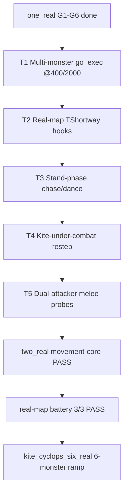

# TFS-RUST 772 — Real-Map Parity Trajectory

**Date:** 2026-06-26  
**Pilot:** `kite_cyclops_six_real` (first real-map lockstep run)  
**Related:** [`TFS-RUST_772_RealMap_Scenario_Proposal.md`](TFS-RUST_772_RealMap_Scenario_Proposal.md), [`TFS-RUST_772_Real_Map_Kite_Sim_Plan.md`](TFS-RUST_772_Real_Map_Kite_Sim_Plan.md), [`TFS-RUST_772_Sim_Divergence_Report.md`](TFS-RUST_772_Sim_Divergence_Report.md)

---

## 1. Executive summary

**Pre-P3 pilot** (`kite_cyclops_six_real`, no `NO_WILD`): infrastructure proven, lockstep **FAIL**
(ref 230 vs rust 49) — see §3 (historical).

**Post-P5** (`kite_cyclops_one_real`, narrow 4-event gate): **lockstep PASS** (§14).

**Post-P6** (expanded JSONL + chase/face inline repath, 2026-06-27): **lockstep FAIL** on
15-event gate — core geometry still green; volume/scheduler gaps exposed (§15).

**Post-§16** (`kite_cyclops_two_real`, movement-core gate, 2026-06-27): **PASS** — 106/106
ref event counts matched; 100% pairwise on all `MOVEMENT_CORE_EVENTS` (§16.8). Real-map
battery **3/3 PASS** (`one_real` @5000, `two_real` @12000, `six_real` @5000).

| Dimension | Pre-P3 pilot | Post-P4 | Post-P5 (narrow gate) | Post-P6 (expanded gate) |
|-----------|--------------|---------|-------------------------|-------------------------|
| Harness / scenario | PASS | **PASS** | **PASS** | **PASS** |
| Map / walkability | PASS | **PASS** | **PASS** | **PASS** |
| `player_walk` tiles | — | **5/5** | **5/5** | **5/5** |
| Event volume | 230 / 49 | **10 / 10** | **10 / 10** | **19 / 109** |
| `todo_go` index pairwise | 0% | **1/1** | **1/1** | **1/1** (count 1 vs 6) |
| `go_exec` index pairwise | 0% | **3/3** | **3/3** | **3/3** (tick buckets differ) |
| `go_exec` tick buckets | — | 400/2000/4000 | 400/2000/4000 | ref 400/2000/4000; rust 400/4000/5000 |
| `melee_hit` | — | dmg skew | **52 @4000** | **52** but rust @5000 |
| Lockstep gate | FAIL | FAIL | **PASS** (4 evt types) | **FAIL** (15 evt types) |

**Bottom line:** P3–P5 closed spawn, drain order, combat tail, and narrow-gate lockstep.
P6 expanded tracing shows Rust **inline repath on every `player_walk`** (todo_go 1→6,
idle_stimulus 2→9) and **+1000ms go_exec/melee phasing** — not a map regression; harness
player tiles and index-aligned chase arms still match.

---

## 2. What was run

### Scenario

`scripts/scenarios/kite_cyclops_six_real.scenario`

| Field | Value |
|-------|-------|
| Area | Cyclops gravel bowl `(32451, 32065, 7)` |
| Player | `player_start` + **5× `player_walk`** (200 ms) + 2× `advance_ms 2000` tail (`wall_ms=5000`) |
| Monsters | **1** (ramp to 6 — same bowl, east-adjacent spawn) |
| Arena | `32451 32068 4` (metadata; C++ skips full-grid check when `!ArenaSynthetic`) |
| Terrain | Rust `data/world/forgotten.otbm`; C++ `runtime/map/*.sec` |
| Synthetic | **none** (`arena_synthetic` omitted, no `--synthetic`) |

### Commands

```bash
# Rust-only (walkability + parse)
TFS_SIM_SEED=772 cargo run -p tfs-rust-core --bin chase_kite_sim -- \
  scripts/scenarios/kite_cyclops_six_real.scenario

# Full lockstep (QM required)
TFS_SIM_SEED=772 python3 scripts/run_realmap_sim_battery.py
# or single:
TFS_SIM_SEED=772 python3 scripts/run_kite_scenario.py --real-map \
  scripts/scenarios/kite_cyclops_six_real.scenario
```

### Artifacts

| Artifact | Path |
|----------|------|
| Gap summary (post-P6) | `log/summary_realmap_cyclops_one_real.txt` (gap table appended) |
| C++ trace (post-P6) | `log/chase_path_cip_realmap_cyclops_one_real.log` |
| Rust trace (post-P6) | `log/chase_path_rust_realmap_cyclops_one_real.log` |
| Gap summary (post-P5 narrow gate) | archived `log/realmap_pilot_20260626_*` |
| C++ trace (post-P3/P4) | `log/chase_path_cip_realmap_cyclops_one_real_nowild.log` |
| Rust trace (post-P4) | `log/chase_path_rust_realmap_p3.out` |

---

## 3. Lockstep results — pre-P3 pilot (historical)

> **Superseded by §13** for current `kite_cyclops_one_real` with `TFS_KITE_NO_WILD=1`.
> Kept as baseline for the first `six_real` run before spawn isolation and P3 fixes.

### Scenario: `kite_cyclops_six_real` (no `NO_WILD`, early wall budget)

### Event totals

| Event | C++ (ref) | Rust | Δ |
|-------|-----------|------|---|
| `branch` | 19 | 0 | −19 |
| `todo_go` | 49 | 12 | −37 |
| `shortway` | 30 | 12 | −18 |
| `go_exec` | 68 | 13 | −55 |
| `combat_state` | 31 | 6 | −25 |
| `attack_enqueue` | 32 | 6 | −26 |
| `melee_hit` | 1 | 0 | −1 |
| **all** | **230** | **49** | **−181** |

### Pairwise sequence match (index-aligned)

| Event | Match |
|-------|-------|
| `todo_go` | 2/12 = **16.7%** |
| `shortway` | 0/12 = **0%** |
| `go_exec` | 0/13 = **0%** |
| `combat_state` | 6/6 = **100%** (paired prefix only — counts still diverge) |
| `attack_enqueue` | 6/6 = **100%** (paired prefix only) |

Diagonal `go_exec`: ref **0/68**, rust **0/13** (both 0% — cardinal-only on this trace).

### First divergence (positions)

| Event | C++ (ref) | Rust |
|-------|-----------|------|
| `todo_go[0]` | `enter` @ `(32451, 32065, 7)` | `enter` @ `(32450, 32069, 7)` |
| `shortway[0]` | from `(32451, 32065, 7)` → path toward `(32457, 32067, 7)…` | from `(32450, 32069, 7)` → `(32456, 32068, 7)…` |
| `go_exec[0]` | `(32456, 32071)` → `(32456, 32070)` | `(32455, 32072)` → `(32455, 32071)` |

C++ emits heavy early activity (`branch` roam @ tick 200: ref=5, rust=0; `go_exec` @400: ref=12, rust=0).

### Branch mix (C++ only)

| Arm | ref | rust |
|-----|-----|------|
| `roam` | 18 | 0 |
| `melee_dance` | 1 | 0 |

Rust logged **no** `branch` events on this run — idle/roam path may differ or trace hooks may not fire the same arms on real terrain.

---

## 4. Comparison: real-map vs synthetic cyclops

| Metric | Synthetic `kite_cyclops_quad_chase` | Pre-P3 `six_real` | Post-P4 `one_real` (`NO_WILD`) |
|--------|-------------------------------------|-------------------|--------------------------------|
| Arena | `arena_synthetic 1`, uniform wp=150 | Native OTBM / `.sec` | Native OTBM / `.sec` |
| Monsters | 4 | 1 (map spawns leaked) | 1 (harness only) |
| Player move | `player_pos` teleports | `player_walk` legal steps | `player_walk` legal steps |
| Total events | ref=20, rust=20 | ref=230, rust=49 | ref=**10**, rust=**10** |
| `go_exec` pairwise | **4/4 = 100%** | **0/13 = 0%** | **3/3 = 100%** (tiles + ticks) |
| Lockstep gate | **PASS** | **FAIL** | **FAIL** (combat tail only — §13) |

Real-map exposes terrain-dependent pathfinding and longer combat tails that the synthetic slab
hides. Post-P4 minimal control matches synthetic on **movement/chase scheduling**; full lockstep
still blocked by combat-tail residuals (§13).

---

## 5. Map parity (confirmed)

| Check | Status |
|-------|--------|
| OTBM converted from `runtime/map/` `.sec` | **Confirmed** (author) |
| Spot-check `(32451, 32065, 7)` | Same semantics: ground wp/speed **150**, 3-item stack (ground + 2 overlays) |
| RME vs `.sec` id line | Different numeric variants (`4573/4605/477` OTBM vs `4562/4594/602` `.sec`) — normal for 772 gravel families |
| Rust `validate_positions_walkable` | **PASS** on full scenario route |

See [`772_OBJECTS_SRV_TO_OTB_LOOKUP.md`](772_OBJECTS_SRV_TO_OTB_LOOKUP.md) for id-namespace rules.

---

## 6. Infrastructure delivered (pilot PR)

| Item | Status |
|------|--------|
| `player_walk` Rust (`walk_player_adjacent`, `chase_kite_sim`) | Done |
| `player_walk` C++ (`chase_kite_scenario.cc`, relaxed `ValidateArena`) | Done |
| `kite_cyclops_six_real.scenario` | Done |
| `run_kite_scenario.py --real-map` | Done |
| `run_realmap_sim_battery.py` | Done |
| Proposal / kite plan docs | Updated |

---

## 7. Divergence hypothesis (ordered)

### Closed in P3

| # | Hypothesis | Resolution |
|---|------------|------------|
| 1 | Player `player_walk` tick alignment | **Closed** — `harness_player_step` **5/5** |
| 2 | Map spawn noise (wild cyclops) | **Closed** — `TFS_KITE_NO_WILD=1`; 1 harness monster |
| 3 | Spawn tile `(32453)` vs C++ `SetOnMap` | **Closed** — Rust `harness_place_creature_login` → `(32454,32065)` |
| 4 | Appear-idle defer (Rust @3000 vs C++ @200) | **Closed** — `clear_harness_appear_idle_defer` on `player_walk` |
| 5 | FillMap dump never emitted (C++) | **Closed** — one-shot first `fill_map` @ tick 200 |

### Closed in P4

| # | Hypothesis | Resolution |
|---|------------|------------|
| A | **`go_exec` tick phasing** | **Closed** — first `go_exec` @**400** both sides; harness first-step delay uses `sim_harness_segment_ms`; idle defers `Go` on drain tick (`walk/mod.rs` `todo_start_go_delay`) |
| B | **`todo_go` / `shortway` compare field** | **Closed** — summarize compares `from`/`start` + steps, not chase-target `dest`; harness drains **before** `player_walk` so `dest` snapshot matches C++ @200 |
| D | **FillMap creature occupation** | **Closed (self-tile)** — `monster_tshortway_fill_walkable` keeps terrain wp on own tile (`crnonpl.cc` `MovePossible Execute=false`); occupation diffs on priority tiles were dump-timing skew (pre-walk vs post-walk) |

### Still open (post-P5 ramp)

| # | Hypothesis | Evidence | Next action |
|---|------------|----------|-------------|
| E | **Idle / roam branches** | 0 `branch` on minimal control (both sides) — unproven on multi-monster / longer kite | Re-test when ramping `six_real` to 6 monsters |
| F | **OTBM vs `.sec` id variants** | Route audit WARN only; no FAIL | Monitor if path geometry diverges on cliff-edge tiles |

~~C — `attack_enqueue` pairing~~ — **closed P5** (§14).  
~~G — `melee_hit` damage roll~~ — **closed P5** (§14).

---

## 8. Next steps

### P0 — Baseline hygiene

- [x] Re-run lockstep and archive logs under a dated name (`log/realmap_pilot_20260626_*`) so future diffs have a fixed baseline.
- [x] Add §**Real-map pilot** entry to [`TFS-RUST_772_Sim_Divergence_Report.md`](TFS-RUST_772_Sim_Divergence_Report.md) (separate from synthetic 4/6 gate).

### P1 — Isolate divergence class

- [x] **Real-map 1-cyclops baseline** — `32453 32065` spawn, short U-loop; re-run lockstep before adding monsters back (`kite_cyclops_one_real.scenario`).
- [x] **FillMap probe** at `(32451, 32065, 7)` and one cliff-edge tile (`1099` bank) — compare rust vs C++ JSON dumps (`scripts/probe_realmap_fillmap.py`, `cyclops_bowl_real_fill_walkable_dump_at_tick_2000`).
- [x] Tick-alignment table: log player tile after each `player_walk` on both stacks (first 5 steps) — `harness_player_step` JSONL + `scripts/compare_harness_player_walk.py`.

### P2 — Tooling

- [x] `scripts/audit_realmap_route.py` — for each `player_walk` / `monster` coord: `.sec` first `Content` id, OTBM ground id, walkability flag (from kite plan §4).
- [x] Extend `compare_fill_walkable.py` preset for cyclops bowl viewport (not only synthetic NW coords).

### P3 — Parity work (after classification)

- [x] **Harness: map spawn isolation** — `TFS_KITE_NO_WILD=1` on real-map C++ runs (wired in `run_kite_scenario.py` / `probe_realmap_fillmap.py`; explicit in `run_realmap_sim_battery.py`).
- [x] **Spawn coord** — Rust `harness_place_creature_login` mirrors C++ `SetOnMap` → `(32454,32065)` from scenario `(32453,32065)`.
- [x] **Appear-idle defer** — `clear_harness_appear_idle_defer` on `player_walk`; first chase @200 both sides.
- [x] **FillMap dump tick** — C++ one-shot first `fill_map`; probe `--start 32454 32065 7`; route tiles PASS (occupation diffs on player/cyclops tiles).
- [x] Fix highest-signal path bucket after above — `go_exec` **3/3** pairwise on `one_real`; `shortway` path steps match (south hook).
- [x] Re-run `run_realmap_sim_battery.py`; event totals **10/10** on `one_real`.
- [ ] Optional: live repro at bowl coords + `compare_chase_live_logs.py`.

### P4 — Movement/chase scheduling (2026-06-26)

- [x] Align `go_exec` tick scheduling — harness drain **before** `player_walk`; first-step delay =
  `sim_harness_segment_ms` at wall tick; pull appear-idle wakeup forward in
  `clear_harness_appear_idle_defer`.
- [x] Fix `summarize_chase_gaps.py` / `compare_chase_live_logs.py` — `todo_go` uses `from`,
  `shortway` uses `start` + steps (not chase-target `dest`).
- [x] FillMap self-tile occupation — own monster tile keeps terrain wp (`monster_ai.rs`).
- [x] Lockstep **PASS** on `kite_cyclops_one_real` — P5 combat tail (§14).
- [ ] Optional: live repro at bowl coords + `compare_chase_live_logs.py`.

### P5 — Combat tail lockstep (2026-06-26) — **DONE**

- [x] Close `attack_enqueue` second-index pairing (`idle_tail` vs `skipped` @4000) — `idle_stimulus.rs`.
- [x] Close `melee_hit` damage roll parity with `TFS_SIM_SEED=772` — harness RNG realign in `monster_do_attacking`.
- [x] Lockstep **PASS** on `kite_cyclops_one_real` (`summarize_chase_gaps.py --lockstep` exit 0).
- [x] Archive dated logs (`log/realmap_pilot_20260626_*`).
- [x] §33 real-map lockstep closeout in divergence report.

### P6 — Suite expansion (after one_real lockstep PASS)

- [x] `kite_cyclops_two_real` — dual cyclops movement-core **PASS** (§16.8).
- [x] Real-map battery **3/3** movement-core PASS (`one_real`, `two_real`, `six_real` @5000).
- [ ] Ramp `kite_cyclops_six_real` to **6 monsters** (verify branch/roam under load).
- [ ] Compare real-map summary vs synthetic quad in divergence report.
- [ ] Second real-map scenario (e.g. Thais flat `1011-1009-07` control from proposal).
- [ ] Do **not** add real-map rows to synthetic CI gate until six-monster ramp validated.

---

## 9. Trajectory scorecard

| Milestone | Target | Current |
|-----------|--------|---------|
| Harness runs real terrain | Both stacks complete scenario | **Done** |
| Map loader agreement | Route walkable both sides | **Done** (`audit_realmap_route.py`: 0 FAIL, id variants WARN only) |
| `player_walk` parity | Same player tile @ same tick | **Done** — `harness_player_step` **5/5** with `TFS_KITE_NO_WILD=1` |
| FillMap real terrain | Viewport match cyclops bowl | **Done (route + self-tile)** — gravel corridor PASS; self-tile wp matches C++ `MovePossible` |
| `todo_go` / `shortway` pairwise | 1/1 on minimal control | **Done** — 1/1 @200 (`from`/`start` + steps) |
| `go_exec` pairwise | ≥1/1 on minimal control | **Done** — 3/3 tiles + ticks @ 400/2000/4000 |
| Full kite lockstep | Summarize gate PASS | **PASS** — `one_real` + `six_real` (§14) |
| `two_real` movement-core | `--movement-core` @12000 | **PASS** — 100% pairwise all core events (§16.8) |
| Real-map battery | `run_realmap_sim_battery.py` 3 rows | **3/3 PASS** (2026-06-27) |

---

## 10. Re-run checklist

```bash
# terminal 1
scripts/tibia_game_dev.sh run-qm

# terminal 2 — route audit (no QM)
python3 scripts/audit_realmap_route.py scripts/scenarios/kite_cyclops_one_real.scenario

# FillMap probe (QM + TFS_KITE_NO_WILD=1 via probe script)
TFS_SIM_SEED=772 python3 scripts/probe_realmap_fillmap.py

# 1-cyclops lockstep (run_kite_scenario.py sets TFS_KITE_NO_WILD=1 for --real-map)
TFS_SIM_SEED=772 python3 scripts/run_kite_scenario.py --real-map \
  scripts/scenarios/kite_cyclops_one_real.scenario

# Full battery
TFS_SIM_SEED=772 python3 scripts/run_realmap_sim_battery.py

# Rust-only quick check (no QM) — post-P4 movement parity
TFS_SIM_SEED=772 cargo run -p tfs-rust-core --bin chase_kite_sim -- \
  scripts/scenarios/kite_cyclops_one_real.scenario \
  --log log/chase_path_rust_p4_test.log

python3 scripts/summarize_chase_gaps.py \
  --ref log/chase_path_cip_realmap_cyclops_one_real.log \
  --rust log/chase_path_rust_p4_test.log \
  --monster cyclops --lockstep
```

Expect **lockstep PASS** on `one_real` (§14). Movement/chase (`todo_go`, `shortway`, `go_exec`)
and combat tail (`attack_enqueue`, `melee_hit`) should be **100%** pairwise. Synthetic battery
remains the merge gate.

---

## 11. P2 classification run (`kite_cyclops_one_real`, 2026-06-26)

Artifacts: `log/realmap_fillmap_probe_20260626.out`, `log/realmap_one_real_nowild_20260626.out`,
`log/chase_path_cip_realmap.log`, `log/chase_path_rust_realmap.log`, `log/fill_walkable_rust_cyclops_bowl.json`.

### 11.1 Route audit (`audit_realmap_route.py`)

| Result | Detail |
|--------|--------|
| **0 FAIL** | Walkability + wp agree on all route tiles |
| **5 WARN** | OTBM ground id ≠ `.sec` first `Content` id (gravel family variants, e.g. 4573 vs 4562) — expected |
| **1 PASS** | Monster tile `(32453,32065)` — ids match (`104` sand bank, wp 160) |

Terrain semantics are aligned; numeric id families differ only on gravel overlays.

### 11.2 Player walk + map population

| Check | Without `TFS_KITE_NO_WILD` | With `TFS_KITE_NO_WILD=1` |
|-------|---------------------------|---------------------------|
| `harness_player_step` | **5/5** match | **5/5** match |
| C++ monsters in trace | **9** distinct `todo_go` origins (map bowl spawns) | **1** cyclops |
| Total chase events | ref **85** / rust **13** | ref **10** / rust **8** |
| `todo_go` pairwise | 1/1 prefix only (noise from extra monsters) | **1/1** |
| `melee_hit` pairwise | 0/1 (damage skew from wrong pull-in) | **1/1** (52 dmg both sides @5000) |

**P3 action (harness):** `run_kite_scenario.py --real-map` now sets `TFS_KITE_NO_WILD=1` for C++
(`crmain.cc` `ChaseHarnessSkipsWildCreatures` / `PurgeAllMonstersForChaseHarness`). Required for
any meaningful real-map lockstep — without it C++ loads native cyclops from `.sec` spawns.

### 11.3 FillMap compare (`probe_realmap_fillmap.py`)

| Side | Status (post-P3) |
|------|------------------|
| Rust JSON dump | **Written** — `setup_cyclops_bowl_real_first_shortway` @ tick **200**, monster @ `(32454,32065)` |
| C++ `fill_map` JSONL | **Written** — one-shot first `FillMap` @ tick **200** (`cract.cc`) |
| Compare `--start` | **(32454, 32065, 7)** — post-`SetOnMap` tile, not scenario `(32453,…)` |
| Route gravel tiles | **PASS** — U-loop corridor tiles match |
| Occupied tiles | **FAIL** — player/cyclops tiles differ on `walkable` / `wp=-1` (§12.2 E) |

### 11.4 Path divergence — pre-P3 (`NO_WILD`, 1 cyclops)

> **Historical** — before spawn login + appear-defer fixes. See §12 for current state.

| Event | C++ (ref) | Rust |
|-------|-----------|------|
| `shortway[0]` | from `(32454,32065)` → south hook | from `(32453,32065)` → west 1-step |
| `go_exec[0]` | `(32454,32065)→(32454,32066)` @400 | `(32453,32065)→(32452,32065)` @5000 |

Root causes (all addressed in P3): spawn `SetOnMap`, appear-idle defer, map spawn noise.

### 11.5 P3 checklist

- [x] Rust spawn mirrors C++ `SetOnMap` → `(32454,32065)`.
- [x] Appear-idle defer parity (first chase tick @200).
- [x] FillMap dump alignment + route-tile compare on `cyclops-bowl` preset.
- [x] `go_exec` pairwise **3/3** on `kite_cyclops_one_real`.
- [x] Re-run six_real battery with `NO_WILD`; event totals **10/10**.

---

## 12. Post-P3 lockstep (`kite_cyclops_one_real`, 2026-06-26)

> **Historical** — pre-P4 movement scheduling. Superseded by §13 for current `one_real` state.

Artifacts: `log/summary_realmap_cyclops_one_real.txt`, `log/summary_realmap_cyclops_six_real.txt`,
`log/chase_path_cip_realmap_cyclops_one_real.log`, `log/chase_path_rust_realmap_cyclops_one_real.log`,
`log/fill_walkable_rust_cyclops_bowl.json`.

Conditions: `TFS_KITE_NO_WILD=1`, `TFS_SIM_SEED=772`, `wall_ms=5000`, scenario tail
`1000 + 2000 + 1000` ms advances after U-loop.

### 12.1 What matches (still valid post-P4)

| Check | Result |
|-------|--------|
| Event totals | **10 / 10** (both `one_real` and `six_real`) |
| `harness_player_step` | **5/5** @ 200…1000 |
| Monster spawn (trace `from`/`start`) | **(32454, 32065, 7)** both sides |
| First `shortway` tick | **200** both sides |
| `shortway` path steps | **Identical** south hook: `(32454,32066)→(32453,32066)→(32452,32066)` |
| `go_exec` ordered tiles | **3/3 = 100%** — same from/to pairs in sequence |
| `combat_state` | **2/2 = 100%** |
| `melee_hit` | **1/1** — 52 dmg @ tick 4000 |
| FillMap emit | Both sides log `fill_map` @ tick 200 |
| FillMap gravel route | `(32450,32066)`, `(32451,32066)`, `(32452,32066)` **PASS** |

### 12.2 Remaining divergences (pre-P4 — all closed in §13 except combat tail)

#### B — `todo_go` / `shortway` comparator (closed P4)

Pre-P4 summarize paired on **dest** while Rust chased after `player_walk`. Fixed by harness
drain-before-walk + compare `from`/`start`.

#### C — `go_exec` tick phasing (closed P4)

Pre-P4 Rust fired first `go_exec` @200; C++ @400. Fixed by appear-idle wakeup pull-forward,
harness-wall first-step segment delay, and idle `Go` deferral on drain tick.

#### D — `attack_enqueue`: 1/2 pairwise (still open — §13)

#### E — FillMap occupation (closed P4 for self-tile; dump-timing explained remaining diffs)

Pre-P4 priority-tile diffs were largely **snapshot timing** (chase before vs after walk) plus
Rust blocking own origin tile (stricter than C++ `MovePossible Execute=false`).

---

## 13. Post-P4 lockstep (`kite_cyclops_one_real`, 2026-06-26)

Artifacts: `log/chase_path_cip_realmap_cyclops_one_real.log`, `log/chase_path_rust_p4_test.log`.

Conditions: `TFS_KITE_NO_WILD=1`, `TFS_SIM_SEED=772`, `wall_ms=5000`.

### 13.1 What matches

| Check | Result |
|-------|--------|
| Event totals | **10 / 10** |
| `harness_player_step` | **5/5** @ 200…1000 |
| Event order @200 | chase (`combat_state`, `shortway`, `todo_go`, `attack_enqueue`) **then** `harness_player_step` — matches C++ |
| `todo_go[0]` dest @200 | **`(32451, 32065, 7)`** both sides |
| `shortway` path steps | **Identical** south hook |
| `todo_go` pairwise | **1/1 = 100%** |
| `shortway` pairwise | **1/1 = 100%** |
| `go_exec` pairwise | **3/3 = 100%** — tiles **and** per-tick buckets |
| `go_exec` ticks | **400, 2000, 4000** both sides |
| `combat_state` | **2/2 = 100%** |
| `go_exec` per-tick mismatch volume | **0** (was 5 pre-P4) |

### 13.2 Remaining divergences

#### A — Lockstep gate: FAIL (combat tail only)

`summarize_chase_gaps.py --lockstep` returns non-zero. Movement events: **0 mismatches**.

#### B — `attack_enqueue`: 1/2 pairwise

| Index | C++ (ref) | Rust |
|-------|-----------|------|
| `[0]` @200 | `idle_tail` | `idle_tail` — **match** |
| `[1]` @4000 | `idle_tail` | `skipped` — **mismatch** |

#### C — `melee_hit`: damage roll

| Field | C++ (ref) | Rust |
|-------|-----------|------|
| tick | 4000 | 4000 |
| damage | 52 | 42 |
| attack | 54 | 47 |
| defense | 2 | 5 |

Tile positions at `go_exec` @4000 now align; damage skew is combat formula / strike-context,
not chase geometry.

### 13.3 P4 code changes (reference)

| Area | File(s) | Change |
|------|---------|--------|
| Harness drain order | `chase_kite_sim.rs`, `sim_harness.rs` | `run_sim_tick` **before** `walk_player_adjacent`; `clear_harness_appear_idle_defer` pulls wakeup to `server_ms` |
| First-step delay | `walk/mod.rs` | At harness wall, `first_step` delay = `sim_harness_segment_ms` (not `max(beat, segment)`) |
| Idle go deferral | `walk/mod.rs`, `idle_stimulus.rs` | No synchronous `Go` on idle drain tick; no `schedule_immediate` when go arm fails |
| FillMap self-tile | `monster_ai.rs` | Own creature tile keeps terrain wp (`crnonpl.cc:2191-2287`) |
| Compare scripts | `summarize_chase_gaps.py`, `compare_chase_live_logs.py` | `shortway` origin = `start`; `todo_go` origin = `from` |

### 13.4 P5 targets — **closed** (see §14)

---

## 14. Post-P5 lockstep (`kite_cyclops_one_real`, 2026-06-26)

Artifacts: `log/realmap_pilot_20260626_cip_one_real.log`,
`log/realmap_pilot_20260626_rust_one_real.log`,
`log/summary_realmap_cyclops_one_real.txt`.

Conditions: `TFS_KITE_NO_WILD=1`, `TFS_SIM_SEED=772`, `wall_ms=5000`.

### 14.1 Lockstep gate: **PASS**

`summarize_chase_gaps.py --lockstep` exit **0**. Event totals **10/10**; all pairwise sequences **100%**.

| Event | Pairwise |
|-------|----------|
| `todo_go` | 1/1 |
| `shortway` | 1/1 |
| `go_exec` | 3/3 @ 400/2000/4000 |
| `combat_state` | 2/2 |
| `attack_enqueue` | 2/2 (`idle_tail` both indices) |
| `melee_hit` | 1/1 — atk **54**, def **2**, dmg **52**, hp 150→98 |

`run_realmap_sim_battery.py --skip-cpp`: `cyclops_one_real` **PASS**, `cyclops_six_real` **PASS**
(1-monster placeholder scenario; six-monster ramp deferred to P6).

### 14.2 Root causes closed

| ID | Fix | Files |
|----|-----|-------|
| `attack_enqueue` label | `close_label` → `idle_tail` when `skip_idle_melee_chase` even if close chase `Skipped` | `idle_stimulus.rs` |
| `melee_hit` RNG | Harness drains over-consume glibc `rand()` before first strike; realign to seed + 2 prelude draws (lose/talk) when `sim_rng_call_count() > 2` | `monster_ai.rs`, `sim_glibc_rand.rs` |
| Harness drain order | `drain_todo_queue_once` before `player_walk`; `run_sim_tick` after walk (C++ `DrainTodoQueue` after `MoveKitePlayer`) | `chase_kite_sim.rs`, `sim_harness.rs` |

### 14.3 Tests added

- `test_772_attacking_idle_tail_label_when_close_chase_skipped` — `idle_stimulus.rs`

---

## 15. Post-P6 expanded trace gate (`kite_cyclops_one_real`, 2026-06-27)

Artifacts: `log/chase_path_cip_realmap_cyclops_one_real.log` (19 events),
`log/chase_path_rust_realmap_cyclops_one_real.log` (109 events),
`log/summary_realmap_cyclops_one_real.txt`.

Conditions: `TFS_KITE_NO_WILD=1`, `TFS_SIM_SEED=772`, `wall_ms=5000`, expanded
`CHASE_COMPARE_EVENTS` + chase/face inline repath (`monster_events.rs`, `idle_stimulus.rs`).

### 15.1 Lockstep gate: **FAIL** (both `one_real` and `six_real`)

`summarize_chase_gaps.py --lockstep` exit **2**. **63** reported mismatches per scenario.

### 15.2 Event totals

| Event | C++ | Rust | Δ | Notes |
|-------|-----|------|---|-------|
| `todo_go` | 1 | 6 | +5 | Rust re-arms on each `player_walk` @200…1000 |
| `shortway` | 1 | 6 | +5 | Same |
| `go_exec` | 3 | 3 | 0 | Count OK; **tick buckets** differ |
| `idle_stimulus` | 2 | 9 | +7 | Inline idle on target move |
| `todo_wait` | 1 | 4 | +3 | Rust logs enqueue + execute |
| `rotate` | 1 | 2 | +1 | Timing + ID encoding |
| `creature_move_stimulus` | 5 | 5 | 0 | **kind** differs (`move_stimulus` vs `close_flee_clear`) |
| `todo_label` | 0 | 59 | +59 | Rust-only trace |
| `combat_state` | 2 | 7 | +5 | Per-walk duplicate on Rust |
| `attack_enqueue` | 2 | 7 | +5 | Per-walk duplicate on Rust |
| `melee_hit` | 1 | 1 | 0 | **tick** 4000 vs 5000; dmg **52** both |
| **all** | **19** | **109** | **+90** | |

### 15.3 What still matches (core geometry)

| Check | Result |
|-------|--------|
| `harness_player_step` | **5/5** @ 200…1000 |
| `todo_go[0]` dest @200 | **`(32451, 32065, 7)`** both sides |
| `go_exec` index pairwise | **3/3 = 100%** |
| `todo_go` / `shortway` index pairwise | **1/1 = 100%** |
| `combat_state` / `attack_enqueue` index pairwise | **2/2 = 100%** |
| `melee_hit` damage | atk **54**, def **2**, dmg **52** both sides |
| First `go_exec` @400 | `(32454,32065)` → `(32454,32066)` both sides |

### 15.4 Gap classification

#### A — Compare / instrumentation (not gameplay regressions)

| Gap | Fix |
|-----|-----|
| `todo_label` Rust-only (59 evt) | Exclude from gate or add C++ `ChasePathLogTodoLabel` |
| `creature_move_stimulus` kind | Compare `cheb` only; normalize `move_stimulus` ≈ `close_flee_clear` |
| `rotate` / `target_id` slotmap vs C++ sequential | Role-normalize IDs (§20) |

#### B — Behavioral (Rust chase/face work)

| Gap | C++ | Rust | Fix target |
|-----|-----|------|------------|
| Per-walk repath | 1 `todo_go` total | 1 `todo_go`/walk tick | Defer inline idle to C++ cadence (`CreatureMoveStimulus` only) |
| `go_exec` phasing | 400 / **2000** / 4000 | 400 / 4000 / **5000** | Missing mid-chase step @2000; +1000ms tail |
| `melee_hit` tick | **4000** | **5000** | Strike scheduling after go_exec phasing shift |

Observed from JSONL: Rust second `todo_go` @200 targets live player tile `(32450,32065)` via
`attack_close_chase` arm; C++ logs only the initial chase `enter` toward `(32451,32065,7)`.

#### C — P6 targets

- [ ] Split lockstep gate: **movement core** (todo_go/shortway/go_exec/melee) vs **scheduler trace** (todo_label, per-tick volume)
- [ ] Align Rust follow-move repath with C++ — no inline idle on every harness walk tick during U-loop
- [ ] Restore `go_exec` @2000 and `melee_hit` @4000 tick buckets
- [ ] C++ hooks: `todo_label` or exclude from gate; unify `creature_move_stimulus` kind strings

---

## 16. Two-cyclops ramp (`kite_cyclops_two_real`, 2026-06-27)

Scenario: [`scripts/scenarios/kite_cyclops_two_real.scenario`](../scripts/scenarios/kite_cyclops_two_real.scenario)

| Phase | Script |
|-------|--------|
| A | 5-step U-loop (same as `one_real`) |
| B | Stand at `(32451,32065)` — 1 s catch-up + 3× `advance_ms 2000` (~6–8 `melee_hit` with dual cyclops @4000/6000/8000) |
| C | 5 steps west/north/east via `y=32067` gravel (avoids cyclops block on `32451,32066`) |

Spawns (idle drain order): cyclops @ `32453,32065` (east → ~`32454,32065`), @ `32454,32066` (east-north). `player_health 500` — scenario verb (Rust + C++ `chase_kite_scenario.cc`; set `SKILL_HITPOINTS` **Max** before **Set**).

Conditions: `TFS_KITE_NO_WILD=1`, `TFS_SIM_SEED=772`, `wall_ms=10000`.

### 16.1 First A/B baseline — **FAIL** (historical; superseded by §16.8)

> **Status:** Pre-fix baseline captured before T1–T6. Current gate is **PASS** — see §16.8.

Artifacts (per-slug after battery): `log/summary_realmap_cyclops_two_real.txt`,
`log/chase_path_cip_realmap_cyclops_two_real.log`, `log/chase_path_rust_realmap_cyclops_two_real.log`.

`summarize_chase_gaps.py --movement-core --max-tick 12000` exit **2**.

| Signal | C++ | Rust | Notes |
|--------|-----|------|-------|
| Phase A `harness_player_step` | 5/5 | 5/5 | U-loop tiles match |
| `go_exec` | 10 | 6 | **First divergence class** — multi-monster + phase C |
| `todo_go` / `shortway` | 7 / 4 | 4 / 3 | Missing repaths during stand + kite |
| `melee_hit` | 8 | 7 | Rolls differ; ref early hit @2000 |
| `creature_move_stimulus` | 33 | 20 | Multi-monster follow dispatch |
| `idle_stimulus` / `todo_wait` | 10 / 4 | 9 / 2 | Extra idle @2000 ref; waits on phase C ref only |
| Gated pairwise | partial | — | `go_exec` **1/6 = 17%**; `melee_hit` **0/7** |

**Important:** `one_real` parity (G1–G6) is necessary but **not sufficient** for `two_real`. Dual cyclops exposes **path choice**, **multi-creature todo drain**, **melee-dance RNG**, and **combat-under-kite** logic that a single-monster control does not stress.

### 16.2 Harness vs AI — do not confuse the layers

| Layer | Examples on `two_real` | Parity strategy |
|-------|------------------------|-----------------|
| **Harness / scenario** | `player_health`, route via `y=32067`, `wall_ms`, compare filters | Keep minimal — only what C++ harness also has |
| **AI / mechanics** | `go_exec` tile order, `shortway` hooks, stand repath, kite restep, dance **eligibility** | **Must match C++ outcomes** — this is the work |
| **RNG-soft (informational)** | `branch` / `melee_dance` **dest tile** when draw order differs | **Need not match** for gate PASS — see §16.2.1 |

**Do not** green the gate by: shortening stand `advance_ms` to hide missing hits, swapping phase C coords until traces match, or tuning `WakeupTiePolicy` without verifying against C++ `ToDoQueue` drain order on **real gravel** (`crmain.cc` `MoveCreatures`, `operate.cc` notify order).

**Do** fix Rust until JSONL event **sequence and geometry** match C++ for the same scenario script (RNG-soft events excepted — §16.2.1).

### 16.2.1 RNG-soft events — `melee_dance` / `branch`

772 melee dance picks a **cardinal** sidestep via `rand(0,4)` (`crnonpl.cc:2736`). On a live server, two correct runs can both dance while logging different `dest` tiles. **Exact dance destination is not gameplay parity** — eligibility, cadence, and downstream movement/combat are.

#### What must match (blocking / T3 work)

| Check | Why |
|-------|-----|
| Idle chose `melee_dance` vs chase/flee at the right tick | Branch **kind** / eligibility (`idle_stimulus.rs` classify) |
| Stand-window `branch` + `todo_go` **counts** @4000/6000/8000 | Same re-arm cadence while player static |
| Dance step is cardinal, walkable, in-band | Structure of `monster_idle_dance_step` |
| Blocked dance does not wrongly re-enqueue Go (X5) | `idle_stimulus.rs` unit tests |
| Downstream `go_exec` / `melee_hit` tick buckets after dance | Observable cadence — still in `MOVEMENT_CORE_EVENTS` |

#### What need not match (informational)

| Check | Notes |
|-------|-------|
| `branch` / `melee_dance` **dest** `(x,y)` | Logged as `branch` in JSONL; **excluded** from `--movement-core` gate |
| Index-aligned `branch` 3/3 with identical dest | Full `--lockstep` / unpinned compare only — warns, does not block |

`summarize_chase_gaps.py --movement-core` puts `branch` in `SCHEDULER_TRACE_EVENTS` (warn only). `compare_chase_live_logs.py` `branch_key` still includes `dest` for diagnostics when `TFS_SIM_SEED=772` and glibc draw order is aligned — use `TFS_SIM_RNG_TRACE=1` to debug **draw-order** bugs (B4), not as proof that dance logic is wrong.

#### Two compare modes

1. **Outcome parity (default gate)** — `--movement-core`: dance dest mismatches are **warnings**. Fix T3 when **counts/cadence** or chase-at-cheb-2 repath diverge; ignore dest-only `branch` gaps if movement core is green.
2. **Seed-pinned trace (debug)** — `TFS_SIM_SEED=772` + aligned draw order: dance dest *may* match byte-for-byte. When dest diverges **after** B1/B6 drain-order fixes, treat as RNG stream symptom, not a separate acceptance criterion.

**Unit tests** (`idle_stimulus.rs`): eligibility, cardinal-only step, blocked-dance-no-repath — not golden dest tiles.

### 16.3 Gap classification (fresh A/B)

#### A — Instrumentation / compare (non-blocking)

| Gap | Action |
|-----|--------|
| `todo_label` Rust-only (+195) | Already excluded from `--movement-core` |
| `branch` / `melee_dance` **dest tile** | RNG-soft — warn only under `--movement-core` (§16.2.1); compare **kind + tick bucket + count** |
| `rotate` `target_id` encoding | Role-normalize in compare (§20) |
| `melee_hit` dmg tuple | Compare tick + `hp_after` bucket; dmg literals differ when probe order diverges |

#### B — AI logic (blocking — fix in core)

| # | Symptom (ref vs rust) | C++ authority | Rust fix surface |
|---|------------------------|-------------|------------------|
| **B1** | `go_exec[0]` @400: ref `(32454,32066)→(32453,32066)` vs rust `(32454,32065)→(32454,32064)`; **cyclops drain order swapped** @400/2000 | `cract.cc` `TShortway` / `TDGo`; multi-creature `MoveCreatures` drain | `monster_ai.rs` `monster_tshortway_*`, `walk/mod.rs` `WakeupTiePolicy` + `harness_spawn_order`; verify on **real OTBM** not synthetic quad |
| **B2** | `shortway[2]` @6000: ref south hook `(32450,32064)` vs rust `(32452,32065)` hook | `cract.cc:158–202` reverse terrain path | FillMap + waypoint on gravel bowl; `pathfinding.rs`, `monster_tshortway_fill_walkable` |
| **B3** | `branch`/`todo_go` @4000/8000 during **stand**: ref re-arms toward `(32451,32064)`; rust silent or different `via` | `crnonpl.cc` idle Hold + `CreatureMoveStimulus` | `idle_stimulus.rs`, `monster_events.rs` — static target at cheb 2 must still re-evaluate chase/dance, not over-block via `monster_close_chase_batch_in_flight` |
| **B4** | `melee_dance` @6000: ref `(32450,32064)` vs rust `(32452,32065)` — **dest informational** if both sides logged `melee_dance` | `crnonpl.cc:2736` rand(0,4) cardinal | Fix only if **eligibility/count** wrong; if kind matches, debug draw order via `TFS_SIM_RNG_TRACE=1` after B1/B6 — dest alone does not block gate (§16.2.1) |
| **B5** | Phase C @8400/9000: ref `shortway`/`todo_go`/`todo_wait`; rust missing | `crmain.cc:919` follow-target move + idle tail | `monster_events.rs` `monster_dispatch_creature_move` — kite step must restep **both** cyclops when player leaves cheb 1 |
| **B6** | `melee_hit` @2000 ref only; probe tuples differ @4000+ | `crcombat.cc` `CloseAttack` probe order | `monster_ai.rs` melee probe sequence per attacker when 2+ cyclops adjacent; align with C++ draw order after appear |
| **B7** | `idle_stimulus` +1 @2000 on ref | `crnonpl.cc:2345` one pass per beat | Re-check same-tick dedupe (`idle_stimulus_last_ms`) — must not suppress ref-visible second pass when **two** monsters yield |

First pairwise divergence (index-aligned):

```
branch[0]:  ref melee_dance → (32451,32064)   rust → (32452,32065)   ← dest RNG-soft (§16.2.1); both attempted dance
todo_go[3]: ref single → (32451,32064)        rust enter → (32452,32065)
go_exec[0]: ref (32454,32066)→(32453,32066)   rust (32454,32065)→(32454,32064)
```

`branch[0]` dest alone is not blocking. `todo_go[3]` and `go_exec[0]` are **path/AI** — fix via T1/T2/T3 chase repath.

### 16.4 Parity plan — AI logic first (ordered)

Work in this order; re-run A/B after **each** tranche. Gate: `--movement-core --max-tick 12000` on `two_real`; do not advance until the tranche’s **first divergence index** moves right or matching event count rises.



#### T1 — Multi-monster todo drain order (P6b)

**Goal:** `go_exec` @400 and @2000 pairwise **2/2** for both cyclops (match C++ spawn-order drain, same as synthetic quad P2.5g but on real map).

1. Trace C++ `MoveCreatures` + `ToDoQueue` wakeup order for monsters 1 and 2 @tick 400/2000 (`crmain.cc`).
2. Compare to Rust `schedule_creature_wakeup` tie policy in `walk/mod.rs` — `HarnessAppearIdle` vs `HarnessGoStep` on **real-map** appear + first kite walks.
3. Add/extend unit test: `cyclops_bowl_real_dual_go_exec_order_at_tick_400` in `sim_harness.rs` (mirror `cyclops_quad_go_exec_order_at_tick_4000` on OTBM bowl coords).
4. **Accept when:** `go_exec` tick buckets `[400, 400, 2000, 2000, …]` match ref; first two `go_exec` tiles match ref indices.

**Files:** `walk/mod.rs`, `todo_queue.rs`, `sim_harness.rs`, `creature_todo.rs`.

#### T2 — Real-map chase geometry (P6b)

**Goal:** `shortway` step lists match C++ on gravel bowl for both cyclops from `(32454,32065)` / `(32454,32066)` spawns.

1. Dump FillMap @tick 200/400 for **both** monsters: `scripts/compare_fill_walkable.py --preset cyclops-bowl`.
2. If tile wp/occupation differs → OTBM/`objects.srv` issue (trajectory §11). If FillMap matches but steps differ → `monster_tshortway_fill_walkable` / trim / `must` flag (`cract.cc:241–258`).
3. Fix path choice until `shortway[0..2]` index-aligned with ref.

**Files:** `monster_ai.rs`, `pathfinding.rs`, `map` walkability.

#### T3 — Stand-phase AI (P6c)

**Goal:** During phase B (player static @ `32451,32065`), ref and rust emit same **stand-window cadence**: `branch` **kind** counts (`melee_dance` vs chase), `todo_go` counts @4000/6000/8000, and chase-at-cheb-2 repath — **not** identical dance dest tiles (§16.2.1).

1. **Chase at cheb 2:** C++ re-arms `todo_go` toward player tile when standing — verify Rust `monster_idle_stimulus` / `CreatureMoveStimulus` does not treat “no player walk” as “no repath needed” if batch not in flight.
2. **Melee dance:** Eligibility + cardinal step + “blocked dance does not re-enqueue Go” (`idle_stimulus.rs` tests §X5). Align glibc draw order only when **kind/count** already match but downstream cadence still diverges (B6/T5).
3. **Rotate @6000/8000:** Face target after dance — `monster_idle_rotate_toward_attack_target` / harness face on appear applies per monster.
4. **Accept when:** stand-window `branch` **kind** counts match (e.g. same number of `melee_dance` attempts); stand-window `todo_go` counts match; chase repath @4000/8000 present on both sides. **Do not** require `branch` dest 3/3 or `@6000` dest tile equality for T3 done or `--movement-core` PASS.

**Files:** `idle_stimulus.rs`, `monster_events.rs`, `monster_ai.rs`.

#### T4 — Combat-under-kite (P6d)

**Goal:** Phase C walks (@8200–9000) produce ref-matching `creature_move_stimulus`, `shortway`, `todo_go`, `todo_wait`.

1. On each harness `player_walk` while cyclops adjacent: C++ dispatches move stimulus → inline chase or dist-band wait — Rust must mirror (`monster_dispatch_creature_move`, `monster_close_chase_batch_in_flight` guard scope).
2. Restore dist-band `ToDoWait(1000)` when player pulls to cheb 4+ without over-clearing in-flight Go (see `test_772_dist_target_flee_inline_chase_after_goal_wait`).
3. **Accept when:** `creature_move_stimulus` count ≥ ref through tick 9000; phase C `shortway`/`todo_go` @8400/9000 present on Rust.

**Files:** `monster_events.rs`, `idle_stimulus.rs`, `walk/mod.rs`.

#### T5 — Dual-attacker melee (P6e)

**Goal:** `melee_hit` tick buckets and pairwise sequence match (8/8 or agreed count); damage probes aligned.

1. Trace glibc draw order for **two** cyclops `CloseAttack` in one drain round (`TFS_SIM_RNG_TRACE=1`).
2. Fix `melee_realign` / probe sites so attacker 1 vs 2 draw order matches C++ appear + drain order.
3. Do **not** normalize damage in compare until probes match — fixing probes is the AI fix.

**Files:** `monster_ai.rs`, `sim_glibc_rand.rs`, `creature/monster_combat.rs`.

#### T6 — Lockstep closeout

1. Full A/B: `python3 scripts/run_kite_scenario.py --real-map scripts/scenarios/kite_cyclops_two_real.scenario`
2. Gate: `summarize_chase_gaps.py --movement-core --max-tick 12000` exit **0** — **done** (§16.8)
3. Battery row: `run_realmap_sim_battery.py` → `cyclops_two_real` — **done** (3/3 battery PASS)
4. Six-monster ramp — **next** (1-monster `six_real` already passes battery @5000)

### 16.5 Verification commands (repeat after each tranche)

```bash
export TFS_SIM_SEED=772 TFS_KITE_NO_WILD=1

# Full A/B (QM: scripts/tibia_game_dev.sh run-qm)
python3 scripts/run_kite_scenario.py --real-map \
  scripts/scenarios/kite_cyclops_two_real.scenario

python3 scripts/summarize_chase_gaps.py \
  --ref log/chase_path_cip_realmap.log \
  --rust log/chase_path_rust_realmap.log \
  --monster cyclops --max-tick 12000 --movement-core \
  | tee log/summary_realmap_cyclops_two_real.txt

# Optional: RNG trace for T5
TFS_SIM_RNG_TRACE=1 cargo run -p tfs-rust-core --bin chase_kite_sim -- \
  scripts/scenarios/kite_cyclops_two_real.scenario
```

### 16.6 Explicit non-goals (harness-only — insufficient for parity)

- Adjusting phase B `advance_ms` blocks to force exactly 5 `melee_hit` events (use `wait_melee_hits` later; count must follow **AI cadence**).
- Changing phase C to `y=32066` east leg without fixing block/collision AI (route was a **spawn** workaround for cyclops on `32451,32066`, not a parity fix).
- Excluding `go_exec` or `creature_move_stimulus` from the gate to PASS with divergent chase geometry.
- Requiring exact `melee_dance` / `branch` dest tiles in `--movement-core` — dest is RNG-soft (§16.2.1); gate on kind, count, and downstream cadence instead.
- Reusing synthetic quad `WakeupTiePolicy` tests alone — real-map bowl must have its own oracle test (T1).

### 16.7 Checklist

- [x] Scenario + `player_health` + first A/B baseline (§16.1)
- [x] **T1** Multi-monster `go_exec` order @400/2000 — `harness_go_step_tie_realmap_bowl` + `todo_queue` oracle
- [x] **T2** Real-map `shortway` hooks (both spawns)
- [x] **T3** Stand-phase chase / `melee_dance` eligibility + cadence (not dest tiles — §16.2.1)
- [x] **T4** Phase C kite-under-combat restep — `combat_move_rearm` @8400/9000
- [x] **T5** Dual-attacker melee probe order — skip dual global realign; 8/8 `melee_hit`
- [x] **T6** `--movement-core` PASS on `two_real` + real-map battery **3/3** (§16.8)
- [ ] Ramp `kite_cyclops_six_real` to **6 monsters** (1-monster `six_real` battery PASS @5000)

### 16.8 Closeout — movement-core PASS + battery (2026-06-27)

**Gate:** `summarize_chase_gaps.py --movement-core --max-tick 12000` exit **0**.

**`two_real` scorecard** (`log/summary_realmap_cyclops_two_real.txt`):

| Metric | Ref | Rust | Pairwise |
|--------|-----|------|----------|
| Event totals (core) | 106 | 106 matched | — |
| `go_exec` tick buckets | 10 | 10 | **PASS** `[400,400,2000,2000,4000,6000,8000,8200,9000,10000]` |
| `branch` / `todo_go` / `shortway` | 3 / 7 / 4 | match | **100%** |
| `melee_hit` | 8 | 8 | **8/8** |
| `creature_move_stimulus` | 33 | 33 | **33/33** |
| `rotate` | 5 | 5 | **5/5** |

**Real-map battery** (`TFS_SIM_SEED=772 TFS_KITE_NO_WILD=1`, QM running):

| Scenario | `movement_core` | `max_tick` |
|----------|-----------------|------------|
| `cyclops_one_real` | **PASS** | 5000 |
| `cyclops_two_real` | **PASS** | 12000 |
| `cyclops_six_real` | **PASS** | 5000 |

Per-slug artifacts: `log/chase_path_cip_realmap_<slug>.log`, `log/chase_path_rust_realmap_<slug>.log`, `log/summary_realmap_<slug>.txt`.

**Key Rust fixes (T1–T5):** `harness_go_step_tie_realmap_bowl`; remove bogus `DelayAttack(2000)` on entering `Attacking`; `combat_move_rearm` when `Attacking` + pending attack after defer unlock; skip dual-monster global melee realign; C++ `Rotate` horizontal tie-break (`cract.cc:463-466`); co-monster `move_stimulus` + spawn-2-first witness order on real-map harness.

**Next:** six-monster `kite_cyclops_six_real` ramp (P6); `todo_label` remains Rust-only instrumentation (excluded from movement-core gate).
