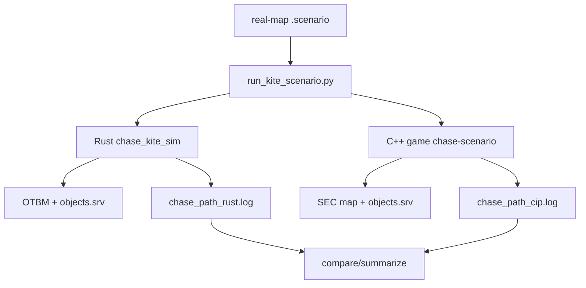

# TFS-RUST 772 — Real Map Kite Simulation Plan

**Date:** 2026-06-25 (updated)  
**Status:** Plan — v0 pilot ready to author  
**Related:** [`TFS-RUST_772_RealMap_Scenario_Proposal.md`](TFS-RUST_772_RealMap_Scenario_Proposal.md), [`TFS-RUST_772_Sim_Divergence_Report.md`](TFS-RUST_772_Sim_Divergence_Report.md)

## 1. Goal

Move the current Rust-vs-C++ monster AI comparison from the synthetic arena into a real shared map area:

- Rust loads the converted OTBM map (`data/world/forgotten.otbm` by default).
- C++ loads the original 772 `.sec` sectors from `reference/cipsoft-772/runtime/map/`.
- Scenario XYZ coordinates are identical on both stacks.
- The harness logs both AIs while a scripted player enters a chosen area, kites a monster through terrain, and exercises real pathfinding constraints such as walls, narrow corridors, diagonal choices, stairs/ramps where applicable, and blocking tiles.

The near-term target is **headless deterministic simulation**, not live protocol login. “Log them in” should mean: create the same sim player in both worlds at the desired real-map coordinate, trigger the same monster appear/target acquisition flow, and drive the player through a validated route. A later phase can optionally reuse the same route script for live client/login tests.

## 2. Current baseline

The divergence report shows the existing harness is mature enough to extend:

- Shared scenario runner: `scripts/run_kite_scenario.py`.
- Rust executor: `crates/tfs-rust-core/src/bin/chase_kite_sim.rs`.
- C++ executor: `build/game chase-scenario`.
- Shared JSONL trace events: `branch`, `todo_go`, `shortway`, `go_exec`, combat/lifecycle events.
- Current gating path: `scripts/run_sim_battery.py --synthetic`.
- Current synthetic DSL supports:
  - `arena`, `arena_synthetic`, `default_wp`
  - `player_start`
  - one or more `monster <label> x y`
  - `monster_appear`
  - `advance_ms`, `player_pos`, `sim_tick`
  - combat setup and `player_damage*` verbs
- Rust already supports real OTBM loading when `--synthetic` / `arena_synthetic 1` is not used:
  - `beat_driven_world_from_map(...)`
  - `validate_positions_walkable(...)`
- C++ already uses the original `.sec` map by default when synthetic overlay is not enabled.

Important historical lesson from §28: running without `--synthetic` previously dropped base lockstep because real map context diverged from synthetic. That is expected; real-map scenarios must become a **separate battery**, not replace the synthetic lockstep gate.

### 2.1 Resolved: C++ sector path in headless mode

| Question | Answer |
|----------|--------|
| Working directory | `reference/cipsoft-772/runtime/` when invoking `build/game chase-scenario` |
| Sector files | `runtime/map/*.sec` (`MAPPATH` in runtime config; `scripts/tibia_game_dev.sh` sets path) |
| Pristine backup | `runtime/origmap/*.sec` (`ORIGMAPPATH`) |
| Filename format | `%04d-%04d-%02d.sec` → `(SectorX, SectorY, Z)` per `map.cc` `LoadMap` |
| Sector size | 32×32 tiles (`TSector` in `map.hh`) |

Rust OTBM default: `data/world/forgotten.otbm` (converted from the same sector set).
Scenario `(x, y, z)` must exist and be walkable on **both** loaders.

### 2.2 Sim lockstep vs live feel (2026-06)

Synthetic battery lockstep is nearly there (quad cyclops FillMap + `go_exec` closed in §25),
but **live** kiting (e.g. six cyclops on real terrain) can still feel wrong. Causes:

| Layer | Synthetic sim | Live |
|-------|---------------|------|
| Terrain | Flat overlay or ignored underlay | Walls, trees, chokepoints |
| Player | `player_pos` teleports | Client walk beats + input latency |
| Monsters | Fixed spawn list + order | Pull range, extra spawns, drain contention |
| Scheduling | `sim_tick` + pinned `TFS_SIM_SEED` | FIFO todo drain under real load |
| Stimuli | Harness-scripted | Damage / appear / idle interleaving |

Real-map sim addresses **terrain + conversion**. It does not replace live debug:

```bash
# Live / headless chase trace (same compare tool)
TFS_CHASE_PATH_DEBUG=1          # Rust
TIBIA_CHASE_PATH_DEBUG=1        # C++ chase-scenario or live QM
python3 scripts/compare_chase_live_logs.py \
  --ref log/chase_path_cip.log --rust log/chase_path_rust.log --monster cyclops
```

**772 AI hygiene (orthogonal):** gate 1098-only monster paths on `beat_driven_loop`
(`MechanicsProfile::step_speed == LinearGo`), not `clientVersion == 772` — e.g.
`monster_on_think_target`, damage-time `searchTarget`, forced look on target select.
Fixes live 772 feel; real-map scenarios still required for pathfinder / OTBM parity.

## 3. Non-goals for the first implementation

Do not start by building a fully autonomous kiting bot. The first useful version should be deterministic and replayable.

Out of scope for v1:

- Live TCP/protocol login with a real client.
- Dynamic player pathfinding during the test.
- Random player behavior.
- Full map-wide creature simulation.
- Broad equality of all ambient map state.

Instead, v1 should replay a fixed player route across identical coordinates and compare monster AI traces.

### 3.1 Pilot status (2026-06-26)

The first real-map pilot uses **`player_walk`** (adjacent legal steps) on OTBM / `.sec`
terrain — not `player_pos` teleports:

- `scripts/scenarios/kite_cyclops_six_real.scenario` — six cyclops, gravel bowl
  `(32451, 32065, 7)`, no `arena_synthetic`
- `scripts/run_kite_scenario.py --real-map` — never sets `TFS_KITE_SYNTHETIC_ARENA`
- `scripts/run_realmap_sim_battery.py` — separate battery from synthetic gate

Rust-only dry run:

```bash
TFS_SIM_SEED=772 cargo run -p tfs-rust-core --bin chase_kite_sim -- \
  scripts/scenarios/kite_cyclops_six_real.scenario
```

Full lockstep:

```bash
TFS_SIM_SEED=772 python3 scripts/run_kite_scenario.py --real-map \
  scripts/scenarios/kite_cyclops_six_real.scenario
```

Full lockstep baseline: [`TFS-RUST_772_RealMap_Parity_Trajectory.md`](TFS-RUST_772_RealMap_Parity_Trajectory.md).

## 4. Coordinate authoring

### 4.1 World coordinates from `.sec` files

`.sec` files are text terrain maps. They do **not** list creature spawns.

```
Filename 1011-1009-07.sec  →  SectorX=1011, SectorY=1009, Z=7
Line     15-20: Content={4602}  →  local (15, 20) inside 32×32 sector

world_x = sector_x * 32 + local_x   →  1011*32+15 = 32367
world_y = sector_y * 32 + local_y   →  1009*32+20 = 32300
world_z = sector_z                  →  7
```

Reverse: `sector_x = x/32`, `local_x = x%32` (same for y).

Synthetic baseline **32360, 32290, 7** → sector **`1011-1009-07.sec`**.

C++ reference: `LoadSector` in `map.cc` (`MapCon[OffsetX][OffsetY]`).

### 4.2 Spawn zones from `spawns.xml`

For hunter / rat / dragon areas, read `data/world/spawns.xml`:

```xml
<spawn centerx="32345" centery="32280" centerz="7" radius="5">
  <monster name="Hunter" x="2" y="-1" z="7" />
</spawn>
```

World monster tile: `(centerx + x, centery + y, centerz)`.

`scripts/spread_spawn_offsets_for_rme.py` assigns unique offsets inside each spawn
block for RME (one creature per tile). Useful when picking editor-visible tiles;
772 BFS placement still searches from zone center.

### 4.3 Scenario validation window

| Input | Rule |
|-------|------|
| `arena cx cy radius` | Every tile in Chebyshev disk must be walkable on OTBM (Rust `validate_arena_walkable`) |
| `player_start`, each `monster`, each `player_pos` | Must be walkable (`validate_positions_walkable`) |
| Monster order | Matches C++ idle drain / `harness_spawn_order` — document in scenario comment |

## 5. Proposed architecture

Add a second scenario mode: **real-map route scenarios**.



The route scenario should remain a shared text file consumed by both stacks. The core change is to stop teleporting the player blindly through an empty synthetic field and instead drive the sim player through a real-map route with validation and optional movement semantics.

## 6. Scenario DSL additions

### 6.1 Map mode

Add explicit map mode metadata so scenarios declare intent:

```text
name realmap_cyclops_corridor_kite
mode real_map
z 7
map_area 32345 32275 32380 32310 7
player_start 32360 32290
monster cyclops 32364 32290
monster_load_type 1
monster_hostile 1
```

Rules:

- `mode real_map` means no synthetic overlay, even if runner has a default synthetic option.
- `arena_synthetic 1` must be rejected in `mode real_map`.
- `map_area min_x min_y max_x max_y z` identifies the validation/window region around the test.
- Keep `arena` available for synthetic scenarios only.

### 6.2 Route verbs

Current `player_pos x y` teleports the player. That was useful for synthetic parity but it hides terrain constraints. Add route-specific verbs:

```text
# Instant placement before the test begins; no movement stimulus beyond spawn/login setup.
player_start 32360 32290

# A real route step. Both harnesses validate that the move is legal/walkable.
player_walk 32361 32290 200
player_walk 32362 32290 200
player_walk 32362 32291 200

# Optional wait/drain at a position.
wait_ms 1000
sim_tick
```

Semantics:

- `player_walk x y ms` advances time by `ms` and moves the player one legal step to the destination tile.
- The destination must be adjacent by Chebyshev distance <= 1 unless an explicit `teleport_player` verb is used.
- The source and destination must be walkable in both maps.
- The step must fire the same creature move stimulus as existing `player_pos` did, but with a stricter “legal movement” contract.
- Preserve the §27 harness rule: for kiting segments, drain to the wall with the old player tile, then apply player movement, then run the move-stimulus tick.

Keep `player_pos` for old synthetic scenarios, but prefer `player_walk` for real-map scripts.

### 6.3 Initial login/placement verbs

Add a clearer setup stage:

```text
login_player 32360 32290
spawn_monsters
monster_appear
```

For v1 these can map to existing behavior:

- Rust: `insert_player(...)`, register creature at `player_start`.
- C++: `TKiteSimPlayer` at the same coordinate.
- `monster_appear` continues to batch appear monsters and defer first idle consistently.

If `login_player` is omitted, default to existing `player_start` behavior. The purpose is clarity and a future bridge to live login.

### 6.4 Route annotations

Optional but useful for debugging:

```text
route_label south_corridor_pull
expect_monster_seen 1
expect_contact_by_ms 6000
max_tick 12000
monster_filter cyclops
```

These should feed the runner/summarizer instead of hardcoding max ticks in `run_sim_battery.py`.

## 7. Map validation layer

Before running either stack, add a validation command that checks the selected real area.

### 7.1 Rust validation

Extend `chase_kite_sim.rs` / `sim_harness.rs` with:

- `validate_route_walkable(...)`: validate every `player_start`, `monster`, and `player_walk` tile.
- `validate_route_adjacency(...)`: reject non-adjacent `player_walk` jumps.
- `validate_area_loaded(...)`: verify `map_area` bounds exist in OTBM.
- Optional `dump_route_tiles`: emit tile type, waypoint/min-wp, blocking flags, creature occupancy.

Rust already has `validate_positions_walkable(...)`; extend this instead of creating a parallel one-off validator.

### 7.2 C++ validation

Mirror validation in `chase_kite_scenario.cc`:

- Check `.sec` tile exists for every scripted coordinate.
- Check movement legality for every `player_walk` step.
- Log equivalent terrain/waypoint metadata if possible.
- Fail fast if any scripted tile differs structurally from Rust expectations.

### 7.3 Cross-map tile audit

Add a small comparison utility:

```bash
python3 scripts/audit_realmap_route.py scripts/scenarios/realmap_cyclops_corridor_kite.scenario
```

Output should include, per route tile:

| Field | Rust OTBM | C++ SEC | Purpose |
|---|---:|---:|---|
| exists | yes/no | yes/no | Catch conversion holes |
| walkable | yes/no | yes/no | Prevent invalid route |
| waypoint/min_wp | number | number | Explain path cost deltas |
| blocks projectile/path | flags | flags | Terrain parity |
| top ground/item ids | ids | ids | Conversion mismatch diagnosis |

If C++ metadata extraction is hard at first, start with Rust-only validation plus C++ fail-fast during scenario execution, then add richer C++ audit after the first real-map scenario runs.

## 8. Player movement model

There are two viable levels of fidelity.

### 8.1 V1: scripted step replay

Use explicit `player_walk` steps authored by a developer:

```text
advance_ms 200
player_walk 32361 32290 200
sim_tick
advance_ms 200
player_walk 32362 32290 200
sim_tick
```

Pros:

- Deterministic.
- Easy to compare.
- Avoids adding a second pathfinder for the player.
- Best for isolating monster AI parity.

Cons:

- Human-authored route may accidentally be unrealistic unless validated.
- Does not automatically dodge terrain or kite dynamically.

This should be the first implementation.

### 8.2 V2: deterministic route planner

Add a pre-run route planner that computes player steps through the real area and writes a frozen `.scenario`:

```bash
python3 scripts/plan_kite_route.py \
  --start 32360,32290,7 \
  --monster 32364,32290,7 \
  --goal 32372,32297,7 \
  --avoid-cheb 1 \
  --prefer-distance 3 \
  --out scripts/scenarios/realmap_cyclops_corridor_kite.scenario
```

Planner requirements:

- Use Rust OTBM terrain as the source of route legality.
- Avoid tiles blocked by terrain.
- Keep a minimum distance from the monster when possible.
- Prefer corridors/turns that force monster pathing decisions.
- Emit the final route as explicit `player_walk` lines so both stacks replay the exact same path.

Do **not** compare live adaptive player AI between stacks yet; compare monster AI under a fixed player route.

### 8.3 V3: closed-loop kiting bot

Only after V1/V2 are stable, add a deterministic bot:

- At each decision tick, inspect player and monster positions.
- Choose a step that maximizes distance while staying in the `map_area`.
- Avoid unwalkable/blocked terrain.
- Tie-break with fixed direction order and seed.
- Log player decision events as JSONL.

This is useful later, but it adds another AI whose parity must be trusted. Keep it out of the first real-map harness.

## 9. Runner changes

Update `scripts/run_kite_scenario.py`:

- Add `--real-map` or infer from `mode real_map`.
- In real-map mode:
  - Do not pass `--synthetic` to Rust.
  - Do not set `TFS_KITE_SYNTHETIC_ARENA` for either stack.
  - Pass `--data-dir` / `--map` through as today.
  - Require the scenario to have `map_area` or explicit route bounds.
- Read `max_tick` and `monster_filter` from scenario metadata when present.
- Save logs with a distinct prefix for real-map scenarios, e.g.:
  - `log/chase_path_cip_realmap_cyclops_corridor_kite.log`
  - `log/chase_path_rust_realmap_cyclops_corridor_kite.log`
  - `log/summary_realmap_cyclops_corridor_kite.txt`

Add a separate battery command:

```bash
TFS_SIM_SEED=772 python3 scripts/run_realmap_sim_battery.py
```

or extend the existing runner with:

```bash
TFS_SIM_SEED=772 python3 scripts/run_sim_battery.py --real-map
```

Keep synthetic as the canonical regression gate and real-map as an additional parity suite until enough scenarios are stable.

## 10. Rust implementation touchpoints

Primary files:

| Area | File | Change |
|---|---|---|
| Scenario parser | `crates/tfs-rust-core/src/bin/chase_kite_sim.rs` | Add `mode`, `map_area`, `player_walk`, `wait_ms`, optional metadata. |
| Real-map validation | `crates/tfs-rust-core/src/sim_harness.rs` | Extend route/area validation around existing `validate_positions_walkable`. |
| Player movement | `crates/tfs-rust-core/src/bin/chase_kite_sim.rs`, `sim_harness.rs` | Add legal step movement helper; keep `teleport_player` for old synthetic `player_pos`. |
| Logging | `crates/tfs-rust-core/src/chase_debug.rs` | Optional `player_step` / `route_marker` events for debugging. |
| Tests | `chase_kite_sim.rs`, `sim_harness.rs` | Parser tests and route validation tests. |

Important: do not remove existing `player_pos` semantics. Synthetic scenarios in the divergence report depend on them.

## 11. C++ implementation touchpoints

Primary area is the existing `chase_kite_scenario.cc` in the C++ reference harness.

Mirror every DSL addition:

- Parse `mode real_map`.
- Reject synthetic overlay in real-map mode.
- Parse `map_area`, `player_walk`, `wait_ms`, `max_tick`, `monster_filter`.
- Use the same drain-before-move segment ordering established in §27.
- Validate route tiles against `.sec` map before scenario execution.
- Emit any new debug events with the same JSON keys and normalized values as Rust.

C++ remains the oracle for 772 behavior. If route validation disagrees, treat the `.sec` behavior as authoritative and investigate OTBM conversion/overlay before changing AI code.

## 12. Example real-map scenario

Coordinates below are illustrative; pick a real validated area before committing a scenario.

```text
name realmap_cyclops_corridor_kite
mode real_map
z 7
map_area 32350 32280 32375 32305 7
max_tick 12000
monster_filter cyclops

player_start 32360 32290
player_name Hero
monster cyclops 32364 32290
monster_load_type 1
monster_hostile 1

# Setup: place player/monster and trigger appear cadence.
advance_ms 0
monster_appear

# Pull east, turn south around terrain, then hold to let the monster path.
advance_ms 400
player_walk 32361 32290 400
sim_tick

advance_ms 400
player_walk 32362 32290 400
sim_tick

advance_ms 400
player_walk 32363 32290 400
sim_tick

advance_ms 400
player_walk 32363 32291 400
sim_tick

advance_ms 400
player_walk 32363 32292 400
sim_tick

wait_ms 2000
sim_tick

wait_ms 2000
sim_tick
```

Authoring checklist:

1. Verify every coordinate exists in both maps.
2. Verify `player_walk` steps are adjacent and walkable.
3. Verify the monster can see/acquire the player from the spawn position.
4. Ensure the route exercises at least one real terrain decision.
5. Keep the first scenario short: 6–12 seconds max tick.

## 13. Comparison strategy

Real-map lockstep should start with layered assertions instead of one all-or-nothing gate.

Recommended summary sections:

1. **Setup parity**
   - player coordinate
   - monster coordinate(s)
   - monster stats/type loaded
   - initial visible/acquired target state
2. **Route parity**
   - same player step count
   - same step timestamps
   - same legal/walkable result
3. **Monster event counts**
   - `branch`, `todo_go`, `shortway`, `go_exec`, combat events
4. **Pairwise event content**
   - existing lockstep comparison
5. **Path geometry diagnostics**
   - first `shortway` mismatch
   - first `go_exec` mismatch
   - min/waypoint at divergent tile if available

Do not expect the first real-map scenario to pass lockstep. The first milestone is comparable traces with clean setup and route parity.

## 14. Phased delivery plan

### Phase R0 — v0 pilot (existing DSL)

Deliverables:

- Confirm OTBM ↔ `runtime/map/` alignment at pilot coords (32360, 32290, 7 lab area).
- Author `scripts/scenarios/kite_cyclops_six_real.scenario`:
  - No `arena_synthetic 1`; larger `arena` for six cyclops + kite path.
  - Clone `player_pos` script from `kite_cyclops_quad_chase.scenario`.
  - Monster spawn order documented in file header.
- Run without `--synthetic`; Rust-only first, then full C++ compare.
- Optional: live repro at same coords with chase debug + `compare_chase_live_logs.py`.

Done when:

- Both stacks execute without synthetic overlay.
- First divergence (if any) is classified: conversion vs AI vs harness.

### Phase R0b — Pick a terrain-stress area

Deliverables:

- Identify a second area with real geometry (corridor, chokepoint, or spawn from `spawns.xml`).
- Audit tiles via `.sec` lookup + OTBM walkability (§4).
- Draft route with 5–15 steps (`player_pos` for v0; `player_walk` after R1).

Done when:

- A human can point to the map area and explain which terrain decision it tests.

### Phase R1 — DSL and validation

Deliverables:

- Add parser support for `mode real_map`, `map_area`, `player_walk`, `wait_ms`, `max_tick`, `monster_filter`.
- Add Rust route validation.
- Add C++ parser support and fail-fast route validation.
- Add parser/validation tests.

Done when:

- Invalid route jumps fail before simulation.
- Missing/unwalkable OTBM tiles fail before simulation.
- Existing synthetic scenarios still parse and run unchanged.

### Phase R2 — Real-map execution parity

Deliverables:

- Run the same real-map scenario on Rust OTBM and C++ `.sec`.
- Produce both JSONL logs and a summary.
- Confirm setup parity and route parity.

Done when:

- Both stacks execute the scenario without synthetic overlay.
- Logs are produced for both stacks.
- The summary distinguishes route/setup failures from monster AI divergence.

### Phase R3 — First real-map lockstep investigation

Deliverables:

- Compare `branch` → `todo_go` → `shortway` → `go_exec` for the first scenario.
- If the first divergence is terrain, dump/audit tile metadata around it.
- If the first divergence is scheduling/RNG, use existing trace tools (`TFS_SIM_RNG_TRACE=1`, tick-bucket compare).

Done when:

- First divergence is classified as one of:
  - OTBM conversion mismatch
  - objects.srv waypoint mismatch
  - C++ `.sec` oracle behavior not mirrored in Rust map/pathfinder
  - real AI/scheduler divergence
  - harness route/stimulus bug

### Phase R4 — Expand real-map battery

Add 3–5 scenarios:

| Scenario | Purpose |
|---|---|
| `kite_cyclops_six_real` | Six-monster kite on real tiles; matches live repro scale. |
| `realmap_rat_corner_dance` | Adjacent melee dance near blocking terrain. |
| `realmap_cyclops_corridor_chase` | Large melee monster around corridor/obstacle. |
| `realmap_hunter_distance_kite` | Dist-chase/flee in real terrain. |
| `realmap_dragon_lowhp_flee` | Low-HP flee path around terrain. |
| `realmap_multi_monster_chokepoint` | Drain order and path tie behavior with several monsters. |

Done when:

- Real-map battery runs independently of synthetic battery.
- Synthetic battery remains the regression gate.
- Real-map battery has stable summaries even when lockstep fails.

### Phase R5 — Optional deterministic kiting route planner

Deliverables:

- `scripts/plan_kite_route.py` to generate frozen `player_walk` routes.
- Route planner uses OTBM walkability and deterministic tie-breaks.
- Generated scenario is reviewed and committed as static text.

Done when:

- Developers can generate candidate routes, but committed tests remain deterministic and reviewable.

## 15. Risks and mitigations

| Risk | Impact | Mitigation |
|---|---|---|
| OTBM conversion differs from `.sec` | False AI divergence | Add route tile audit and classify terrain mismatches before touching AI. |
| Ambient map creatures/items affect C++ RNG/pathing | RNG desync | Keep headless harness spawning only scenario monsters; purge/skip ambient creatures as synthetic harness already learned. |
| `player_walk` semantics differ from real player movement | Harness divergence | Validate adjacency/walkability and use the same creature move stimulus path as existing player movement. |
| Route too complex too early | Hard-to-debug failures | Start with one monster, short route, 6–12s max tick. |
| Dynamic kiting bot creates another parity problem | Noisy results | Use frozen route replay for v1. |
| Existing synthetic gate regresses | Loss of known baseline | Keep synthetic scenarios and `--synthetic` behavior unchanged. |
| Live feel still wrong after sim pass | Wrong layer diagnosed | Run same coords live + sim; compare JSONL; don't relax synthetic gate |
| 1098 AI paths on 772 | Wrong idle/chase behavior live | Gate on `beat_driven_loop`, not version literal (see §2.2) |

## 16. Validation commands

Use RTK for heavy commands where available.

Initial Rust-only iteration (v0 pilot):

```bash
TFS_SIM_SEED=772 python3 scripts/run_kite_scenario.py --skip-cpp \
  scripts/scenarios/kite_cyclops_six_real.scenario
```

After DSL lands:

Full C++ compare requires the query manager:

```bash
scripts/tibia_game_dev.sh run-qm
TFS_SIM_SEED=772 python3 scripts/run_kite_scenario.py scripts/scenarios/realmap_cyclops_corridor_kite.scenario
```

Synthetic regression guard:

```bash
TFS_SIM_SEED=772 python3 scripts/run_sim_battery.py --synthetic
```

After adding a real-map battery:

```bash
TFS_SIM_SEED=772 python3 scripts/run_sim_battery.py --real-map
```

## 17. Recommended first implementation slice

**Track A — v0 pilot (no parser changes):**

1. Author `kite_cyclops_six_real.scenario` without `arena_synthetic 1`.
2. Run `TFS_SIM_SEED=772 python3 scripts/run_kite_scenario.py scripts/scenarios/kite_cyclops_six_real.scenario` (no `--synthetic`).
3. Compare traces; document first divergence in divergence report §real-map.
4. If live still diverges at same coords, capture `TFS_CHASE_PATH_DEBUG` logs and diff.

**Track B — DSL hardening (after pilot):**

1. Add `mode real_map`, `map_area`, `player_walk`, `wait_ms`, `max_tick`, `monster_filter` to Rust and C++.
2. Teach `run_kite_scenario.py` to infer real-map mode and skip synthetic env/flags.
3. Add `scripts/audit_realmap_route.py` for OTBM vs `.sec` tile audit.
4. Add `--real-map` battery slice; keep synthetic as canonical gate.

Track A gives terrain coverage immediately; Track B makes routes stricter and authoring safer.
