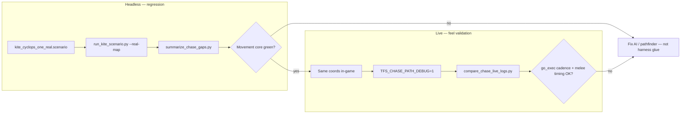

# TFS-RUST 772 — Real Parity Sim: Findings & Workflow

**Date:** 2026-06-27  
**Related:** [`TFS-RUST_772_RealMap_Parity_Trajectory.md`](TFS-RUST_772_RealMap_Parity_Trajectory.md), [`TFS-RUST_772_Real_Map_Kite_Sim_Plan.md`](TFS-RUST_772_Real_Map_Kite_Sim_Plan.md), [`TFS-RUST_772_Sim_Divergence_Report.md`](TFS-RUST_772_Sim_Divergence_Report.md), [`TIBIA_GAME_MASTER_DEV.md`](TIBIA_GAME_MASTER_DEV.md)

---

## 1. Executive summary

The real-map sim (`chase_kite_sim` + `kite_cyclops_one_real.scenario`) is a **deterministic headless parity probe** against the C++ `chase-scenario` harness — not a faithful replay of how a client player walks or how the live server schedules AI.

Three distinct layers must not be conflated:

| Layer | Role | Matches in-game feel? |
|-------|------|------------------------|
| **Headless harness** | Scripted scenario → JSONL trace compare | Partially — by design |
| **C++ reference harness** | Same scenario DSL, `.sec` terrain | Same partial model |
| **Live server** | `advance_beat_772` + client walk packets | Ground truth for feel |

**Key finding (P6, pre-fix):** P5 narrow lockstep PASS masked a real Rust AI bug — Rust repathed on every player kite step via `close_flee_clear` while C++ committed to the initial chase path.

**Status (P6 post-fix, 2026-06-27):** Fresh C++ A/B on `kite_cyclops_one_real` — **movement + scheduler trace PASS** (19 vs 19 gated events; ref 19 / rust 89 total — delta is Rust-only `todo_label`). Chase geometry, cadence, and scheduler hooks now match C++ on this scenario.

**Bottom line:** Headless real-map sim now validates **terrain, chase geometry, and scheduler trace** against C++. Use **live chase tracing** for in-game feel (harness still uses instant `player_walk`, not client walk queue).

---

## 2. What the harness actually does (vs live)

### 2.1 Player movement — instant, not client-like

Harness `player_walk` calls `walk_player_adjacent` → `try_creature_walk_step` — one **synchronous** tile move.

Live 772 uses `player_move_request` → `clear_todo_772` → `add_event_walk` with walk-beat timing on the creature todo queue.

The harness never exercises the player walk queue path.

### 2.2 Time — scenario walls, not continuous beats

| | Harness | Live server |
|---|---------|-------------|
| Clock | Jumps in 200 ms chunks on `player_walk` / `advance_ms` | `advance_beat_772(beat_ms)` on timer (~200 ms), independent of input |
| Monster step delay | Tied to `sim_harness_wall_ms` + `sim_harness_segment_ms` | Beat-driven `ToDoGo` via main loop |
| Drain | `drain_todo_queue_once` before walk, `run_sim_tick` after | Continuous todo drain each beat |

### 2.3 Harness-only knobs (parity glue, not live mechanics)

These exist to match C++ headless traces:

| Knob | Purpose |
|------|---------|
| `HARNESS_APPEAR_IDLE_DEFER_MS` (2000) | Defer first idle until first `advance_ms` drain |
| `clear_harness_appear_idle_defer` | Pull idle wakeup to current wall on first `player_walk` |
| `sim_harness_wall_ms` / `sim_harness_segment_ms` | Cap drain; tie `ToDoGo` delay to scenario beat |
| `harness_spawn_order` + tie policies | Multi-monster todo ordering (quad cyclops) |
| `harness_place_creature_login` | `SearchLoginField(dist=1)` spawn relocation |
| `TFS_SIM_SEED` + `TFS_SIM_MELEE_REALIGN` | glibc RNG parity for combat rolls |
| `TFS_KITE_NO_WILD=1` | Suppress ambient map spawns during C++ compare |

Some are legitimate C++ harness parity. Some were added to green narrow gates while event volume still diverged.

---

## 3. Smoking gun: Rust repaths every kite step; C++ does not

Scenario: `scripts/scenarios/kite_cyclops_one_real.scenario`  
Conditions: `TFS_KITE_NO_WILD=1`, `TFS_SIM_SEED=772`, `wall_ms=5000`

### 3.1 C++ reference harness (correct behavior)

| Tick | Event |
|------|-------|
| 200 | **1×** `todo_go` — south hook toward `(32451,32065)` |
| 200–1000 | Player walks only — **no additional** `todo_go` / `shortway` |
| 400 / 2000 / 4000 | 3× `go_exec` — steady execution of initial 3-step path |
| 4000 | `melee_hit` dmg 52 |

### 3.2 Rust (pre-fix P6 — over-reactive)

| Tick | Event |
|------|-------|
| 200 | **2×** `todo_go` — appear idle + `close_flee_clear` after player walk |
| 400–1000 | `close_flee_clear` + new `todo_go` on **each** `player_walk` |
| 400 / 4000 / 5000 | 3× `go_exec` — missing @2000; +1000 ms late |
| 5000 | `melee_hit` — 1 s late vs C++ |

### 3.3 Rust (post-fix — matches C++ on fresh A/B)

| Metric | C++ ref | Rust |
|--------|---------|------|
| `todo_go` | 1 | 1 |
| `go_exec` tick buckets | 400 / 2000 / 4000 | 400 / 2000 / 4000 |
| `melee_hit` | dmg 52 @ 4000 | dmg 52 @ 4000 |
| `idle_stimulus` | 2 | 2 |
| `todo_wait` | 1 | 1 |
| `rotate` | 1 @ tick 0 | 1 @ tick 0 |
| `creature_move_stimulus` | 5× `move_stimulus` | 5× `move_stimulus` |
| Gated event total | 19 | 19 (pairwise 100%) |

Fixes: `monster_close_chase_batch_in_flight` guard; same-tick `IdleStimulus` dedupe; harness appear target+face @ tick 0; `todo_wait` enqueue-only trace.

### 3.4 Root cause (pre-fix)

`monster_close_chase_clear_pending_go_on_target_flee` in `monster_events.rs` clears the todo queue and calls `monster_idle_stimulus` whenever the player is >1 tile away during close chase. That fires on every harness walk tick during the U-loop.

C++ `CreatureMoveStimulus` (`crmain.cc:888–961`) has a **narrower** scope — it does not full-idle-repath on every kite tile while an in-flight `ToDoGo` path is still valid.

### 3.5 Why P5 PASS hid this

The P5 narrow gate compared index-aligned **first** events only:

- `todo_go[0]` dest matched
- `go_exec` tiles matched (3/3)
- `melee_hit` damage matched after RNG realign

Event **volume** (1 vs 6 `todo_go`, tick buckets 400/2000/4000 vs 400/4000/5000) was not gated. P6 expanded tracing exposed the bug.

---

## 4. What “realistic” sim would require

The current harness is the right tool for **Rust vs C++ headless lockstep on real terrain**. A player-realistic sim would additionally need:

1. **Continuous beat loop** — `advance_beat_772(200)` every beat, not time jumps on input
2. **Player via `player_move_request`** — queued walk with step delays, not `try_creature_walk_step`
3. **Input script as packet timing** — e.g. “send West at t=800 ms”, not “adjacent step at wall=800”
4. **No harness wall/segment overrides** during the run (or a separate live-sim mode)
5. **Fix the AI first** — constrain `close_flee_clear` to C++ `CreatureMoveStimulus` scope

Even then, live differs on pull range, extra spawns, input latency, and load — but chase **cadence** would be much closer.

---

## 5. Best workflow for “real” parity

Use a **two-track** approach: headless for regression, live for feel.



### 5.1 Track A — Headless real-map lockstep (terrain + geometry)

**Purpose:** Prove Rust chase pathfinding and scheduling match C++ on OTBM / `.sec` at fixed coordinates.

**Prerequisites:**

```bash
# C++ reference (once per clone)
scripts/setup_reference_local.sh
scripts/tibia_game_dev.sh build

# Query manager required for C++ chase-scenario
scripts/tibia_game_dev.sh run-qm   # separate terminal
```

**Run:**

```bash
export TFS_SIM_SEED=772
export TFS_KITE_NO_WILD=1

# Single scenario
python3 scripts/run_kite_scenario.py --real-map \
  scripts/scenarios/kite_cyclops_one_real.scenario

# Full real-map battery
python3 scripts/run_realmap_sim_battery.py
```

**Artifacts:**

| File | Contents |
|------|----------|
| `log/chase_path_cip_realmap.log` | C++ JSONL trace |
| `log/chase_path_rust_realmap.log` | Rust JSONL trace |
| `log/summary_realmap_cyclops_one_real.txt` | Gap summary |

**Rust-only fast iteration:**

```bash
TFS_SIM_SEED=772 TFS_CHASE_PATH_DEBUG=1 \
  cargo run -p tfs-rust-core --bin chase_kite_sim -- \
  scripts/scenarios/kite_cyclops_one_real.scenario \
  --log log/chase_path_rust.log
```

**Walkability pre-check (no sim):**

```bash
cargo run -p tfs-rust-core --bin chase_kite_sim -- \
  --audit-route scripts/scenarios/kite_cyclops_one_real.scenario
```

### 5.2 Track B — Live server chase tracing (feel validation)

**Purpose:** Capture what actually happens when you kite in-game at the same coordinates. This is the authoritative check when headless passes but monsters feel wrong.

**Enable tracing:**

```bash
# Rust server
export TFS_CHASE_PATH_DEBUG=1
export TFS_CHASE_PATH_LOG=log/chase_path_rust.log
# start tfs-rust-server as usual

# C++ reference stack (optional compare)
export TIBIA_CHASE_PATH_DEBUG=1
scripts/tibia_game_online.sh restart
# log: reference/cipsoft-772/runtime/log/chase_path.log
```

**Reproduce at scenario coordinates:**

- Player start: `(32451, 32065, 7)` — cyclops gravel bowl
- Kite the same U-loop as the scenario (5 adjacent steps, ~200 ms apart)
- Pull one cyclops from `(32453, 32065)` — avoid extra wild spawns when comparing

**Compare:**

```bash
python3 scripts/compare_chase_live_logs.py \
  --ref reference/cipsoft-772/runtime/log/chase_path.log \
  --rust log/chase_path_rust.log \
  --monster cyclops
```

Or against a headless C++ capture:

```bash
python3 scripts/compare_chase_live_logs.py \
  --ref log/chase_path_cip_realmap.log \
  --rust log/chase_path_rust.log \
  --monster cyclops \
  --max-tick 5000
```

### 5.3 What to gate on

Use `--movement-core` on `summarize_chase_gaps.py` (default in `run_realmap_sim_battery.py`). This gate includes **movement geometry and scheduler trace**; only `todo_label` is excluded (Rust-only instrumentation).

#### Movement + scheduler (must pass — `--movement-core`)

| Check | How |
|-------|-----|
| `harness_player_step` | 5/5 @ 200…1000 on scenario route |
| `todo_go[0]` dest + count | Same target tile; count ref=1 rust=1 |
| `shortway[0]` steps | Identical path hook |
| `go_exec` count + tick buckets | 3/3; e.g. 400 / 2000 / 4000 |
| `go_exec` tiles | Same from→to sequence |
| `melee_hit` tick + damage | Same tick bucket and dmg roll |
| `idle_stimulus` count | Match ref (2 on `one_real`) |
| `todo_wait` count | Match ref (enqueue-only trace) |
| `rotate` | Same dir + tick bucket (target id normalized in compare) |
| `creature_move_stimulus` | Count + cheb; kind normalized to `move_stimulus` |
| `combat_state` / `attack_enqueue` | Pairwise match, no repath dupes |

```bash
python3 scripts/summarize_chase_gaps.py \
  --ref log/chase_path_cip_realmap.log \
  --rust log/chase_path_rust_realmap.log \
  --monster cyclops \
  --max-tick 5000 \
  --movement-core
```

#### Informational only

| Event | Notes |
|-------|-------|
| `todo_label` | Rust-only — never gate |
| `branch` / `parked` / `ranged_hit` | Scenario-dependent; warn only |
| `branch` → `melee_dance` **dest** | RNG-soft — `rand(0,4)` cardinal (`crnonpl.cc:2736`); see §5.3.1 |

#### 5.3.1 RNG-soft events — `melee_dance`

772 melee dance rolls a cardinal sidestep. **Different dest tiles on the same tick do not imply AI wrongness** — two correct servers can disagree on which adjacent tile was picked.

**Gate on (blocking):**

- `branch` **kind** at expected ticks (e.g. `melee_dance` attempted during stand, not skipped for flee)
- Stand-window `todo_go` / `go_exec` / `melee_hit` **counts and tick buckets**
- Unit-tested structure: eligibility, cardinal step, blocked dance does not re-enqueue Go

**Do not gate on:**

- Exact `branch` / `melee_dance` `dest` `(x,y)` — compare script uses dest in `branch_key` for diagnostics; `--movement-core` lists `branch` under scheduler trace warnings only

**Debug mode:** With `TFS_SIM_SEED=772` and aligned glibc draw order, dest *may* lockstep. Use `TFS_SIM_RNG_TRACE=1` when dest diverges **after** multi-monster drain order (T1/T5) is fixed — treat dest mismatch as draw-order symptom, not a separate PASS criterion.

Full policy on real-map dual cyclops: trajectory §16.2.1 (T3 acceptance).

**Red flags in any log:**

- `todo_go` count ref=1 rust=6 on one_real — over-repath bug
- `go_exec` missing @2000 — queue churn from inline idle
- `melee_hit` @5000 vs ref @4000 — strike phasing shifted
- `close_flee_clear` on every `harness_player_step` tick — AI too reactive

### 5.4 Interpretation cheat sheet

| Symptom in-game | Likely cause | Check in logs |
|-----------------|--------------|---------------|
| Cyclops stutters / re-paths every kite tile | `close_flee_clear` inline idle | `todo_go` per tick > 1; `creature_move_stimulus` kind |
| Cyclops hits 1 s late | go_exec phasing shift | `go_exec` ticks; `melee_hit` tick |
| Cyclops walks wrong hook around gravel | Pathfinder / OTBM wp | `shortway` steps vs C++ |
| Extra monsters interfere | Wild spawns | Run with `TFS_KITE_NO_WILD=1` in sim; isolate pulls live |
| Feels fine live but harness fails | Harness glue / RNG / drain order | Compare live log to headless — if live matches C++, fix harness not AI |

---

## 6. Fix list (P6 — done on `kite_cyclops_one_real`)

1. **Constrain `close_flee_clear`** — `monster_close_chase_batch_in_flight`; no inline idle during in-flight `ToDoGo` (`monster_events.rs`, `monster_ai.rs`).
2. **Restore go_exec cadence** — 400 / 2000 / 4000 and `melee_hit` @ 4000 verified on fresh A/B.
3. **Scheduler trace parity** — same-tick idle dedupe; appear target+face @ tick 0; `todo_wait` enqueue-only logging.
4. **`--movement-core` gate** — movement + scheduler blocking; `todo_label` excluded (`summarize_chase_gaps.py`).
5. **Optional (future):** live-sim mode — beat-driven clock + `player_move_request` scenario verb.

**Stop doing:** tuning `segment_ms`, RNG realign, or drain order to green a narrow gate while event volume diverges.

---

## 7. Quick reference commands

```bash
# --- Headless real-map: 1 cyclops (PASS baseline) ---
TFS_SIM_SEED=772 TFS_KITE_NO_WILD=1 \
  python3 scripts/run_kite_scenario.py --real-map \
  scripts/scenarios/kite_cyclops_one_real.scenario

# --- Headless real-map: 2 cyclops (AI parity work — see trajectory §16) ---
TFS_SIM_SEED=772 TFS_KITE_NO_WILD=1 \
  python3 scripts/run_kite_scenario.py --real-map \
  scripts/scenarios/kite_cyclops_two_real.scenario

# --- Gap summary (movement + scheduler gate) ---
python3 scripts/summarize_chase_gaps.py \
  --ref log/chase_path_cip_realmap.log \
  --rust log/chase_path_rust_realmap.log \
  --monster cyclops --max-tick 12000 --movement-core

# --- Live vs headless C++ capture ---
python3 scripts/compare_chase_live_logs.py \
  --ref log/chase_path_cip_realmap.log \
  --rust log/chase_path_rust.log \
  --monster cyclops --max-tick 5000

# --- Player walk alignment sanity ---
python3 scripts/compare_harness_player_walk.py \
  --ref log/chase_path_cip_realmap.log \
  --rust log/chase_path_rust_realmap.log
```

**Two-cyclops parity:** **PASS** on `--movement-core` @12000 (§16.8 in trajectory doc). Real-map battery **3/3 PASS** via `run_realmap_sim_battery.py`. Next: six-monster `six_real` ramp.

---

## 8. Related documents

| Doc | Use when |
|-----|----------|
| [`TFS-RUST_772_RealMap_Parity_Trajectory.md`](TFS-RUST_772_RealMap_Parity_Trajectory.md) | Historical P3–P6 pilot results and gap tables |
| [`TFS-RUST_772_Real_Map_Kite_Sim_Plan.md`](TFS-RUST_772_Real_Map_Kite_Sim_Plan.md) | Scenario authoring, coordinate lookup, battery design |
| [`TFS-RUST_772_Sim_Divergence_Report.md`](TFS-RUST_772_Sim_Divergence_Report.md) | Full synthetic + real-map divergence history |
| [`TIBIA_GAME_MASTER_DEV.md`](TIBIA_GAME_MASTER_DEV.md) | C++ build, QM, live chase debug env vars |
